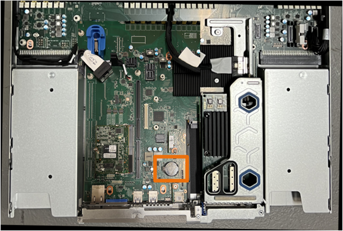

= CMOS 배터리를 다시 설치합니다
:allow-uri-read: 

.단계
. ESD 밴드의 스트랩 끝을 손목 둘레에 감고 클립 끝을 금속 바닥에 단단히 고정하여 정전기 방전을 방지하십시오.
. 제품 뒷면에서 2슬롯 라이저 조립품을 찾습니다.
+
image::../media/SGF6112-two-slot-riser-position.png[2슬롯 라이저 위치]

. 파란색 표시가 있는 구멍을 통해 라이저 조립품을 잡고 조심스럽게 위로 들어 올립니다. 라이저 조립품을 들어 올릴 때 섀시 앞쪽으로 이동하여 설치된 NIC의 외부 커넥터가 섀시에서 분리되도록 합니다.
. 금속 프레임 면이 아래를 향하도록 라이저를 평평한 정전기 방지 표면에 놓습니다.
. 시스템 보드에서 분리한 라이저 조립품 아래의 위치에 있는 CMOS 배터리를 찾습니다.
+

. 손가락이나 플라스틱 지렛대 도구를 사용하여 배터리에서 고정 클립(강조 표시됨)을 눌러 소켓에서 빼냅니다.
+
image::../media/SGF6112-battery-cmos.png[CMOS 배터리 클립]

. 배터리를 분리하여 올바르게 폐기하십시오.

== CMOS 배터리를 다시 설치합니다

교체용 CMOS 배터리를 시스템 보드의 소켓에 설치합니다.

.시작하기 전에
* 올바른 교체용 CMOS 배터리(CR2032)가 있습니다.
* 고장난 CMOS 배터리를 제거했습니다.

.단계
. ESD 밴드의 스트랩 끝을 손목 둘레에 감고 클립 끝을 금속 바닥에 단단히 고정하여 정전기 방전을 방지하십시오.
. CMOS 배터리를 포장에서 꺼냅니다.
. 배터리가 제자리에 고정될 때까지 양극(+)이 위를 향하도록 교체용 배터리를 시스템 보드의 빈 소켓에 밀어 넣습니다.
. 시스템 보드의 가이드 핀에 맞춰진 2슬롯 라이저 어셈블리(원으로 표시됨)의 정렬 구멍을 찾아 라이저 어셈블리의 위치가 올바른지 확인합니다.
+
image::../media/sgf6112_two-slot-riser_alignment_hole.png[대형 라이저 어셈블리의 정렬 구멍]

. 시스템 보드에서 가이드 핀을 찾습니다
+
image::../media/sgf6112_two-slot-riser_guide-pin.png[2슬롯 라이저 조립품용 시스템 보드의 가이드 핀]

. 라이저 조립품을 섀시에 놓고 시스템 보드 및 가이드 핀의 커넥터에 맞춥니다.
. 파란색 표시가 있는 구멍 옆에 있는 가운데 선을 따라 2슬롯 라이저 조립품을 조심스럽게 눌러 완전히 장착합니다.
. 다른 유지보수 절차가 없는 경우 제품 덮개를 다시 설치하고 제품을 랙에 다시 장착하고 케이블을 연결한 다음 전원을 공급합니다.
. 교체한 어플라이언스에 SED 드라이브에 대해 드라이브 암호화가 활성화된 경우 다음을 수행해야 합니다 link:../installconfig/optional-enabling-node-encryption.html#access-an-encrypted-drive["드라이브 암호화 암호를 입력합니다"] 교체용 어플라이언스를 처음 시작할 때 암호화된 드라이브에 액세스합니다.
. 교체한 어플라이언스에서 KMS(키 관리 서버)를 사용하여 노드 암호화에 대한 암호화 키를 관리하는 경우 노드가 그리드에 연결되기 전에 추가 구성이 필요할 수 있습니다. 노드가 그리드에 자동으로 연결되지 않는 경우 이러한 구성 설정이 새 어플라이언스로 전송되었는지 확인하고 필요한 구성이 없는 설정을 수동으로 구성합니다.
+
** link:../installconfig/accessing-storagegrid-appliance-installer.html["StorageGRID 연결을 구성합니다"]
** https://docs.netapp.com/us-en/storagegrid/admin/kms-overview-of-kms-and-appliance-configuration.html#set-up-the-appliance["어플라이언스에 대한 노드 암호화를 구성합니다"^]

. 어플라이언스에 로그인합니다.
+
.. 다음 명령을 입력합니다. `ssh admin@_grid_node_IP_`
.. 에 나열된 암호를 입력합니다 `Passwords.txt` 파일.
.. 루트로 전환하려면 다음 명령을 입력합니다. `su -`
.. 에 나열된 암호를 입력합니다 `Passwords.txt` 파일.

. 어플라이언스에 대한 BMC 네트워크 연결을 복구합니다. 두 가지 옵션이 있습니다.
+
** 고정 IP, 넷마스크 및 게이트웨이를 사용합니다
** DHCP를 사용하여 IP, 넷마스크 및 게이트웨이를 얻습니다
+
... 정적 IP, 넷마스크 및 게이트웨이를 사용하도록 BMC 구성을 복원하려면 다음 명령을 입력합니다.
+
`*run-host-command ipmitool lan set 1 ipsrc static*`

+
`*run-host-command ipmitool lan set 1 ipaddr _Appliance_IP_*`

+
`*run-host-command ipmitool lan set 1 netmask _Netmask_IP_*`

+
`*run-host-command ipmitool lan set 1 defgw ipaddr _Default_gateway_*`

... DHCP를 사용하여 IP, 넷마스크 및 게이트웨이를 가져오도록 BMC 구성을 복원하려면 다음 명령을 입력합니다.
+
`*run-host-command ipmitool lan set 1 ipsrc dhcp*`

. BMC 네트워크 연결을 복원한 후 BMC 인터페이스에 연결하여 추가 사용자 정의 BMC 구성을 감사하고 복원합니다. 예를 들어, SNMP 트랩 대상 및 e-메일 알림에 대한 설정을 확인해야 합니다. 을 참조하십시오 link:../installconfig/configuring-bmc-interface.html["BMC 인터페이스를 구성합니다"].
. 어플라이언스 노드가 그리드 관리자에 표시되고 경고가 나타나지 않는지 확인합니다.

