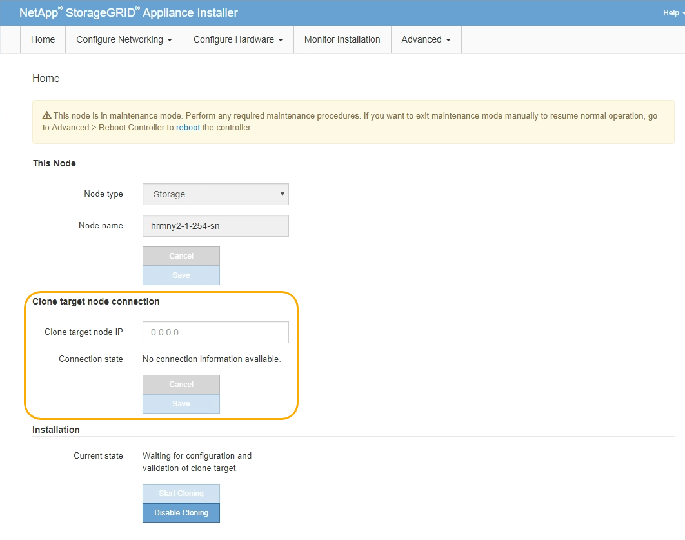

= 클론 어플라이언스 노드
:allow-uri-read: 
:icons: font
:imagesdir: ../media/

[role="lead"]
클론 생성 프로세스는 소스 노드(어플라이언스 교체)와 타겟(새) 어플라이언스 간에 데이터를 전송하는 데 며칠이 걸릴 수 있습니다.

.시작하기 전에
* 호환 대상 어플라이언스를 캐비닛이나 랙에 설치하고, 모든 케이블을 연결하고, 전원을 공급했습니다.
* 교체 어플라이언스의 StorageGRID 어플라이언스 설치 프로그램 버전이 필요한 경우 StorageGRID 어플라이언스 설치 프로그램 펌웨어를 업그레이드 및 다운그레이드하여 StorageGRID 시스템의 소프트웨어 버전과 일치하는지 확인했습니다.
* StorageGRID 접속 구성, SANtricity 시스템 관리자(스토리지 어플라이언스 전용) 및 BMC 인터페이스를 포함하여 타겟 어플라이언스를 구성했습니다.
+
** StorageGRID 연결을 구성할 때는 임시 IP 주소를 사용합니다.
** 네트워크 링크를 구성할 때는 최종 링크 구성을 사용하십시오.

NOTE: 초기 타겟 어플라이언스 구성을 완료한 후 StorageGRID 어플라이언스 설치 프로그램을 열어 둡니다. 노드 클론 생성 프로세스를 시작하면 타겟 어플라이언스의 설치 관리자 페이지로 돌아갑니다.

* 대상 어플라이언스에 대한 노드 암호화를 선택적으로 활성화했습니다.
* 대상 어플라이언스에 대해 RAID 모드를 선택적으로 설정할 수 있습니다(스토리지 어플라이언스만 해당).
* 을(를) 검토했습니다 link:considerations-and-requirements-for-appliance-node-cloning.html["어플라이언스 노드 클론 생성을 위한 고려 사항 및 요구 사항"].

StorageGRID 네트워크 성능과 데이터 가용성을 유지하려면 한 번에 하나의 어플라이언스 노드만 복제해야 합니다.

.단계
. link:../commonhardware/placing-appliance-into-maintenance-mode.html["클론 생성 중인 소스 노드를 유지보수 모드로 설정합니다"].
. 소스 노드의 StorageGRID 어플라이언스 설치 프로그램에서 홈 페이지의 설치 섹션에서 * 클론 생성 활성화 * 를 선택합니다.
+
운영 관리자 노드 연결 섹션이 클론 타겟 노드 연결 섹션으로 대체됩니다.

+

. 클론 타겟 노드 IP * 의 경우 클론 데이터 전송 트래픽에 사용할 네트워크의 타겟 노드에 할당된 임시 IP 주소를 입력한 다음 * Save * 를 선택합니다.
+
일반적으로 그리드 네트워크의 IP 주소를 입력하지만 클론 데이터 전송 트래픽에 다른 네트워크를 사용해야 하는 경우 해당 네트워크에 있는 대상 노드의 IP 주소를 입력합니다.

+

NOTE: 클론 데이터 전송에 1GbE 관리자 네트워크를 사용하면 클론 생성 속도가 느려집니다.

+
타겟 어플라이언스를 구성 및 검증한 후 설치 섹션에서 소스 노드에서 * 클론 생성 시작 * 이 활성화됩니다.

+
복제를 방해하는 문제가 있는 경우 * 클론 생성 시작 * 이 활성화되지 않으며 해결해야 하는 문제가 * 연결 상태 * 로 나열됩니다. 이러한 문제는 소스 노드와 타겟 어플라이언스의 StorageGRID 어플라이언스 설치 관리자 홈 페이지에 나열되어 있습니다. 한 번에 하나의 문제만 표시되고 상태가 변경되면 상태가 자동으로 업데이트됩니다. 클론 생성 시작 * 을 활성화하려면 모든 클론 생성 문제를 해결하십시오.

+
클론 생성 시작 * 이 활성화되면 * 현재 상태 * 는 트래픽을 복제하기 위해 선택된 StorageGRID 네트워크와 해당 네트워크 연결 사용에 대한 정보를 나타냅니다. 을 참조하십시오 link:considerations-and-requirements-for-appliance-node-cloning.html["어플라이언스 노드 클론 생성을 위한 고려 사항 및 요구 사항"].

. 소스 노드에서 * 클론 생성 시작 * 을 선택합니다.
. 소스 또는 타겟 노드에서 StorageGRID 어플라이언스 설치 프로그램을 사용하여 클론 생성 진행률을 모니터링합니다.
+
소스 노드와 타겟 노드의 StorageGRID 어플라이언스 설치 프로그램은 동일한 상태를 나타냅니다.

+
image::../media/cloning_progress.png[복제 진행 상태]

+
클론 생성 모니터링 페이지에서는 클론 생성 프로세스의 각 단계에 대한 자세한 진행 상황을 제공합니다.

+
** * 클론 피어링 관계 설정 * 은 클론 생성 설정 및 구성의 진행률을 표시합니다.
** * 이 노드에서 다른 노드 복제 * 는 데이터 전송 진행률을 표시합니다. (복제 프로세스의 이 부분을 완료하는 데 며칠이 걸릴 수 있습니다.)
** * 복제된 노드를 활성화하고 이 노드를 오프라인으로 둡니다. * 데이터 전송이 완료된 후 컨트롤을 대상 노드로 전송하고 소스 노드를 설치 전 상태로 설정하는 과정이 표시됩니다.

. 클론 생성 프로세스를 종료하고 소스 노드를 서비스로 반환해야 하는 경우 소스 노드에서 StorageGRID 어플라이언스 설치 관리자 홈 페이지로 이동하여 * 고급 * > * 컨트롤러 재부팅 * 을 선택한 다음 * StorageGRID * 으로 재부팅 * 을 선택합니다.
+
클로닝 프로세스가 종료된 경우:

+
** 소스 노드가 유지보수 모드를 종료하고 StorageGRID를 다시 연결합니다.
** 타겟 노드는 사전 설치 상태로 유지됩니다.
소스 노드의 클론을 다시 시작하려면 1단계에서 클론 생성 프로세스를 다시 시작합니다.

클론 생성이 성공적으로 완료되면 다음을 수행합니다.

* 소스 및 타겟 노드가 IP 주소를 바꿉니다.
+
** 이제 타겟 노드는 그리드, 관리 및 클라이언트 네트워크의 소스 노드에 원래 할당된 IP 주소를 사용합니다.
** 이제 소스 노드는 타겟 노드에 처음 할당된 임시 IP 주소를 사용합니다.

* 타겟 노드가 유지보수 모드를 종료하고 StorageGRID를 결합하여 소스 노드를 대체합니다.
* 소스 어플라이언스는 이미 설치되어 있는 상태입니다 https://docs.netapp.com/us-en/storagegrid-118/maintain/preparing-appliance-for-reinstallation-platform-replacement-only.html["재설치를 준비했습니다"^].

NOTE: 어플라이언스가 그리드에 다시 연결되지 않으면 소스 노드의 StorageGRID 어플라이언스 설치 관리자 홈 페이지로 이동하여 * 고급 * > * 컨트롤러 재부팅 * 을 선택한 다음 * 유지 관리 모드로 재부팅 * 을 선택합니다. 소스 노드가 유지보수 모드로 재부팅된 후 노드 클론 복제 절차를 반복합니다.

* 타겟 노드에서 예기치 않은 문제가 발생하는 경우 사용자 데이터는 복구 옵션으로 소스 어플라이언스에 유지됩니다. 타겟 노드가 StorageGRID에 성공적으로 다시 결합되면 소스 어플라이언스의 사용자 데이터가 오래되어 더 이상 필요하지 않습니다.
+
소스 어플라이언스를 다른 그리드에 새 노드로 설치하거나 확장하면 오래된 사용자 데이터를 덮어씁니다.

+
소스 어플라이언스에서 컨트롤러 구성을 재설정하여 이 데이터에 액세스할 수 없도록 할 수도 있습니다.

+
.. 를 엽니다 link:../installconfig/accessing-storagegrid-appliance-installer.html["StorageGRID 어플라이언스 설치 프로그램"] 대상 노드에 처음 할당된 임시 IP 주소를 사용하는 소스 어플라이언스의 경우
.. 도움말 * > * 지원 및 디버그 도구 * 를 선택합니다.
.. 스토리지 컨트롤러 구성 재설정 * 을 선택합니다.
+

NOTE: 필요한 경우 기술 지원 부서에 스토리지 컨트롤러 구성 재설정에 대한 지원을 문의하십시오.

+

NOTE: 데이터를 덮어쓰거나 컨트롤러 구성을 재설정하면 오래된 데이터를 검색하는 것이 어렵거나 불가능합니다. 그러나 어떤 방법으로도 소스 어플라이언스에서 데이터를 안전하게 제거할 수 없습니다. 보안 삭제가 필요한 경우 데이터 삭제 도구 또는 서비스를 사용하여 소스 어플라이언스에서 데이터를 영구적으로 안전하게 제거합니다.

다음을 수행할 수 있습니다.

* 소스 어플라이언스를 추가 클론 생성 작업의 타겟으로 사용합니다. 추가 구성이 필요하지 않습니다. 이 어플라이언스에는 첫 번째 클론 타겟에 대해 원래 지정된 임시 IP 주소가 이미 할당되어 있습니다.
* 소스 어플라이언스를 새 어플라이언스 노드로 설치 및 설정합니다.
* 소스 제품을 StorageGRID에서 더 이상 사용하지 않을 경우 폐기하십시오.

