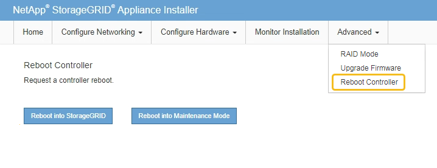

= DNS 서버 구성을 확인합니다
:allow-uri-read: 
:icons: font
:imagesdir: ../media/

[role="lead"]
이 어플라이언스 노드에서 현재 사용 중인 DNS 서버를 확인하고 일시적으로 변경할 수 있습니다.

.시작하기 전에
제품이 다 되었습니다 link:../commonhardware/placing-appliance-into-maintenance-mode.html["유지보수 모드로 전환되었습니다"].

.이 작업에 대해
KMS의 호스트 이름이 IP 주소 대신 도메인 이름으로 지정되었기 때문에 암호화된 어플라이언스가 KMS(키 관리 서버) 또는 KMS 클러스터에 연결할 수 없는 경우 DNS 서버 설정을 변경해야 할 수 있습니다. 어플라이언스에 대한 DNS 설정에 대한 모든 변경 사항은 일시적이며 유지 관리 모드를 종료할 때 손실됩니다. 이러한 변경 사항을 영구적으로 적용하려면 Grid Manager(* 유지 관리 * > * 네트워크 * > * DNS 서버 *)에서 DNS 서버를 지정합니다.

* KMS 서버가 호스트 이름에 대해 IP 주소 대신 정규화된 도메인 이름을 사용하여 정의된 노드 암호화 어플라이언스인 경우에만 DNS 구성을 일시적으로 변경해야 합니다.
* 노드 암호화 어플라이언스가 도메인 이름을 사용하여 KMS에 연결되는 경우 그리드에 정의된 DNS 서버 중 하나에 연결해야 합니다. 그런 다음 이러한 DNS 서버 중 하나가 도메인 이름을 IP 주소로 변환합니다.
* 노드가 그리드의 DNS 서버에 연결할 수 없거나 노드 암호화 어플라이언스 노드가 오프라인일 때 그리드 전체 DNS 설정을 변경한 경우 노드가 KMS에 연결할 수 없습니다. 어플라이언스의 암호화된 데이터는 DNS 문제가 해결될 때까지 해독할 수 없습니다.

KMS 연결을 방해하는 DNS 문제를 해결하려면 StorageGRID 어플라이언스 설치 프로그램에서 하나 이상의 DNS 서버의 IP 주소를 지정하십시오. 이러한 임시 DNS 설정을 사용하면 어플라이언스가 KMS에 연결하고 노드의 데이터를 해독할 수 있습니다.

예를 들어 암호화된 노드가 오프라인 상태일 때 그리드의 DNS 서버가 변경되면 노드가 다시 온라인 상태가 될 때 KMS에 도달할 수 없습니다. KMS는 이전 DNS 값을 계속 사용하고 있기 때문입니다. StorageGRID 어플라이언스 설치 프로그램에 새 DNS 서버 IP 주소를 입력하면 임시 KMS 연결을 통해 노드 데이터를 해독할 수 있습니다.

.단계
. StorageGRID 어플라이언스 설치 프로그램에서 * 네트워킹 구성 * > * DNS 구성 * 을 선택합니다.
. 지정된 DNS 서버가 올바른지 확인합니다.
+
image::../media/dns_configuration.png[DNS 구성]

. 필요한 경우 DNS 서버를 변경합니다.
+

NOTE: DNS 설정에 대한 변경 사항은 일시적이며 유지 관리 모드를 종료할 때 손실됩니다.

. 임시 DNS 설정이 만족스러우면 * Save * 를 선택합니다.
+
노드는 이 페이지에 지정된 DNS 서버 설정을 사용하여 KMS에 다시 연결하여 노드의 데이터를 해독할 수 있도록 합니다.

. 노드 데이터가 해독된 후 노드를 재부팅합니다. StorageGRID 어플라이언스 설치 프로그램에서 * 고급 * > * 컨트롤러 재부팅 * 을 선택한 후 다음 옵션 중 하나를 선택합니다.
+
** 노드를 그리드에 다시 조인하는 상태에서 컨트롤러를 재부팅하려면 * StorageGRID로 재부팅 * 을 선택합니다. 유지보수 모드에서 작업을 수행하고 노드를 정상 운영으로 전환할 준비가 되었으면 이 옵션을 선택합니다.
** 유지보수 모드로 재부팅 * 을 선택하여 유지보수 모드로 남아 있는 노드를 사용하여 컨트롤러를 재부팅합니다. (이 옵션은 컨트롤러가 유지보수 모드일 때만 사용할 수 있습니다.) 그리드에 다시 연결하기 전에 노드에서 수행해야 하는 추가 유지보수 작업이 있는 경우 이 옵션을 선택합니다.
+

+

NOTE: 노드가 재부팅되고 그리드에 다시 연결되면 Grid Manager에 나열된 시스템 전체 DNS 서버가 사용됩니다. 그리드를 다시 연결한 후 어플라이언스는 어플라이언스가 유지보수 모드일 때 StorageGRID 어플라이언스 설치 프로그램에 지정된 임시 DNS 서버를 더 이상 사용하지 않습니다.

+
어플라이언스가 재부팅되고 그리드에 다시 가입하는 데 최대 20분이 걸릴 수 있습니다. 재부팅이 완료되고 노드가 그리드에 다시 결합되었는지 확인하려면 Grid Manager로 돌아갑니다. nodes * 페이지에는 어플라이언스 노드의 정상 상태(노드 이름 왼쪽에 녹색 확인 표시 아이콘)가 표시되어야 image:../media/icon_alert_green_checkmark.png["녹색 확인 표시"]하며, 이는 알림이 활성화되지 않고 노드가 그리드에 연결되어 있음을 나타냅니다.

+
image::../media/nodes_menu.png[어플라이언스 노드가 그리드에 다시 합류했습니다]

