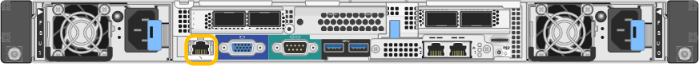
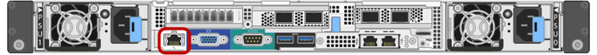

= BMC 인터페이스에 액세스합니다
:allow-uri-read: 
:icons: font
:imagesdir: ../media/

[role="lead"]
BMC 관리 포트의 DHCP 또는 고정 IP 주소를 사용하여 다음 어플라이언스 모델에서 BMC 인터페이스에 액세스할 수 있습니다.

* SG100을 참조하십시오
* SG110입니다
* SG1000입니다
* SG1100으로 문의하십시오
* SG6000 을 참조하십시오
* SG6100

.시작하기 전에
* 관리 클라이언트에서 을 사용하고 있습니다 https://docs.netapp.com/us-en/storagegrid-118/admin/web-browser-requirements.html["지원되는 웹 브라우저"^].
* 어플라이언스의 BMC 관리 포트가 사용하려는 관리 네트워크에 연결되어 있습니다.
+
[role="tabbed-block"]
====
.SG100을 참조하십시오
--
image::../media/sg100_bmc_management_port.png[SG100 BMC 관리 포트]

--
.SG110입니다
--
image::../media/sgf6112_cn_bmc_management_port.png[BMC 관리 포트 SG110]

--
.SG1000입니다
--

--
.SG1100으로 문의하십시오
--
image::../media/sg1100_bmc_management_port.png[BMC 관리 포트 SG1100]

--
.SG6000 을 참조하십시오
--

--
.SG6100
--
image::../media/sgf6112_cn_bmc_management_port.png[SGF6112 BMC 관리 포트]

--
====

.단계
. BMC 인터페이스의 URL을 입력합니다
`*https://_BMC_Port_IP_*`
+
용 `_BMC_Port_IP_`, BMC 관리 포트에 대해 DHCP 또는 고정 IP 주소를 사용합니다.

+
BMC 로그인 페이지가 나타납니다.

+

NOTE: 아직 구성하지 않은 경우 `BMC_Port_IP`의 지침을 따릅니다 link:configuring-bmc-interface.html["BMC 인터페이스를 구성합니다"].  하드웨어 문제로 인해 해당 절차를 수행할 수 없고 아직 BMC IP 주소를 구성하지 않은 경우 BMC에 계속 액세스할 수 있습니다. 기본적으로 BMC는 DHCP를 사용하여 IP 주소를 얻습니다. BMC 네트워크에서 DHCP가 활성화된 경우 네트워크 관리자는 BMC MAC에 할당된 IP 주소를 제공할 수 있습니다. 이 주소는 어플라이언스 전면에 있는 레이블에 인쇄되어 있습니다. BMC 네트워크에서 DHCP가 활성화되지 않은 경우, BMC는 몇 분 후에 응답하지 않으며 기본 정적 IP를 할당합니다 `192.168.0.120`. 랩톱을 BMC 포트에 직접 연결하고 네트워킹 설정을 변경하여 랩톱에 과 같은 IP를 할당해야 할 수 있습니다 `192.168.0.200/24`을 클릭하여 를 찾습니다 `192.168.0.120`.

. 사용자가 설정한 암호를 사용하여 admin 또는 root 사용자 이름과 암호를 입력합니다 link:changing-root-password-for-bmc-interface.html["기본 암호를 변경했습니다"]:
+

NOTE: 기본 사용자는 StorageGRID 어플라이언스를 설치한 시기에 따라 다릅니다. 기본 사용자는 새 설치의 경우 * admin *, 이전 설치의 경우 * root * 입니다.

. 로그인 * 을 선택합니다.
+
image::../media/bmc_dashboard.gif[BMC 대시보드]

. 선택적으로 * 설정 * > * 사용자 관리 * 를 선택하고 "사용 안 함" 사용자를 클릭하여 추가 사용자를 생성합니다.
+

NOTE: 사용자가 처음 로그인할 때 보안을 강화하기 위해 암호를 변경하라는 메시지가 표시될 수 있습니다.

