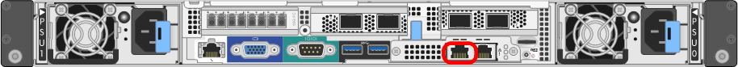

= StorageGRID 어플라이언스 설치 프로그램에 액세스합니다
:allow-uri-read: 
:icons: font
:imagesdir: ../media/

[role="lead"]
설치 프로그램 버전을 확인하고 그리드 네트워크, 관리자 네트워크(옵션) 및 클라이언트 네트워크(옵션)의 세 StorageGRID 네트워크와 어플라이언스 및 네트워크 사이의 연결을 구성하려면 StorageGRID 어플라이언스 설치 프로그램에 액세스해야 합니다.

.시작하기 전에
* StorageGRID 관리 네트워크에 연결할 수 있는 관리 클라이언트를 사용 중이거나 서비스 랩톱을 사용 중입니다.
* 클라이언트 또는 서비스 랩톱에 가 있습니다 https://docs.netapp.com/us-en/storagegrid-118/admin/web-browser-requirements.html["지원되는 웹 브라우저"^].
* 서비스 어플라이언스 또는 스토리지 어플라이언스 컨트롤러는 사용하려는 모든 StorageGRID 네트워크에 연결됩니다.
* 이러한 네트워크에서 서비스 어플라이언스 또는 스토리지 어플라이언스 컨트롤러의 IP 주소, 게이트웨이 및 서브넷을 알고 있습니다.
* 사용할 네트워크 스위치를 구성했습니다.

.이 작업에 대해
StorageGRID 어플라이언스 설치 프로그램에 처음 액세스하려면 서비스 어플라이언스 또는 스토리지 어플라이언스 컨트롤러의 관리 네트워크 포트에 DHCP 할당 IP 주소를 사용할 수 있습니다(관리 네트워크에 연결되어 있다고 가정). 또는 서비스 랩톱을 서비스 어플라이언스 또는 스토리지 어플라이언스 컨트롤러에 직접 연결할 수 있습니다.

.단계
. 가능하면 서비스 어플라이언스 또는 스토리지 어플라이언스 컨트롤러의 관리 네트워크 포트에 대한 DHCP 주소를 사용하십시오. 다음 그림에서 관리 네트워크 포트가 강조 표시되어 있습니다. (관리자 네트워크가 연결되지 않은 경우 그리드 네트워크의 IP 주소를 사용합니다.)
+
[role="tabbed-block"]
====
.SG100을 참조하십시오
--
image::../media/sg100_admin_network_port.png[SG100의 관리 네트워크 포트입니다]

--
.SG1000입니다
--
image::../media/sg1000_admin_network_port.png[SG1000의 관리 네트워크 포트]

--
.E5500SG
--
E5500SG 의 경우 다음 중 하나를 수행할 수 있습니다.

** E5500SG 컨트롤러에서 7개 세그먼트 디스플레이를 확인합니다. E5500SG 컨트롤러의 관리 포트 1 및 10/25GbE 포트 2 및 4가 DHCP 서버를 통해 네트워크에 연결되어 있는 경우, 컨트롤러는 엔클로저의 전원을 켤 때 동적으로 할당된 IP 주소를 가져오려고 시도합니다. 컨트롤러가 전원 켜기 프로세스를 완료하면 7개 세그먼트 디스플레이에 * HO * 가 표시되고, 그 뒤에 2개의 숫자가 반복됩니다.
+
[listing]
----
HO -- IP address for Admin Network -- IP address for Grid Network HO
----
+
시퀀스:

+
*** 첫 번째 번호 세트는 연결된 경우 관리 네트워크의 어플라이언스 스토리지 노드에 대한 DHCP 주소입니다. 이 IP 주소는 E5500SG 컨트롤러의 관리 포트 1에 할당됩니다.
*** 두 번째 숫자 세트는 그리드 네트워크의 어플라이언스 스토리지 노드에 대한 DHCP 주소입니다. 이 IP 주소는 어플라이언스에 처음 전원을 공급하면 10/25GbE 포트 2 및 4에 할당됩니다.
+

NOTE: DHCP를 사용하여 IP 주소를 할당할 수 없는 경우 0.0.0.0이 표시됩니다.

--
.SG6000-CN을 참조하십시오
--

--
.SGF6112를 참조하십시오
--
image::../media/sg6100_admin_network_port.png[SGF6112의 관리 네트워크 포트입니다]

--
====
+
.. 네트워크 관리자로부터 관리 네트워크의 어플라이언스에 대한 DHCP 주소를 얻습니다.
.. 클라이언트에서 StorageGRID 어플라이언스 설치 프로그램에 대한 이 URL을 입력합니다. +
`*https://_Appliance_IP_:8443*`
+
용 `_Appliance_IP_`, DHCP 주소를 사용합니다(관리자 네트워크가 있는 경우 해당 IP 주소 사용).

.. 보안 경고 메시지가 나타나면 브라우저의 설치 마법사를 사용하여 인증서를 보고 설치합니다.
+
다음에 이 URL에 액세스할 때 알림이 나타나지 않습니다.

+
StorageGRID 어플라이언스 설치 관리자 홈 페이지가 나타납니다. 이 페이지에 처음 액세스할 때 표시되는 정보와 메시지는 어플라이언스가 현재 StorageGRID 네트워크에 연결되어 있는 방식에 따라 다릅니다. 오류 메시지가 나타날 수 있으며, 이 메시지는 이후 단계에서 해결될 것입니다.

+
image::../media/appliance_installer_home_5700_5600.png[StorageGRID Webscale 어플라이언스 설치 관리자 홈 페이지의 상단 부분 스크린 샷]

. DHCP를 사용하여 IP 주소를 얻을 수 없는 경우 링크 로컬 연결을 사용할 수 있습니다.
+
[role="tabbed-block"]
====
.SG100을 참조하십시오
--
서비스 랩톱을 이더넷 케이블을 사용하여 서비스 어플라이언스의 맨 오른쪽 RJ-45 포트에 직접 연결합니다.

image::../media/sg100_link_local_port.png[SG100 링크 - 로컬 연결]

--
.SG1000입니다
--
서비스 랩톱을 이더넷 케이블을 사용하여 서비스 어플라이언스의 맨 오른쪽 RJ-45 포트에 직접 연결합니다.

image::../media/sg1000_link_local_port.png[SG1000 링크 - 로컬 연결]

--
.E5500SG
--
이더넷 케이블을 사용하여 서비스 랩톱을 E5500SG 컨트롤러의 관리 포트 2에 연결합니다.

image::../media/e5700sg_mgmt_port_2.gif[E5500SG 컨트롤러의 관리 포트 2 위치]

--
.SG6000-CN을 참조하십시오
--
이더넷 케이블을 사용하여 SG6000-CN 컨트롤러의 맨 오른쪽 RJ-45 포트에 서비스 랩톱을 직접 연결합니다.

image::../media/sg6000_cn_link_local_port.png[SG6000-CN용 관리 포트 위치]

--
.SGF6112를 참조하십시오
--
서비스 랩톱을 이더넷 케이블을 사용하여 어플라이언스의 맨 오른쪽 RJ-45 포트에 직접 연결합니다.

image::../media/sg6100_link_local_port.png[SGF6112 링크 - 로컬 연결]

--
====
+
.. 서비스 랩톱에서 웹 브라우저를 엽니다.
.. StorageGRID 어플라이언스 설치 프로그램에 대한 이 URL을 입력합니다: +
`*\https://169.254.0.1:8443*`
+
StorageGRID 어플라이언스 설치 관리자 홈 페이지가 나타납니다. 이 페이지에 처음 액세스할 때 표시되는 정보와 메시지는 어플라이언스가 현재 StorageGRID 네트워크에 연결되어 있는 방식에 따라 다릅니다. 오류 메시지가 나타날 수 있으며, 이 메시지는 이후 단계에서 해결될 것입니다.

+

NOTE: 링크 로컬 연결을 통해 홈 페이지에 액세스할 수 없는 경우 서비스 랩톱 IP 주소를 로 구성합니다 `169.254.0.2`다시 시도하십시오.

.작업을 마친 후
StorageGRID 어플라이언스 설치 프로그램에 액세스한 후:

* 어플라이언스의 StorageGRID 어플라이언스 설치 프로그램 버전이 StorageGRID 시스템에 설치된 소프트웨어 버전과 일치하는지 확인합니다. 필요한 경우 StorageGRID 어플라이언스 설치 프로그램을 업그레이드합니다.
+
link:verifying-and-upgrading-storagegrid-appliance-installer-version.html["StorageGRID 어플라이언스 설치 프로그램 버전을 확인하고 업그레이드합니다"]

* StorageGRID 어플라이언스 설치 관리자 홈 페이지에 표시되는 메시지를 검토하고 필요에 따라 링크 구성 및 IP 구성을 구성합니다.
+
image::../media/appliance_installer_home_services_appliance.png[어플라이언스 설치 프로그램 홈]

