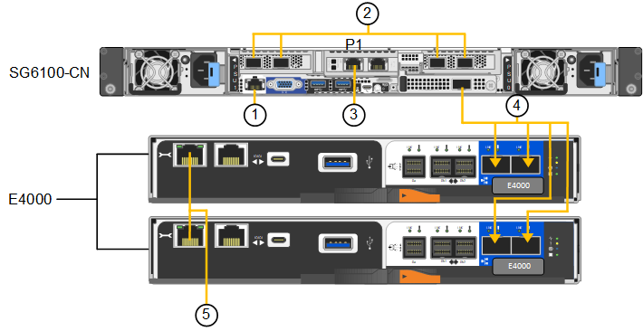

= 케이블 제품
:allow-uri-read: 
:icons: font
:imagesdir: ../media/

[role="lead"]
어플라이언스 또는 컨트롤러의 네트워크 포트를 그리드 네트워크 및 StorageGRID용 클라이언트 네트워크(옵션)에 연결합니다. 일부 어플라이언스의 경우 어플라이언스의 관리 포트를 서비스 랩톱에 연결하거나 컨트롤러 관리 포트를 연결합니다.

[role="tabbed-block"]
====
.SG100 및 SG1000입니다
--
어플라이언스의 관리 포트를 서비스 랩톱에 연결하고 어플라이언스의 네트워크 포트를 그리드 네트워크 및 StorageGRID용 클라이언트 네트워크(옵션)에 연결해야 합니다.

.시작하기 전에
* 관리 포트를 연결하기 위한 RJ-45 이더넷 케이블이 있습니다.
* 네트워크 포트에 대한 다음 옵션 중 하나가 있습니다. 이러한 품목은 제품에는 제공되지 않습니다.
+
** 4개의 네트워크 포트를 연결하기 위한 TwinAx 케이블 1-4개.
** SG100의 경우 포트에 광 케이블을 사용하려는 경우 SFP+ 또는 SFP28 트랜시버를 1~4개 사용하십시오.
** SG1000의 경우 포트에 광 케이블을 사용할 계획인 경우 1~4개의 QSFP+ 또는 QSFP28 트랜시버를 사용합니다.

CAUTION: * 레이저 방사 노출 위험 * -- SFP 또는 QSFP 트랜시버의 부품을 분해하거나 제거하지 마십시오. 레이저 방사선에 노출될 수 있습니다.

.이 작업에 대해
다음 그림은 어플라이언스 후면에 있는 포트를 보여줍니다.

SG100 포트 연결:

image::../media/sg100_connections.png[SG100 후면 커넥터]

SG1000 포트 연결:

image::../media/sg1000_connections.png[SG1000 포트 연결]

[cols="1a,2a,2a,3a"]
|===
| 속성 표시기 | 포트 | 포트의 유형입니다 | 사용 

 a| 
1
 a| 
어플라이언스의 BMC 관리 포트
 a| 
1GbE(RJ-45)
 a| 
BMC 인터페이스에 액세스하는 네트워크에 연결합니다.

 a| 
2
 a| 
어플라이언스에 네트워크 포트 4개가 있습니다
 a| 
* SG100:10/25-GbE의 경우
* SG1000: 10/25/40/100GbE의 경우

 a| 
그리드 네트워크 및 StorageGRID용 클라이언트 네트워크에 연결합니다.  을 참조하십시오 link:../installconfig/gathering-installation-information-sg100-and-sg1000.html#port-bond-modes["포트 본드 모드(포트 본드 모드(SG100 및 SG1000)"].

 a| 
3
 a| 
어플라이언스의 관리 네트워크 포트(그림에서 P1 레이블)
 a| 
1GbE(RJ-45)

*주의:* 이 포트는 1000 BaseT/full에서만 작동하며 10 또는 100메가비트 속도를 지원하지 않습니다.
 a| 
StorageGRID용 관리 네트워크에 어플라이언스를 연결합니다.

 a| 
 a| 
어플라이언스에서 가장 오른쪽에 있는 RJ-45 포트
 a| 
1GbE(RJ-45)

*주의:* 이 포트는 1000 BaseT/full에서만 작동하며 10 또는 100메가비트 속도를 지원하지 않습니다.
 a| 
* 관리 네트워크에 대한 중복 연결을 원할 경우 관리 포트 1에 연결할 수 있습니다.
* 연결을 끊은 상태로 두고 임시 로컬 액세스(IP 169.254.0.1)에 사용할 수 있습니다.
* 설치하는 동안 DHCP 할당 IP 주소를 사용할 수 없는 경우 어플라이언스를 서비스 랩톱에 연결하는 데 사용할 수 있습니다.

|===
.단계
. 이더넷 케이블을 사용하여 어플라이언스의 BMC 관리 포트를 관리 네트워크에 연결합니다.
+
이 연결은 선택 사항이지만 지원을 원활하게 하는 것이 좋습니다.

. TwinAx 케이블이나 광 케이블과 트랜시버를 사용하여 어플라이언스의 네트워크 포트를 해당 네트워크 스위치에 연결합니다.
+
하드웨어 및 링크 속도에 필요한 장비는 다음 표를 참조하십시오.

+
[cols="2a,2a"]
|===
| SG100 링크 속도(GbE) | 필수 장비 

 a| 
10
 a| 
SFP+ 트랜시버

 a| 
25
 a| 
SFP28 트랜시버

| SG1000 링크 속도(GbE) | 필수 장비 

 a| 
10
 a| 
QSA 및 SFP+ 트랜시버

 a| 
25
 a| 
QSA 및 SFP28 트랜시버

 a| 
40
 a| 
QSFP+ 트랜시버

 a| 
100
 a| 
QFSP28 트랜시버

|===
+
** 포트 속도 옵션으로 자동 협상을 지원하는 모델에서 고정 포트 본딩 모드를 선택한 경우 StorageGRID 그리드 네트워크 전용 포트를 클라이언트 네트워크 전용 포트와 다른 속도로 실행할 수 있습니다.
** 포트 속도 옵션으로 Autonegotiate를 지원하지 않는 모델에서는 4개의 네트워크 포트 모두 동일한 링크 속도를 사용해야 합니다.
** 고정 포트 결합 모드(기본값)를 사용하려는 경우 표 에 나와 있는 대로 포트를 StorageGRID 그리드 및 클라이언트 네트워크에 연결합니다.
+
[cols="1a,2a"]
|===
| 포트 | 연결 대상... 

 a| 
포트 1
 a| 
클라이언트 네트워크(옵션)

 a| 
포트 2
 a| 
그리드 네트워크

 a| 
포트 3
 a| 
클라이언트 네트워크(옵션)

 a| 
포트 4
 a| 
그리드 네트워크

|===
** Aggregate 포트 결합 모드를 사용하려는 경우 하나 이상의 네트워크 포트를 하나 이상의 스위치에 연결합니다. 단일 장애 지점이 발생하지 않도록 4개 포트 중 2개 이상을 연결해야 합니다. 단일 LACP 결합에 둘 이상의 스위치를 사용하는 경우 스위치는 MLAG 또는 동급 스위치를 지원해야 합니다.

. StorageGRID용 관리 네트워크를 사용하려는 경우 이더넷 케이블을 사용하여 어플라이언스의 관리 네트워크 포트를 관리 네트워크에 연결합니다.

--
.SG110 및 SG1100
--
어플라이언스의 관리 포트를 서비스 랩톱에 연결하고 어플라이언스의 네트워크 포트를 그리드 네트워크 및 StorageGRID용 클라이언트 네트워크 옵션에 연결합니다.

.시작하기 전에
* 관리 포트를 연결하기 위한 RJ-45 이더넷 케이블이 있습니다.
* 네트워크 포트에 대한 다음 옵션 중 하나가 있습니다. 이러한 품목은 제품에는 제공되지 않습니다.
+
** 4개의 네트워크 포트를 연결하기 위한 TwinAx 케이블 1-4개.
** SG110의 경우 포트에 광 케이블을 사용하려는 경우 SFP+ 또는 SFP28 트랜시버 1~4개가 필요합니다.
** SG1100의 경우 포트에 광 케이블을 사용할 계획인 경우 QSFP+ 또는 QSFP28 트랜시버 1~4개가 필요합니다.

CAUTION: * 레이저 방사 노출 위험 * -- SFP 또는 QSFP 트랜시버의 부품을 분해하거나 제거하지 마십시오. 레이저 방사선에 노출될 수 있습니다.

.이 작업에 대해
다음 그림은 어플라이언스 후면에 있는 포트를 보여줍니다.

SG110 포트 연결:

image::../media/sgf6112_connections.png[SG110 후면 커넥터]

SG1100 포트 연결:

[cols="1a,2a,2a,3a"]
|===
| 속성 표시기 | 포트 | 포트의 유형입니다 | 사용 

 a| 
1
 a| 
어플라이언스의 BMC 관리 포트
 a| 
1GbE(RJ-45)
 a| 
BMC 인터페이스에 액세스하는 네트워크에 연결합니다.

 a| 
2
 a| 
어플라이언스에 네트워크 포트 4개가 있습니다
 a| 
* SG110의 경우: 10/25-GbE
* SG1100의 경우 10/25/40/100-GbE

 a| 
그리드 네트워크 및 StorageGRID용 클라이언트 네트워크에 연결합니다. 을 참조하십시오 link:gathering-installation-information-sg110-and-sg1100.html#port-bond-modes["포트 결합 모드(SG110 및 SG1100)"]

 a| 
3
 a| 
어플라이언스의 관리 네트워크 포트입니다
 a| 
1GbE(RJ-45)

* 중요: * 이 포트는 1/10GbE(RJ-45)에서만 작동하며 100메가비트 속도를 지원하지 않습니다.
 a| 
StorageGRID용 관리 네트워크에 어플라이언스를 연결합니다.

 a| 
 a| 
어플라이언스에서 가장 오른쪽에 있는 RJ-45 포트
 a| 
1GbE(RJ-45)

* 중요: * 이 포트는 1/10GbE(RJ-45)에서만 작동하며 100메가비트 속도를 지원하지 않습니다.
 a| 
* 관리 네트워크에 대한 중복 연결을 원할 경우 관리 포트 1에 연결할 수 있습니다.
* 연결을 끊은 상태로 두고 임시 로컬 액세스(IP 169.254.0.1)에 사용할 수 있습니다.
* 설치하는 동안 DHCP 할당 IP 주소를 사용할 수 없는 경우 어플라이언스를 서비스 랩톱에 연결하는 데 사용할 수 있습니다.

|===
.단계
. 이더넷 케이블을 사용하여 어플라이언스의 BMC 관리 포트를 관리 네트워크에 연결합니다.
+
이 연결은 선택 사항이지만 지원을 원활하게 하는 것이 좋습니다.

. TwinAx 케이블이나 광 케이블과 트랜시버를 사용하여 어플라이언스의 네트워크 포트를 해당 네트워크 스위치에 연결합니다.
+
하드웨어 및 링크 속도에 필요한 장비는 다음 표를 참조하십시오.

+
[cols="2a,2a"]
|===
| SG110 링크 속도(GbE) | 필수 장비 

 a| 
10
 a| 
SFP+ 트랜시버

 a| 
25
 a| 
SFP28 트랜시버

| SG1100 링크 속도(GbE) | 필수 장비 

 a| 
10
 a| 
QSA 및 SFP+ 트랜시버

 a| 
25
 a| 
QSA 및 SFP28 트랜시버

 a| 
40
 a| 
QSFP+ 트랜시버

 a| 
100
 a| 
QFSP28 트랜시버

|===
+
** 포트 속도 옵션으로 자동 협상을 지원하는 모델에서 고정 포트 본딩 모드를 선택한 경우 StorageGRID 그리드 네트워크 전용 포트를 클라이언트 네트워크 전용 포트와 다른 속도로 실행할 수 있습니다.
** 포트 속도 옵션으로 Autonegotiate를 지원하지 않는 모델에서는 4개의 네트워크 포트 모두 동일한 링크 속도를 사용해야 합니다.
** 고정 포트 결합 모드(기본값)를 사용하려는 경우 표 에 나와 있는 대로 포트를 StorageGRID 그리드 및 클라이언트 네트워크에 연결합니다.
+
[cols="1a,2a"]
|===
| 포트 | 연결 대상... 

 a| 
포트 1
 a| 
클라이언트 네트워크(옵션)

 a| 
포트 2
 a| 
그리드 네트워크

 a| 
포트 3
 a| 
클라이언트 네트워크(옵션)

 a| 
포트 4
 a| 
그리드 네트워크

|===
** Aggregate 포트 결합 모드를 사용하려는 경우 하나 이상의 네트워크 포트를 하나 이상의 스위치에 연결합니다. 단일 장애 지점이 발생하지 않도록 4개 포트 중 2개 이상을 연결해야 합니다. 단일 LACP 결합에 둘 이상의 스위치를 사용하는 경우 스위치는 MLAG 또는 동급 스위치를 지원해야 합니다.

. StorageGRID용 관리 네트워크를 사용하려는 경우 이더넷 케이블을 사용하여 어플라이언스의 관리 네트워크 포트를 관리 네트워크에 연결합니다.

--
.SG5700입니다
--
두 컨트롤러를 서로 연결하고, 각 컨트롤러의 관리 포트를 연결한 다음, E5500SG 컨트롤러의 10/25-GbE 포트를 그리드 네트워크 및 StorageGRID용 선택적 클라이언트 네트워크에 연결합니다.

.시작하기 전에
* 제품에 포함된 다음 품목을 개봉했습니다.
+
** 전원 코드 2개
** 컨트롤러의 FC 인터커넥트 포트에 대한 광 케이블 2개.
** 10GbE 또는 16Gbps FC를 지원하는 SFP+ 트랜시버 8개 트랜시버는 두 컨트롤러의 상호 연결 포트 2개와 E700SG 컨트롤러의 10/25-GbE 네트워크 포트 4개와 함께 사용할 수 있습니다. 단, 네트워크 포트에서 10GbE 링크 속도를 사용하려는 경우에는 가능합니다.

* 다음 품목은 제품에 포함되어 있지 않습니다.
+
** 사용하려는 10/25-GbE 포트에 대해 1-4개의 광 케이블을 사용합니다.
** 25-GbE 링크 속도를 사용하려는 경우 SFP28 트랜시버 1~4개
** 관리 포트 연결용 이더넷 케이블

CAUTION: * 레이저 방사선에 노출될 위험 * - SFP 트랜시버를 분해하거나 제거하지 마십시오. 레이저 방사선에 노출될 수 있습니다.

.이 작업에 대해
이 그림은 SG5760 및 SG5760X의 컨트롤러 2개와 E2800 시리즈 스토리지 컨트롤러 위쪽 및 E5500SG 컨트롤러 맨 아래에 있는 컨트롤러 2개를 보여 줍니다. SG5712 및 SG5712X에서는 E2800 시리즈 스토리지 컨트롤러를 후면에서 볼 때 E5500SG 컨트롤러의 왼쪽에 연결합니다.

SG5760 연결:

image::../media/sg5760_connections.gif[SG5760 어플라이언스에 연결]

SG5760X 연결:

image::../media/sg5760X_connections.png[SG5760X 어플라이언스에 연결]

[cols="1a,2a,2a,2a"]
|===
| 속성 표시기 | 포트 | 포트의 유형입니다 | 사용 

 a| 
1
 a| 
각 컨트롤러에 2개의 인터커넥트 포트
 a| 
16Gb/s FC 광 SFP+
 a| 
두 컨트롤러를 서로 연결합니다.

 a| 
2
 a| 
E2800 시리즈 컨트롤러의 관리 포트 1
 a| 
1GbE(RJ-45)
 a| 
SANtricity 시스템 관리자에 액세스하는 네트워크에 연결합니다. StorageGRID용 관리 네트워크 또는 독립 관리 네트워크를 사용할 수 있습니다.

 a| 
2
 a| 
E2800 시리즈 컨트롤러의 관리 포트 2
 a| 
1GbE(RJ-45)
 a| 
기술 지원용으로 예약되어 있습니다.

 a| 
3
 a| 
E5500SG 컨트롤러의 관리 포트 1
 a| 
1GbE(RJ-45)
 a| 
StorageGRID용 관리 네트워크에 E5500SG 컨트롤러를 연결합니다.

 a| 
3
 a| 
E5700SG 컨트롤러의 관리 포트 2
 a| 
1GbE(RJ-45)
 a| 
* 관리 네트워크에 대한 중복 연결을 원할 경우 관리 포트 1에 연결할 수 있습니다.
* 유선을 해제하고 임시 로컬 액세스(IP 169.254.0.1)에 사용할 수 있습니다.
* 설치하는 동안 DHCP 할당 IP 주소를 사용할 수 없는 경우 E700SG 컨트롤러를 서비스 랩톱에 연결하는 데 사용할 수 있습니다.

 a| 
4
 a| 
E5500SG 컨트롤러의 10/25-GbE 포트 1-4
 a| 
10GbE 또는 25GbE

* 참고: * 어플라이언스에 포함된 SFP+ 트랜시버는 10GbE 링크 속도를 지원합니다. 네트워크 포트 4개에 25GbE 링크 속도를 사용하려면 SFP28 트랜시버를 제공해야 합니다.
 a| 
그리드 네트워크 및 StorageGRID용 클라이언트 네트워크에 연결합니다. 을 참조하십시오 link:gathering-installation-information-sg5700.html#port-bond-modes["포트 결합 모드(E5500SG 컨트롤러)"].

|===
.단계
. 광 케이블 2개와 SFP+ 트랜시버 8개 중 4개를 사용하여 E2800 컨트롤러를 E5500SG 컨트롤러에 연결합니다.
+
[cols="1a,1a"]
|===
| 이 포트 연결... | 이 포트로... 

 a| 
E2800 컨트롤러의 상호 연결 포트 1입니다
 a| 
E5500SG 컨트롤러의 상호 연결 포트 1

 a| 
E2800 컨트롤러의 상호 연결 포트 2
 a| 
E5700SG 컨트롤러의 인터커넥트 포트 2를 참조하십시오

|===
. SANtricity System Manager를 사용하려면 이더넷 케이블을 사용하여 E2800 컨트롤러(왼쪽의 RJ-45 포트)의 관리 포트 1(P1)을 SANtricity System Manager용 관리 네트워크에 연결합니다.
+
E2800 컨트롤러(오른쪽의 RJ-45 포트)에서 관리 포트 2(P2)를 사용하지 마십시오. 이 포트는 기술 지원을 위해 예약되어 있습니다.

. StorageGRID용 관리 네트워크를 사용하려는 경우 이더넷 케이블을 사용하여 E5500SG 컨트롤러(왼쪽의 RJ-45 포트)의 관리 포트 1을 관리 네트워크에 연결합니다.
+
관리 네트워크에 대해 액티브-백업 네트워크 연결 모드를 사용하려는 경우 이더넷 케이블을 사용하여 E700SG 컨트롤러(오른쪽의 RJ-45 포트)의 관리 포트 2를 관리 네트워크에 연결합니다.

. 광 케이블과 SFP+ 또는 SFP28 트랜시버를 사용하여 E5500SG 컨트롤러의 10/25-GbE 포트를 해당 네트워크 스위치에 연결합니다.
+

NOTE: 10GbE 링크 속도를 사용하려는 경우 SFP+ 트랜시버를 설치합니다. 25GbE 링크 속도를 사용하려는 경우 SFP28 트랜시버를 설치합니다.

+
** 포트 속도 옵션으로 자동 협상을 지원하는 모델에서 고정 포트 본딩 모드를 선택한 경우 StorageGRID 그리드 네트워크 전용 포트를 클라이언트 네트워크 전용 포트와 다른 속도로 실행할 수 있습니다.
** 포트 속도 옵션으로 Autonegotiate를 지원하지 않는 모델에서는 4개의 네트워크 포트 모두 동일한 링크 속도를 사용해야 합니다.
** 고정 포트 결합 모드(기본값)를 사용하려는 경우 표 에 나와 있는 대로 포트를 StorageGRID 그리드 및 클라이언트 네트워크에 연결합니다.
+
[cols="1a,1a"]
|===
| 포트 | 연결 대상... 

 a| 
포트 1
 a| 
클라이언트 네트워크(옵션)

 a| 
포트 2
 a| 
그리드 네트워크

 a| 
포트 3
 a| 
클라이언트 네트워크(옵션)

 a| 
포트 4
 a| 
그리드 네트워크

|===
** Aggregate 포트 결합 모드를 사용하려는 경우 하나 이상의 네트워크 포트를 하나 이상의 스위치에 연결합니다. 단일 장애 지점이 발생하지 않도록 4개 포트 중 2개 이상을 연결해야 합니다. 단일 LACP 결합에 둘 이상의 스위치를 사용하는 경우 스위치는 MLAG 또는 동급 스위치를 지원해야 합니다.

--
.SG5800을 참조하십시오
--
2개의 컨트롤러를 서로 연결하고, 각 컨트롤러의 관리 포트를 연결하고, SG5800 컨트롤러의 10/25GbE 포트를 그리드 네트워크 및 StorageGRID용 클라이언트 네트워크 옵션에 연결합니다.

.시작하기 전에
* 제품에 포함된 다음 품목을 개봉했습니다.
+
** 전원 코드 2개
** 컨트롤러의 iSCSI 인터커넥트 포트용 케이블 2개

* 다음 품목은 제품에 포함되어 있지 않습니다.
+
** 사용할 10/25GbE 포트용 광 또는 구리 케이블 1~4개
** 광 케이블 및 10GbE 링크 속도를 사용하려는 경우 SFP+ 트랜시버 1~8개
** 광 케이블과 25-GbE 링크 속도를 사용하려는 경우 SFP28 트랜시버 1~8개
** 관리 포트 연결용 이더넷 케이블

CAUTION: * 레이저 방사선에 노출될 위험 * - SFP 트랜시버를 분해하거나 제거하지 마십시오. 레이저 방사선에 노출될 수 있습니다.

.이 작업에 대해
이 그림은 SG5860의 컨트롤러 2개를 보여 주며, E4000 시리즈 스토리지 컨트롤러가 상단에 있고 SG5800 컨트롤러가 하단에 있습니다. SG5812에서 E4000 시리즈 스토리지 컨트롤러는 뒷면에서 볼 때 SG5800 컨트롤러의 왼쪽에 있습니다.

SG5860 연결:

image::../media/sg5860_connections.png[SG5860 어플라이언스에 연결합니다]

[cols="1a,2a,2a,2a"]
|===
| 속성 표시기 | 포트 | 포트의 유형입니다 | 사용 

 a| 
1
 a| 
각 컨트롤러에 2개의 인터커넥트 포트
 a| 
25GbE iSCSI(SFP28)
 a| 
두 컨트롤러를 서로 연결합니다.

 a| 
2
 a| 
E4000 시리즈 컨트롤러의 관리 포트 1
 a| 
1GbE(RJ-45)
 a| 
SANtricity 시스템 관리자에 액세스하는 네트워크에 연결합니다. StorageGRID용 관리 네트워크 또는 독립 관리 네트워크를 사용할 수 있습니다.

 a| 
3
 a| 
SG5800 컨트롤러의 관리 포트 1입니다
 a| 
1GbE(RJ-45)
 a| 
SG5800 컨트롤러를 StorageGRID용 관리 네트워크에 연결합니다.

 a| 
4
 a| 
SG5800 컨트롤러의 10/25-GbE 포트 1-4개
 a| 
10GbE 또는 25GbE
 a| 
그리드 네트워크 및 StorageGRID용 클라이언트 네트워크에 연결합니다. 을 참조하십시오 link:gathering-installation-information-sg5800.html#port-bond-modes["포트 본드 모드(SG5800 컨트롤러)"].

|===
.단계
. 제공된 케이블 2개를 사용하여 E4000 컨트롤러를 SG5800 컨트롤러에 연결합니다.
+
[cols="1a,1a"]
|===
| 이 포트 연결... | 이 포트로... 

 a| 
E4000 컨트롤러의 연결 포트 1
 a| 
SG5800 컨트롤러의 인터커넥트 포트 1을 참조하십시오

 a| 
E4000 컨트롤러의 연결 포트 2
 a| 
SG5800 컨트롤러의 인터커넥트 포트 2를 참조하십시오

|===
. 선택적으로 이더넷 케이블을 사용하여 E4000 컨트롤러(왼쪽의 RJ-45 포트)의 관리 포트 1(P1)을 SANtricity System Manager용 관리 네트워크에 연결합니다.
. StorageGRID용 관리 네트워크를 사용하려면 이더넷 케이블을 사용하여 SG5800 컨트롤러(왼쪽의 RJ-45 포트)의 관리 포트 1을 관리 네트워크에 연결합니다.
. 구리 케이블 또는 광 케이블과 SFP+ 또는 SFP28 트랜시버를 사용하여 SG5800 컨트롤러의 10/25-GbE 포트를 적절한 네트워크 스위치에 연결합니다.
+

NOTE: 10GbE 링크 속도를 사용하려는 경우 SFP+ 트랜시버를 설치합니다. 25GbE 링크 속도를 사용하려는 경우 SFP28 트랜시버를 설치합니다.

+
** 포트 속도 옵션으로 자동 협상을 지원하는 모델에서 고정 포트 본딩 모드를 선택한 경우 StorageGRID 그리드 네트워크 전용 포트를 클라이언트 네트워크 전용 포트와 다른 속도로 실행할 수 있습니다.
** 포트 속도 옵션으로 Autonegotiate를 지원하지 않는 모델에서는 4개의 네트워크 포트 모두 동일한 링크 속도를 사용해야 합니다.
** 고정 포트 결합 모드(기본값)를 사용하려는 경우 표 에 나와 있는 대로 포트를 StorageGRID 그리드 및 클라이언트 네트워크에 연결합니다.
+
[cols="1a,1a"]
|===
| 포트 | 연결 대상... 

 a| 
포트 1
 a| 
클라이언트 네트워크(옵션)

 a| 
포트 2
 a| 
그리드 네트워크

 a| 
포트 3
 a| 
클라이언트 네트워크(옵션)

 a| 
포트 4
 a| 
그리드 네트워크

|===
** Aggregate 포트 결합 모드를 사용하려는 경우 하나 이상의 네트워크 포트를 하나 이상의 스위치에 연결합니다. 단일 장애 지점이 발생하지 않도록 4개 포트 중 2개 이상을 연결해야 합니다. 단일 LACP 결합에 둘 이상의 스위치를 사용하는 경우 스위치는 MLAG 또는 동급 스위치를 지원해야 합니다.

--
.SG6000 을 참조하십시오
--
스토리지 컨트롤러를 SG6000-CN 컨트롤러에 연결하고, 세 컨트롤러 모두의 관리 포트를 연결하고, SG6000-CN 컨트롤러의 네트워크 포트를 StorageGRID용 그리드 네트워크 및 선택적 클라이언트 네트워크에 연결합니다.

.시작하기 전에
* 스토리지 컨트롤러 2개를 SG6000-CN 컨트롤러에 연결하기 위해 어플라이언스와 함께 제공된 광 케이블 4개가 있습니다.
* 관리 포트를 연결하기 위한 RJ-45 이더넷 케이블(최소 4개)이 있습니다.
* 네트워크 포트에 대한 다음 옵션 중 하나가 있습니다. 이러한 품목은 제품에는 제공되지 않습니다.
+
** 4개의 네트워크 포트를 연결하기 위한 TwinAx 케이블 1-4개.
** 포트에 광 케이블을 사용하려는 경우 SFP+ 또는 SFP28 트랜시버 1~4개
+

CAUTION: * 레이저 방사선에 노출될 위험 * - SFP 트랜시버를 분해하거나 제거하지 마십시오. 레이저 방사선에 노출될 수 있습니다.

.이 작업에 대해
다음 그림은 SG6060 및 SG6060X 어플라이언스의 컨트롤러 3개와 SG6000-CN 컴퓨팅 컨트롤러가 상단에, E2800 스토리지 컨트롤러 2개가 아래쪽에 있는 모습입니다. SG6060은 E2800A 컨트롤러를 사용하고 SG6060X는 두 가지 E2800B 컨트롤러 버전 중 하나를 사용합니다.

NOTE: E2800 컨트롤러의 두 버전은 상호 연결 포트의 위치를 제외하고 동일한 사양과 기능을 제공합니다.

CAUTION: E2800A 및 E2800B 컨트롤러를 동일한 어플라이언스에서 사용하지 마십시오.

SG6060 연결:

image::../media/sg6000_e2800_connections.png[SG6060 - E2800A 연결]

SG6060X 연결:

* 버전 1
+
image::../media/sg6000x_e2800B_connections.png[SG6060 - E2800B 연결]

* 버전 2
+

NOTE: E2800B 컨트롤러의 FC 트랜시버가 위쪽 FC 연결 포트(6)에 설치된 경우 이를 오른쪽 아래 FC 연결 포트(7)로 이동합니다.

+
image::../media/sg6000x_e2800B2_connections.png[SG6060 - E2800B 연결]

다음 그림은 SGF6024 어플라이언스에 있는 3개의 컨트롤러와 SG6000-CN 컴퓨팅 컨트롤러가 상단에 있고 두 개의 EF570 스토리지 컨트롤러가 컴퓨팅 컨트롤러 아래에 나란히 표시되어 있습니다.

SGF6024 연결:

image::../media/sg6000_ef570_connections.png[SG6000에서 SGF570 간 연결]

[cols="1a,2a,2a,3a"]
|===
| 속성 표시기 | 포트 | 포트의 유형입니다 | 사용 

 a| 
1
 a| 
SG6000-CN 컨트롤러의 BMC 관리 포트
 a| 
1GbE(RJ-45)
 a| 
BMC 인터페이스에 액세스하는 네트워크에 연결합니다.

 a| 
2
 a| 
FC 연결 포트:

* SG6000-CN 컨트롤러에서 4
* 각 스토리지 컨트롤러에 2개씩

 a| 
16Gb/s FC 광 SFP+
 a| 
각 스토리지 컨트롤러를 SG6000-CN 컨트롤러에 연결합니다.

 a| 
3
 a| 
SG6000-CN 컨트롤러의 네트워크 포트 4개
 a| 
10/25GbE
 a| 
그리드 네트워크 및 StorageGRID용 클라이언트 네트워크에 연결합니다. 을 참조하십시오 link:../installconfig/gathering-installation-information-sg6000.html#port-bond-modes["포트 결합 모드(SG6000-CN 컨트롤러)"].

 a| 
4
 a| 
SG6000-CN 컨트롤러의 관리 네트워크 포트(그림에서 P1 레이블)
 a| 
1GbE(RJ-45)

*주의:* 이 포트는 1000 BaseT/full에서만 작동하며 10 또는 100메가비트 속도를 지원하지 않습니다.
 a| 
SG6000-CN 컨트롤러를 StorageGRID용 관리 네트워크에 연결합니다.

 a| 
 a| 
SG6000-CN 컨트롤러의 가장 오른쪽 RJ-45 포트
 a| 
1GbE(RJ-45)

*주의:* 이 포트는 1000 BaseT/full에서만 작동하며 10 또는 100메가비트 속도를 지원하지 않습니다.
 a| 
* 관리 네트워크에 대한 중복 연결을 원할 경우 관리 포트 1에 연결할 수 있습니다.
* 유선을 해제하고 임시 로컬 액세스(IP 169.254.0.1)에 사용할 수 있습니다.
* 설치 중에 DHCP 할당 IP 주소를 사용할 수 없는 경우 SG6000-CN 컨트롤러를 서비스 랩톱에 연결하는 데 사용할 수 있습니다.

 a| 
5
 a| 
각 스토리지 컨트롤러의 관리 포트 1
 a| 
1GbE(RJ-45)
 a| 
SANtricity 시스템 관리자에 액세스하는 네트워크에 연결합니다.

 a| 
 a| 
각 스토리지 컨트롤러에 있는 관리 포트 2입니다
 a| 
1GbE(RJ-45)
 a| 
기술 지원용으로 예약되어 있습니다.

|===
.단계
. 이더넷 케이블을 사용하여 SG6000-CN 컨트롤러의 BMC 관리 포트를 관리 네트워크에 연결합니다.
+
이 연결은 선택 사항이지만 지원을 원활하게 하는 것이 좋습니다.

. 스토리지 컨트롤러의 4개의 광 케이블과 4개의 SFP+ 트랜시버를 사용하여 각 스토리지 컨트롤러의 FC 포트 2개를 SG6000-CN 컨트롤러의 FC 포트에 연결합니다.
. TwinAx 케이블 또는 광 케이블과 SFP+ 또는 SFP28 트랜시버를 사용하여 SG6000-CN 컨트롤러의 네트워크 포트를 해당 네트워크 스위치에 연결합니다.
+

NOTE: 10GbE 링크 속도를 사용하려는 경우 SFP+ 트랜시버를 설치합니다. 25GbE 링크 속도를 사용하려는 경우 SFP28 트랜시버를 설치합니다.

+
** 포트 속도 옵션으로 자동 협상을 지원하는 모델에서 고정 포트 본딩 모드를 선택한 경우 StorageGRID 그리드 네트워크 전용 포트를 클라이언트 네트워크 전용 포트와 다른 속도로 실행할 수 있습니다.
** 포트 속도 옵션으로 Autonegotiate를 지원하지 않는 모델에서는 4개의 네트워크 포트 모두 동일한 링크 속도를 사용해야 합니다.
** 고정 포트 결합 모드(기본값)를 사용하려는 경우 표 에 나와 있는 대로 포트를 StorageGRID 그리드 및 클라이언트 네트워크에 연결합니다.
+
[cols="1a,2a"]
|===
| 포트 | 연결 대상... 

 a| 
포트 1
 a| 
클라이언트 네트워크(옵션)

 a| 
포트 2
 a| 
그리드 네트워크

 a| 
포트 3
 a| 
클라이언트 네트워크(옵션)

 a| 
포트 4
 a| 
그리드 네트워크

|===
+
*** Aggregate 포트 결합 모드를 사용하려는 경우 하나 이상의 네트워크 포트를 하나 이상의 스위치에 연결합니다. 단일 장애 지점이 발생하지 않도록 4개 포트 중 2개 이상을 연결해야 합니다. 단일 LACP 결합에 둘 이상의 스위치를 사용하는 경우 스위치는 MLAG 또는 동급 스위치를 지원해야 합니다.

. StorageGRID용 관리 네트워크를 사용하려는 경우 이더넷 케이블을 사용하여 SG6000-CN 컨트롤러의 관리 네트워크 포트를 관리 네트워크에 연결합니다.
. SANtricity 시스템 관리자용 관리 네트워크를 사용하려면 이더넷 케이블을 사용하여 각 스토리지 컨트롤러(왼쪽의 RJ-45 포트)의 관리 포트 1(P1)을 SANtricity 시스템 관리자용 관리 네트워크에 연결합니다.
+
스토리지 컨트롤러(오른쪽의 RJ-45 포트)에서 관리 포트 2(P2)를 사용하지 마십시오. 이 포트는 기술 지원을 위해 예약되어 있습니다.

--
.SG6100
--
어플라이언스의 관리 포트를 서비스 랩톱에 연결하고 어플라이언스의 네트워크 포트를 그리드 네트워크 및 StorageGRID용 클라이언트 네트워크 옵션에 연결합니다.

.시작하기 전에
* SG6160만 해당: 2개의 스토리지 컨트롤러를 SG6100-CN 컨트롤러에 연결하기 위해 어플라이언스와 함께 제공되는 100GbE~4x25GbE 브레이크아웃 케이블이 있습니다.
* RJ-45 이더넷 케이블이 있습니다.
+
** 관리 포트 연결용 RJ-45 케이블 1개
** SG6160 모델만 해당: SG6100-CN의 두 번째 관리 포트와 BMC 포트 및 두 개의 E4000 컨트롤러의 유지보수 포트를 포함하여 사용하려는 선택 포트용 추가 RJ-45 이더넷 케이블 최대 4개

* 네트워크 포트에 대한 다음 옵션 중 하나가 있습니다. 이러한 품목은 제품에는 제공되지 않습니다.
+
** 4개의 네트워크 포트를 연결하기 위한 TwinAx 케이블 1-4개.
** 포트에 광 케이블을 사용하려는 경우 1~8개의 SFP+ 또는 SFP28 트랜시버

CAUTION: * 레이저 방사선에 노출될 위험 * - SFP 트랜시버를 분해하거나 제거하지 마십시오. 레이저 방사선에 노출될 수 있습니다.

.이 작업에 대해
다음 그림은 SGF6112 후면의 포트와 SG6160 어플라이언스의 3개의 컨트롤러를 보여줍니다. SG6160 어플라이언스에는 SG6100-CN 컴퓨팅 컨트롤러가 포함되어 있으며 맨 위에는 E4000 스토리지 컨트롤러 2개가 있습니다.

SGF6112 연결:

image::../media/sgf6112_connections.png[SGF6112 후면 커넥터]

SG6160 연결:

[cols="1a,2a,2a,3a"]
|===
| 속성 표시기 | 포트 | 포트의 유형입니다 | 사용 

 a| 
1
 a| 
어플라이언스의 BMC 관리 포트
 a| 
1GbE(RJ-45)
 a| 
BMC 인터페이스에 액세스하는 네트워크에 연결합니다.

 a| 
2
 a| 
어플라이언스에 10GbE 네트워크 포트 4개/25GbE 네트워크 포트
 a| 
 a| 
그리드 네트워크 및 StorageGRID용 클라이언트 네트워크에 연결합니다. 을 참조하십시오 link:gathering-installation-information-sg6100.html#port-bond-modes["포트 본드 모드(SG6100)"]

 a| 
3
 a| 
어플라이언스의 관리 네트워크 포트(그림에서 P1 레이블)
 a| 
1/10GbE(RJ-45)

* 중요: * 이 포트는 1/10GbE(RJ-45)에서만 작동하며 100메가비트 속도를 지원하지 않습니다.
 a| 
StorageGRID용 관리 네트워크에 어플라이언스를 연결합니다.

 a| 
 a| 
어플라이언스에서 가장 오른쪽에 있는 RJ-45 포트
 a| 
1/10GbE(RJ-45)

*주의:* 이 포트는 1/10-GbE(RJ-45)에서만 작동하며 100메가비트 속도를 지원하지 않습니다.
 a| 
* 관리 네트워크에 대한 중복 연결을 원할 경우 관리 포트 1에 연결할 수 있습니다.
* 연결을 끊은 상태로 두고 임시 로컬 액세스(IP 169.254.0.1)에 사용할 수 있습니다.
* 설치하는 동안 DHCP 할당 IP 주소를 사용할 수 없는 경우 어플라이언스를 서비스 랩톱에 연결하는 데 사용할 수 있습니다.

 a| 
4(SG6160만 해당)
 a| 
총 5개의 연결 포트
 a| 
* SG6100-CN에 있는 100GbE 포트 1개
* 각 스토리지 컨트롤러에 10/25GbE 포트 2개

 a| 
각 스토리지 컨트롤러를 SG6100-CN 컨트롤러에 연결합니다.

 a| 
5(SG6160만 해당)
 a| 
각 스토리지 컨트롤러의 관리 포트 1
 a| 
1GbE(RJ-45)
 a| 
SANtricity 시스템 관리자에 액세스하는 네트워크에 연결합니다.

 a| 
 a| 
각 스토리지 컨트롤러에 있는 관리 포트 2입니다
 a| 
1GbE(RJ-45)
 a| 
SANtricity 시스템 관리자에 액세스하는 네트워크에 연결합니다.

|===
.단계
. 이더넷 케이블을 사용하여 어플라이언스의 BMC 관리 포트를 관리 네트워크에 연결합니다.
+
이 연결은 선택 사항이지만 지원을 원활하게 하는 것이 좋습니다.

. 1개의 100-GbE GSFP28-4x25-GbE SFP28 케이블을 사용하여 각 스토리지 컨트롤러에 있는 2개의 인터커넥트 포트를 SG6100-CN 컨트롤러의 100GbE 포트에 연결합니다.
. TwinAx 케이블이나 광 케이블과 트랜시버를 사용하여 어플라이언스의 네트워크 포트를 해당 네트워크 스위치에 연결합니다.
+
[cols="2a,2a"]
|===
| 링크 속도(GbE) | 필수 장비 

 a| 
10
 a| 
SFP+ 트랜시버

 a| 
25
 a| 
SFP28 트랜시버

|===
+
** 그리드 및 클라이언트 네트워크 포트는 자동 협상이 링크 속도로 선택되고 포트 결합 모드로 고정이 선택된 경우에만 다른 속도로 실행될 수 있습니다. 그렇지 않으면 포트 4개가 모두 같은 속도로 실행됩니다.
** 고정 포트 결합 모드(기본값)를 사용하려는 경우 표 에 나와 있는 대로 포트를 StorageGRID 그리드 및 클라이언트 네트워크에 연결합니다.
+
[cols="1a,2a"]
|===
| 포트 | 연결 대상... 

 a| 
포트 1
 a| 
클라이언트 네트워크(옵션)

 a| 
포트 2
 a| 
그리드 네트워크

 a| 
포트 3
 a| 
클라이언트 네트워크(옵션)

 a| 
포트 4
 a| 
그리드 네트워크

|===
** Aggregate 포트 결합 모드를 사용하려는 경우 하나 이상의 네트워크 포트를 하나 이상의 스위치에 연결합니다. 단일 장애 지점이 발생하지 않도록 4개 포트 중 2개 이상을 연결해야 합니다. 단일 LACP 결합에 둘 이상의 스위치를 사용하는 경우 스위치는 MLAG 또는 동급 스위치를 지원해야 합니다.

. StorageGRID용 관리 네트워크를 사용하려는 경우 이더넷 케이블을 사용하여 어플라이언스의 관리 네트워크 포트를 관리 네트워크에 연결합니다.

--
====