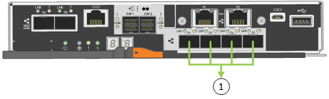

= 네트워크 정보 수집(SG5700)
:allow-uri-read: 
:icons: font
:imagesdir: ../media/

[role="lead"]
표를 사용하여 어플라이언스에 연결하는 각 네트워크에 필요한 정보를 기록합니다. 이러한 값은 하드웨어를 설치하고 구성하는 데 필요합니다.

TIP: 표를 사용하는 대신 ConfigBuilder와 함께 제공된 통합 문서를 사용합니다. ConfigBuilder 통합 문서를 사용하면 시스템 정보를 업로드하고 JSON 파일을 생성하여 StorageGRID 어플라이언스 설치 프로그램에서 일부 구성 단계를 자동으로 완료할 수 있습니다. 을 참조하십시오 link:automating-appliance-installation-and-configuration.html["어플라이언스 설치 및 구성 자동화"].

== E2800 컨트롤러의 SANtricity System Manager에 연결하는 데 필요한 정보입니다

E2800 시리즈 컨트롤러는 SANtricity 시스템 관리자에 사용할 관리 네트워크에 연결됩니다.

[cols="2a,1a"]
|===
| 정보가 필요합니다 | 귀사의 가치 

 a| 
관리 포트 1에 연결할 이더넷 스위치 포트
 a| 

 a| 
관리 포트 1의 MAC 주소(포트 P1 근처의 레이블에 인쇄되어 있음)
 a| 

 a| 
전원을 켠 후 사용할 수 있는 경우 관리 포트 1에 대해 DHCP 할당 IP 주소입니다

* 참고: * E2800 컨트롤러에 연결할 네트워크에 DHCP 서버가 포함된 경우 네트워크 관리자는 MAC 주소를 사용하여 DHCP 서버에서 할당한 IP 주소를 확인할 수 있습니다.
 a| 

 a| 
속도 및 이중 모드

* 참고: * SANtricity 시스템 관리자 관리 네트워크의 이더넷 스위치가 자동 교섭으로 설정되어 있는지 확인해야 합니다.
 a| 
반드시:

* 자동 협상(기본값)

 a| 
IP 주소 형식입니다
 a| 
다음 중 하나를 선택하십시오.

* IPv4
* IPv6

 a| 
관리 네트워크에서 어플라이언스에 사용할 고정 IP 주소입니다
 a| 
IPv4의 경우:

* IPv4 주소:
* 서브넷 마스크:
* 게이트웨이:

IPv6의 경우:

* IPv6 주소:
* 라우팅 가능한 IP 주소:
* E2800 컨트롤러 라우터 IP 주소:

|===

== E700SG 컨트롤러를 관리 네트워크에 연결하는 데 필요한 정보입니다

StorageGRID용 관리 네트워크는 시스템 관리 및 유지 보수에 사용되는 선택적 네트워크입니다. 어플라이언스는 E5500SG 컨트롤러의 1GbE 관리 포트를 사용하여 관리 네트워크에 연결됩니다.

[cols="2a,1a"]
|===
| 정보가 필요합니다 | 귀사의 가치 

 a| 
관리자 네트워크가 활성화되었습니다
 a| 
다음 중 하나를 선택하십시오.

* 아니요
* 예(기본값)

 a| 
네트워크 연결 모드
 a| 
다음 중 하나를 선택하십시오.

* 독립적입니다
* Active - 백업

 a| 
포트 1의 스위치 포트
 a| 

 a| 
포트 2용 스위치 포트(Active-Backup 네트워크 연결 모드만 해당)
 a| 

 a| 
전원을 켠 후 사용할 수 있는 경우 관리 포트 1에 대해 DHCP 할당 IP 주소입니다

* 참고: * 관리 네트워크에 DHCP 서버가 포함된 경우, E700SG 컨트롤러는 부팅 후 7개 세그먼트 디스플레이에 DHCP 할당 IP 주소를 표시합니다. MAC 주소를 사용하여 할당된 IP를 조회하여 DHCP 할당 IP 주소를 확인할 수도 있습니다.
 a| 
* IPv4 주소(CIDR):
* 게이트웨이:

 a| 
관리 네트워크의 어플라이언스 스토리지 노드에 사용할 고정 IP 주소입니다

* 참고: * 네트워크에 게이트웨이가 없는 경우 게이트웨이에 대해 동일한 정적 IPv4 주소를 지정합니다.
 a| 
* IPv4 주소(CIDR):
* 게이트웨이:

 a| 
관리 네트워크 서브넷(CIDR)
 a| 

|===

== E5500SG 컨트롤러에서 10/25-GbE 포트를 연결 및 구성하는 데 필요한 정보입니다

E5500SG 컨트롤러에 있는 4개의 10/25-GbE 포트는 StorageGRID 그리드 네트워크 및 클라이언트 네트워크에 연결됩니다.

NOTE: 을 참조하십시오 link:gathering-installation-information-sg5700.html#port-bond-modes["포트 결합 모드(E5500SG 컨트롤러)"].

[cols="2a,1a"]
|===
| 정보가 필요합니다 | 귀사의 가치 

 a| 
링크 속도

* 참고: * 25GbE를 선택한 경우 SPF28 트랜시버를 설치합니다. 자동 협상은 지원되지 않으므로 25GbE 포트 및 연결된 스위치도 구성해야 합니다.
 a| 
다음 중 하나를 선택하십시오.

* 10GbE(기본값)
* 25GbE

 a| 
포트 결합 모드
 a| 
다음 중 하나를 선택하십시오.

* 고정(기본값)
* 집계

 a| 
포트 1용 스위치 포트(클라이언트 네트워크)
 a| 

 a| 
포트 2용 스위치 포트(그리드 네트워크)
 a| 

 a| 
포트 3용 스위치 포트(클라이언트 네트워크)
 a| 

 a| 
포트 4용 스위치 포트(그리드 네트워크)
 a| 

|===

== E700SG 컨트롤러를 그리드 네트워크에 연결하는 데 필요한 정보입니다

StorageGRID용 그리드 네트워크는 모든 내부 StorageGRID 트래픽에 사용되는 필수 네트워크입니다. 이 어플라이언스는 E5500SG 컨트롤러의 10/25-GbE 포트를 사용하여 그리드 네트워크에 연결됩니다.

NOTE: 을 참조하십시오 link:gathering-installation-information-sg5700.html#port-bond-modes["포트 결합 모드(E5500SG 컨트롤러)"].

[cols="2a,1a"]
|===
| 정보가 필요합니다 | 귀사의 가치 

 a| 
네트워크 연결 모드
 a| 
다음 중 하나를 선택하십시오.

* Active-Backup(기본값)
* LACP(802.3ad)

 a| 
VLAN 태그 지정이 활성화되었습니다
 a| 
다음 중 하나를 선택하십시오.

* 아니요(기본값)
* 예

 a| 
VLAN 태그(VLAN 태그 지정이 활성화된 경우)
 a| 
0에서 4095 사이의 값을 입력합니다.

 a| 
전원을 켠 후 사용할 수 있는 경우 그리드 네트워크에 대해 DHCP 할당 IP 주소입니다

* 참고: * 그리드 네트워크에 DHCP 서버가 포함된 경우, E700SG 컨트롤러는 부팅된 후 7세그먼트 디스플레이에 그리드 네트워크에 대해 DHCP 할당 IP 주소를 표시합니다.
 a| 
* IPv4 주소(CIDR):
* 게이트웨이:

 a| 
그리드 네트워크에서 어플라이언스 스토리지 노드에 사용할 고정 IP 주소입니다

* 참고: * 네트워크에 게이트웨이가 없는 경우 게이트웨이에 대해 동일한 정적 IPv4 주소를 지정합니다.
 a| 
* IPv4 주소(CIDR):
* 게이트웨이:

 a| 
그리드 네트워크 서브넷(CIDR)

* 참고: * 클라이언트 네트워크가 활성화되지 않은 경우 컨트롤러의 기본 라우트는 여기에 지정된 게이트웨이를 사용합니다.
 a| 

|===

== E700SG 컨트롤러를 클라이언트 네트워크에 연결하는 데 필요한 정보입니다

StorageGRID용 클라이언트 네트워크는 일반적으로 그리드에 대한 클라이언트 프로토콜 액세스를 제공하는 데 사용되는 선택적 네트워크입니다. 어플라이언스는 E5500SG 컨트롤러의 10/25-GbE 포트를 사용하여 클라이언트 네트워크에 연결됩니다.

NOTE: 을 참조하십시오 link:gathering-installation-information-sg5700.html#port-bond-modes["포트 결합 모드(E5500SG 컨트롤러)"].

[cols="2a,1a"]
|===
| 정보가 필요합니다 | 귀사의 가치 

 a| 
클라이언트 네트워크가 활성화되었습니다
 a| 
다음 중 하나를 선택하십시오.

* 아니요(기본값)
* 예

 a| 
네트워크 연결 모드
 a| 
다음 중 하나를 선택하십시오.

* Active-Backup(기본값)
* LACP(802.3ad)

 a| 
VLAN 태그 지정이 활성화되었습니다
 a| 
다음 중 하나를 선택하십시오.

* 아니요(기본값)
* 예

 a| 
VLAN 태그

(VLAN 태그 지정이 설정된 경우)
 a| 
0에서 4095 사이의 값을 입력합니다.

 a| 
전원을 켠 후 사용할 수 있는 경우 클라이언트 네트워크에 대해 DHCP 할당 IP 주소입니다
 a| 
* IPv4 주소(CIDR):
* 게이트웨이:

 a| 
클라이언트 네트워크의 어플라이언스 스토리지 노드에 사용할 고정 IP 주소입니다

* 참고: * 클라이언트 네트워크가 활성화된 경우 컨트롤러의 기본 라우트는 여기에 지정된 게이트웨이를 사용합니다.
 a| 
* IPv4 주소(CIDR):
* 게이트웨이:

|===

== 포트 본드 모드

시기 link:configuring-network-links.html["네트워크 링크 구성"] E700SG 컨트롤러의 경우 Grid Network 및 선택적 Client Network에 연결되는 10/25-GbE 포트와 선택적 Admin Network에 연결되는 1GbE 관리 포트에 포트 결합을 사용할 수 있습니다. 포트 본딩을 사용하면 StorageGRID 네트워크와 어플라이언스 간에 중복 경로를 제공하여 데이터를 보호할 수 있습니다.

=== 10/25-GbE 포트의 네트워크 연결 모드

E5500SG 컨트롤러의 10/25GbE 네트워킹 포트는 그리드 네트워크 및 클라이언트 네트워크 연결을 위한 고정 포트 결합 모드 또는 애그리게이트 포트 결합 모드를 지원합니다.

==== 고정 포트 결합 모드

고정 모드는 10/25-GbE 네트워킹 포트의 기본 구성입니다.

image::../media/e5700sg_fixed_port.gif[고정 포트 결합 모드에 사용되는 포트]

[cols="1a,3a"]
|===
| 속성 표시기 | 어떤 포트가 연결되어 있는지 확인합니다 

 a| 
c
 a| 
이 네트워크를 사용하는 경우 포트 1과 3이 클라이언트 네트워크에 대해 함께 연결됩니다.

 a| 
g
 a| 
포트 2와 4는 그리드 네트워크를 위해 서로 연결되어 있습니다.

|===
고정 포트 결합 모드를 사용하는 경우 두 가지 네트워크 결합 모드 중 하나인 액티브-백업 또는 링크 통합 제어 프로토콜(LACP) 중 하나를 사용할 수 있습니다.

* Active-Backup 모드(기본값)에서는 한 번에 하나의 포트만 활성화됩니다. 활성 포트에 장애가 발생하면 백업 포트가 자동으로 페일오버 연결을 제공합니다. 포트 4는 포트 2(그리드 네트워크)에 대한 백업 경로를 제공하고 포트 3은 포트 1(클라이언트 네트워크)에 대한 백업 경로를 제공합니다.
* LACP 모드에서 각 포트 쌍은 컨트롤러와 네트워크 간에 논리 채널을 형성하므로 더 높은 처리량을 허용합니다. 한 포트에 장애가 발생해도 다른 포트는 계속 채널을 제공합니다. 처리량은 감소하지만 연결성은 영향을 받지 않습니다.

NOTE: 중복 연결이 필요하지 않은 경우 각 네트워크에 대해 하나의 포트만 사용할 수 있습니다. 그러나 StorageGRID가 설치된 후 그리드 관리자에서 경보가 발생하므로 케이블이 분리되었음을 나타냅니다. 이 알람을 안전하게 확인할 수 있습니다.

==== 애그리게이트 포트 결합 모드

애그리게이트 포트 결합 모드는 각 StorageGRID 네트워크의 성능을 크게 높이고 추가 페일오버 경로를 제공합니다.

[cols="1a,3a"]
|===
| 속성 표시기 | 어떤 포트가 연결되어 있는지 확인합니다 

 a| 
1
 a| 
연결된 모든 포트는 단일 LACP 결합으로 그룹화되므로 모든 포트를 그리드 네트워크 및 클라이언트 네트워크 트래픽에 사용할 수 있습니다.

|===
Aggregate 포트 결합 모드를 사용하려는 경우:

* LACP 네트워크 결합 모드를 사용해야 합니다.
* 각 네트워크에 대해 고유한 VLAN 태그를 지정해야 합니다. 이 VLAN 태그는 네트워크 트래픽이 올바른 네트워크로 라우팅되도록 각 네트워크 패킷에 추가됩니다.
* VLAN 및 LACP를 지원할 수 있는 스위치에 포트를 연결해야 합니다. LACP 결합에 여러 스위치가 사용되는 경우 스위치는 MLAG(Multi-Chassis Link Aggregation Group) 또는 이와 동등한 스위치를 지원해야 합니다.
* VLAN, LACP, MLAG 또는 이와 동등한 기능을 사용하도록 스위치를 구성하는 방법을 이해합니다.

4개의 10GbE 포트 모두를 사용하지 않으려면 1개, 2개 또는 3개의 포트를 사용할 수 있습니다. 둘 이상의 포트를 사용하면 10/25-GbE 포트 중 하나에 장애가 발생하더라도 일부 네트워크 연결이 계속 유지될 가능성을 극대화할 수 있습니다.

NOTE: 4개 미만의 포트를 사용하도록 선택한 경우 StorageGRID가 설치된 후 그리드 관리자에서 하나 이상의 알람이 발생하므로 케이블이 분리되었음을 나타냅니다. 알람을 안전하게 확인할 수 있습니다.

=== 1GbE 관리 포트의 네트워크 연결 모드

E5500SG 컨트롤러에 있는 2개의 1GbE 관리 포트의 경우 독립 네트워크 연결 모드 또는 Active-Backup 네트워크 연결 모드를 선택하여 옵션 관리 네트워크에 연결할 수 있습니다.

독립 모드에서는 관리 포트 1만 관리 네트워크에 연결됩니다. 이 모드는 중복 경로를 제공하지 않습니다. 관리 포트 2는 유선으로 남겨두고 임시 로컬 연결에 사용할 수 있습니다(IP 주소 169.254.0.1 사용).

Active-Backup 모드에서는 관리 포트 1과 2가 모두 관리 네트워크에 연결됩니다. 한 번에 하나의 포트만 활성화됩니다. 활성 포트에 장애가 발생하면 백업 포트가 자동으로 페일오버 연결을 제공합니다. 이러한 두 개의 물리적 포트를 하나의 논리 관리 포트에 연결하면 관리 네트워크에 대한 중복 경로가 제공됩니다.

NOTE: 1GbE 관리 포트가 Active-Backup 모드로 구성되어 있을 때 E5500SG 컨트롤러에 임시로 로컬 연결해야 하는 경우, 두 관리 포트에서 케이블을 분리하고 임시 케이블을 관리 포트 2에 연결한 다음 IP 주소 169.254.0.1을 사용하여 어플라이언스에 액세스합니다.

image::../media/e5700sg_bonded_management_ports.gif[E700SG 결합형 관리 포트]

.관련 정보
* link:cabling-appliance-sg5700.html["케이블 어플라이언스(SG5700)"]
* link:gathering-installation-information-sg5700.html#port-bond-modes["포트 결합 모드(E5500SG 컨트롤러)"]
* link:configuring-hardware.html["하드웨어 구성(SG5700)"]

