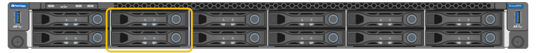

= SG100 및 SG1000 어플라이언스: 개요
:allow-uri-read: 
:icons: font
:imagesdir: ../media/

[role="lead"]
StorageGRID SG100 서비스 어플라이언스 및 SG1000 서비스 어플라이언스는 게이트웨이 노드 및 관리자 노드로 작동하여 StorageGRID 시스템에서 고가용성 로드 밸런싱 서비스를 제공할 수 있습니다. 두 어플라이언스 모두 게이트웨이 노드와 관리 노드(운영 또는 비운영)로 동시에 작동할 수 있습니다.

== 어플라이언스 기능

두 서비스 어플라이언스 모델 모두 다음과 같은 기능을 제공합니다.

* StorageGRID 시스템의 게이트웨이 노드 또는 관리자 노드 기능
* 노드 배포 및 구성을 간소화하는 StorageGRID 어플라이언스 설치 프로그램
* 를 구축하면 기존 관리 노드나 로컬 드라이브로 다운로드한 소프트웨어에서 StorageGRID 소프트웨어에 액세스할 수 있습니다. 배포 프로세스를 더욱 단순화하기 위해 제조 과정에서 최신 버전의 소프트웨어가 어플라이언스에 사전 로드됩니다.
* 일부 어플라이언스 하드웨어를 모니터링하고 진단하기 위한 베이스보드 관리 컨트롤러(BMC).
* 그리드 네트워크, 관리자 네트워크 및 클라이언트 네트워크를 포함한 세 가지 StorageGRID 네트워크에 모두 연결할 수 있는 기능:
+
** SG100은 그리드 네트워크 및 클라이언트 네트워크에 대한 10GbE 또는 25GbE 연결을 최대 4개까지 지원합니다.
** SG1000은 그리드 네트워크 및 클라이언트 네트워크에 대한 10, 25, 40 또는 100 GbE 연결을 최대 4개까지 지원합니다.

== SG100 및 SG1000 다이어그램

이 그림은 베젤이 분리된 SG100과 SG1000의 전면을 보여줍니다. 전면에서 두 어플라이언스는 베젤에 있는 제품 이름을 제외하고 동일합니다.

주황색 테두리로 표시된 두 개의 SSD(Solid State Drive)는 StorageGRID 운영 체제를 저장하는 데 사용될 수 있으며 이중화를 위해 RAID 1을 사용하여 미러링됩니다. SG100 또는 SG1000 서비스 어플라이언스가 관리 노드로 구성된 경우 이러한 드라이브는 감사 로그, 메트릭 및 데이터베이스 테이블을 저장하는 데 사용됩니다.

나머지 드라이브 슬롯은 비어 있습니다.

== SG100 커넥터

이 그림은 SG100 후면에 있는 커넥터를 보여줍니다.

image::../media/sg100_rear_connectors.png[후면 커넥터 SG100]

[cols="1a,2a,2a,2a"]
|===
| 속성 표시기 | 포트 | 유형 | 사용 

 a| 
1
 a| 
네트워크 포트 1-4
 a| 
케이블 또는 SFP 트랜시버 유형(SFP28 및 SFP+ 모듈 지원), 스위치 속도 및 구성된 링크 속도를 기반으로 한 10/25-GbE
 a| 
그리드 네트워크 및 StorageGRID용 클라이언트 네트워크에 연결합니다.

 a| 
2
 a| 
BMC 관리 포트
 a| 
1GbE(RJ-45)
 a| 
어플라이언스 베이스보드 관리 컨트롤러에 연결합니다.

 a| 
3
 a| 
진단 및 지원 포트
 a| 
* VGA
* 직렬, 115200 8-N-1
* USB

 a| 
기술 지원용으로 예약되어 있습니다.

 a| 
4
 a| 
관리 네트워크 포트 1
 a| 
1GbE(RJ-45)
 a| 
StorageGRID용 관리 네트워크에 어플라이언스를 연결합니다.

 a| 
5
 a| 
관리 네트워크 포트 2
 a| 
1GbE(RJ-45)
 a| 
옵션:

* StorageGRID용 관리 네트워크에 대한 중복 연결을 위해 관리 포트 1과 연결합니다.
* 연결이 끊어진 상태로 임시 로컬 액세스(IP 169.254.0.1)에 대해 사용 가능한 상태로 둡니다.
* 설치하는 동안 DHCP 할당 IP 주소를 사용할 수 없는 경우 IP 구성에 포트 2를 사용합니다.

|===

== SG1000 커넥터

이 그림은 SG1000 후면의 커넥터를 보여줍니다.

image::../media/sg1000_rear_connectors.png[후면 커넥터 SG1000]

[cols="1a,2a,2a,2a"]
|===
| 속성 표시기 | 포트 | 유형 | 사용 

 a| 
1
 a| 
네트워크 포트 1-4
 a| 
케이블 또는 트랜시버 유형, 스위치 속도 및 구성된 링크 속도를 기반으로 하는 10/25/40/100GbE QSFP28 및 QSFP+(40/100GbE)는 기본적으로 지원되며 QSA(별도 판매)와 함께 SFP28/SFP+ 트랜시버를 사용하여 10/25GbE 속도를 사용할 수 있습니다.
 a| 
그리드 네트워크 및 StorageGRID용 클라이언트 네트워크에 연결합니다.

 a| 
2
 a| 
BMC 관리 포트
 a| 
1GbE(RJ-45)
 a| 
어플라이언스 베이스보드 관리 컨트롤러에 연결합니다.

 a| 
3
 a| 
진단 및 지원 포트
 a| 
* VGA
* 직렬, 115200 8-N-1
* USB

 a| 
기술 지원용으로 예약되어 있습니다.

 a| 
4
 a| 
관리 네트워크 포트 1
 a| 
1GbE(RJ-45)
 a| 
StorageGRID용 관리 네트워크에 어플라이언스를 연결합니다.

 a| 
5
 a| 
관리 네트워크 포트 2
 a| 
1GbE(RJ-45)
 a| 
옵션:

* StorageGRID용 관리 네트워크에 대한 중복 연결을 위해 관리 포트 1과 연결합니다.
* 연결이 끊어진 상태로 임시 로컬 액세스(IP 169.254.0.1)에 대해 사용 가능한 상태로 둡니다.
* 설치하는 동안 DHCP 할당 IP 주소를 사용할 수 없는 경우 IP 구성에 포트 2를 사용합니다.

|===

== SG100 및 SG1000 응용 프로그램

게이트웨이 서비스를 제공하는 다양한 방법과 일부 그리드 관리 서비스의 이중화를 위해 StorageGRID 서비스 어플라이언스를 구성할 수 있습니다.

어플라이언스는 다음과 같은 방법으로 배포할 수 있습니다.

* 새 그리드 또는 기존 그리드를 게이트웨이 노드로 추가합니다
* 새 그리드에 기본 또는 비 기본 관리 노드로 추가하거나 기존 그리드에 비 기본 관리 노드로 추가합니다
* 게이트웨이 노드 및 관리 노드(기본 또는 비기본)로 동시에 작동합니다

이 어플라이언스를 사용하면 고가용성(HA) 그룹과 S3 또는 Swift 데이터 경로 연결을 위한 지능형 로드 밸런싱을 손쉽게 사용할 수 있습니다.

다음 예에서는 제품의 기능을 극대화하는 방법을 설명합니다.

* 2개의 SG100 또는 2개의 SG1000 어플라이언스를 사용하여 게이트웨이 노드로 구성하여 게이트웨이 서비스를 제공하십시오.
+

NOTE: SG100 및 SG1000 서비스 어플라이언스를 같은 사이트에 배포하지 마십시오. 성능을 예측할 수 없습니다.

* 일부 그리드 관리 서비스의 이중화를 제공하려면 SG100 또는 SG1000 어플라이언스 2개를 사용하십시오. 각 어플라이언스를 관리자 노드로 구성하여 이 작업을 수행합니다.
* 2개의 SG100 또는 2개의 SG1000 어플라이언스를 사용하여 하나 이상의 가상 IP 주소를 통해 액세스되는 고가용성 로드 밸런싱 및 트래픽 셰이핑 서비스를 제공합니다. 이 작업을 수행하려면 관리 노드 또는 게이트웨이 노드의 조합으로 어플라이언스를 구성하고 두 노드를 동일한 HA 그룹에 추가합니다.
+

NOTE: 동일한 HA 그룹에서 관리자 노드 및 게이트웨이 노드를 사용하는 경우 관리 노드 전용 포트는 페일오버되지 않습니다. 의 지침을 참조하십시오 https://docs.netapp.com/us-en/storagegrid-118/admin/configure-high-availability-group.html["HA 그룹 구성"^].

SG100과 SG1000 서비스 어플라이언스를 StorageGRID 스토리지 어플라이언스와 함께 사용하면 외부 하이퍼바이저 또는 컴퓨팅 하드웨어에 종속되지 않고 어플라이언스 전용 그리드를 구축할 수 있습니다.
