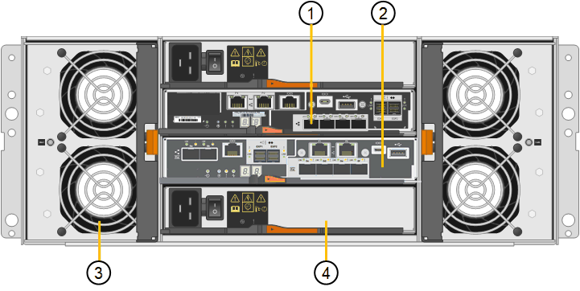

= SG5700 어플라이언스: 개요
:allow-uri-read: 
:icons: font
:imagesdir: ../media/

[role="lead"]
SG5700 StorageGRID 어플라이언스는 StorageGRID 그리드에서 스토리지 노드로 작동하는 통합 스토리지 및 컴퓨팅 플랫폼입니다. 어플라이언스는 어플라이언스 스토리지 노드와 가상(소프트웨어 기반) 스토리지 노드를 결합하는 하이브리드 그리드 환경에서 사용할 수 있습니다.

StorageGRID SG5700 시리즈 어플라이언스는 다음 기능을 제공합니다.

* StorageGRID 스토리지 노드의 스토리지 및 컴퓨팅 요소 통합
* 스토리지 노드 구축 및 구성을 단순화하기 위해 StorageGRID 어플라이언스 설치 프로그램을 포함합니다.
* 하드웨어 관리 및 모니터링을 위한 E-Series SANtricity System Manager 포함.
* StorageGRID 그리드 네트워크 및 클라이언트 네트워크에 대한 10GbE 또는 25GbE 연결을 최대 4개까지 지원합니다.
* FDE(전체 디스크 암호화) 드라이브 또는 FIPS 드라이브를 지원합니다. 이러한 드라이브를 SANtricity 시스템 관리자의 드라이브 보안 기능과 함께 사용하면 데이터에 대한 무단 액세스가 방지됩니다.

SG5712 및 SG5712X, SG5760 및 SG5760X의 4가지 모델에서 SG57어플라이언스를 사용할 수 있습니다. 스토리지 컨트롤러의 상호 연결 포트 위치를 제외하고는 SG5712와 SG5712X 간에 사양 또는 기능 차이가 없습니다. 마찬가지로, 스토리지 컨트롤러에서 상호 연결 포트의 위치를 제외하고 SG5760과 SG5760X 사이에는 사양 또는 기능 차이가 없습니다.

== SG5700 구성 요소

SG5700 모델에는 다음과 같은 구성 요소가 포함됩니다.

[role="tabbed-block"]
====
.SG5712를 참조하십시오
--
컴퓨팅 컨트롤러:: E5500SG 컨트롤러
스토리지 컨트롤러:: E2800A 컨트롤러
섀시:: E-Series DE212C 엔클로저, 2개의 랙 유닛(2U) 엔클로저
드라이브:: NL-SAS 드라이브 12개(3.5인치)
중복 전원 공급 장치 및 팬:: 2개의 전원 팬 캐니스터

--
.SG5712X입니다
--
컴퓨팅 컨트롤러:: E5500SG 컨트롤러
스토리지 컨트롤러:: E2800B 컨트롤러
섀시:: E-Series DE212C 엔클로저, 2개의 랙 유닛(2U) 엔클로저
드라이브:: NL-SAS 드라이브 12개(3.5인치)
중복 전원 공급 장치 및 팬:: 2개의 전원 팬 캐니스터

--
.SG5760입니다
--
컴퓨팅 컨트롤러:: E5500SG 컨트롤러
스토리지 컨트롤러:: E2800A 컨트롤러
섀시:: E-Series DE460C 엔클로저, 4개의 랙 유닛(4U) 엔클로저
드라이브:: NL-SAS 드라이브 60개(3.5인치)
중복 전원 공급 장치 및 팬:: 두 개의 전원 캐니스터 및 두 개의 팬 캐니스터

--
.SG5760X입니다
--
컴퓨팅 컨트롤러:: E5500SG 컨트롤러
스토리지 컨트롤러:: E2800B 컨트롤러
섀시:: E-Series DE460C 엔클로저, 4개의 랙 유닛(4U) 엔클로저
드라이브:: NL-SAS 드라이브 60개(3.5인치)
중복 전원 공급 장치 및 팬:: 두 개의 전원 캐니스터 및 두 개의 팬 캐니스터

--
====
StorageGRID 어플라이언스에서 사용할 수 있는 최대 기본 스토리지는 각 엔클로저의 드라이브 수에 따라 고정됩니다. 쉘프를 추가하려면 드라이브를 추가할 때 사용 가능한 스토리지를 확장할 수 없습니다.

== SG5700 다이어그램

=== SG5712 프론트 및 리어 뷰

그림에서는 12개의 드라이브를 장착할 수 있는 2U 엔클로저의 SG5712의 전면 및 후면을 보여 줍니다.

image::../media/sg5712_front_and_back_views.gif[SG5712 어플라이언스의 전면 및 후면]

=== SG5712 구성 요소

SG5712에는 컨트롤러 2개와 전원 팬 캐니스터 2개가 포함되어 있습니다.

image::../media/sg5712_with_callouts.gif[SG5712 어플라이언스의 컨트롤러 및 전원 팬 캐니스터]

[cols="1a,3a"]
|===
| 속성 표시기 | 설명 

 a| 
1
 a| 
E2800A 컨트롤러(스토리지 컨트롤러)

 a| 
2
 a| 
E5500SG 컨트롤러(컴퓨팅 컨트롤러)

 a| 
3
 a| 
전원 팬 캐니스터

|===

=== SG5712X 전면도 및 후면도

이 그림은 12개의 드라이브를 장착할 수 있는 2U 엔클로저인 SG5712X의 전면과 후면을 보여줍니다.

image::../media/sg5712x_front_and_back_views.gif[SG5712X 어플라이언스의 앞면과 뒷면]

=== SG5712X 구성 요소

SG5712X에는 컨트롤러 2개와 전원 팬 캐니스터 2개가 포함되어 있습니다.

image::../media/sg5712x_with_callouts.gif[SG5712X 어플라이언스의 컨트롤러 및 전원 팬 캐니스터]

[cols="1a,3a"]
|===
| 속성 표시기 | 설명 

 a| 
1
 a| 
E2800B 컨트롤러(스토리지 컨트롤러)

 a| 
2
 a| 
E5500SG 컨트롤러(컴퓨팅 컨트롤러)

 a| 
3
 a| 
전원 팬 캐니스터

|===

=== SG5760 전면도 및 후면도

이 그림은 SG5760 모델의 전면과 후면, 5개의 드라이브 드로어에 60개의 드라이브를 장착할 수 있는 4U 엔클로저를 보여 줍니다.

image::../media/sg5760_front_and_back_views.gif[SG5760 어플라이언스의 전면 및 후면]

=== SG5760 구성 요소

SG5760에는 컨트롤러 2개, 팬 캐니스터 2개, 전원 캐니스터 2개가 있습니다.

image::../media/sg5760_with_callouts.gif[컨트롤러,fan canisters,and power canisters in SG5760 appliance]

[cols="1a,2a"]
|===
| 속성 표시기 | 설명 

 a| 
1
 a| 
E2800A 컨트롤러(스토리지 컨트롤러)

 a| 
2
 a| 
E5500SG 컨트롤러(컴퓨팅 컨트롤러)

 a| 
3
 a| 
팬 캐니스터(1/2)

 a| 
4
 a| 
전원 캐니스터(1/2)

|===

=== SG5760X 전면 및 후면

그림에서는 SG5760X 모델의 전면과 후면, 5개의 드라이브 드로어에 60개의 드라이브를 장착할 수 있는 4U 엔클로저를 보여 줍니다.

image::../media/sg5760x_front_and_back_views.gif[SG5760X 어플라이언스의 앞면과 뒷면]

=== SG5760X 구성 요소

SG5760X에는 컨트롤러 2개, 팬 캐니스터 2개 및 전원 캐니스터 2개가 포함되어 있습니다.

[cols="1a,3a"]
|===
| 속성 표시기 | 설명 

 a| 
1
 a| 
E2800B 컨트롤러(스토리지 컨트롤러)

 a| 
2
 a| 
E5500SG 컨트롤러(컴퓨팅 컨트롤러)

 a| 
3
 a| 
팬 캐니스터(1/2)

 a| 
4
 a| 
전원 캐니스터(1/2)

|===

== SG5700 컨트롤러

StorageGRID 어플라이언스의 12 드라이브 SG5712 및 SG5712X 및 60 드라이브 SG5760 및 SG5760X 모델에는 모두 E5500SG 컴퓨팅 컨트롤러와 E-Series E2800 스토리지 컨트롤러가 포함됩니다.

* SG5712 및 SG5760은 E2800A 컨트롤러를 사용합니다.
* SG5712X 및 SG5760X는 E2800B 컨트롤러를 사용합니다.

E2800A 및 E2800B 컨트롤러는 상호 연결 포트의 위치를 제외하고 사양 및 기능에서 동일합니다.

=== E5500SG 컴퓨팅 컨트롤러

* 어플라이언스의 컴퓨팅 서버로 작동합니다.
* StorageGRID 어플라이언스 설치 프로그램을 포함합니다.
+

NOTE: StorageGRID 소프트웨어는 어플라이언스에 사전 설치되어 있지 않습니다. 이 소프트웨어는 어플라이언스를 배포할 때 관리 노드에서 액세스합니다.

* 는 그리드 네트워크, 관리자 네트워크 및 클라이언트 네트워크를 포함하여 세 개의 StorageGRID 네트워크에 모두 연결할 수 있습니다.
* E2800 컨트롤러에 연결하고 이니시에이터로 작동합니다.

==== E700SG 커넥터

image::../media/e5700sg_controller_with_callouts.gif[E5500SG 컨트롤러의 커넥터]

[cols="1a,2a,2a,2a"]
|===
| 속성 표시기 | 포트 | 유형 | 사용 

 a| 
1
 a| 
상호 연결 포트 1 및 2
 a| 
16Gb/s FC(파이버 채널), 광 SFP
 a| 
E5500SG 컨트롤러를 E2800 컨트롤러에 연결합니다.

 a| 
2
 a| 
진단 및 지원 포트
 a| 
* RJ-45 직렬 포트
* 마이크로 USB 직렬 포트
* USB 포트

 a| 
기술 지원용으로 예약되어 있습니다.

 a| 
3
 a| 
드라이브 확장 포트
 a| 
12Gb/s SAS
 a| 
사용 안 합니다.

 a| 
4
 a| 
네트워크 포트 1-4
 a| 
SFP 트랜시버 유형, 스위치 속도 및 구성된 링크 속도를 기반으로 한 10GbE 또는 25GbE
 a| 
그리드 네트워크 및 StorageGRID용 클라이언트 네트워크에 연결합니다.

 a| 
5
 a| 
관리 포트 1
 a| 
1Gb(RJ-45) 이더넷
 a| 
StorageGRID용 관리자 네트워크에 연결합니다.

 a| 
6
 a| 
관리 포트 2
 a| 
1Gb(RJ-45) 이더넷
 a| 
옵션:

* StorageGRID용 관리 네트워크에 대한 중복 연결을 위해 관리 포트 1과 연결합니다.
* 유선을 해제하고 임시 로컬 액세스(IP 169.254.0.1)를 위해 사용 가능한 상태로 둡니다.
* 설치하는 동안 DHCP 할당 IP 주소를 사용할 수 없는 경우 IP 구성에 포트 2를 사용합니다.

|===

=== E2800 스토리지 컨트롤러

SG5700에는 E2800A 및 E2800B의 2가지 버전의 E2800 스토리지 컨트롤러가 사용됩니다. E2800A에는 HIC가 없으며 E2800B에는 4포트 HIC가 있습니다. 두 컨트롤러 버전은 상호 연결 포트의 위치를 제외하고 동일한 사양과 기능을 가집니다.

E2800 시리즈 스토리지 컨트롤러의 사양은 다음과 같습니다.

* 어플라이언스에 대한 스토리지 컨트롤러로 작동합니다.
* 드라이브의 데이터 스토리지를 관리합니다.
* 단일 모드에서 표준 E-Series 컨트롤러로 사용됩니다.
* SANtricity OS 소프트웨어(컨트롤러 펌웨어) 포함.
* 어플라이언스 하드웨어를 모니터링하고 경고, AutoSupport 기능 및 드라이브 보안 기능을 관리하기 위한 SANtricity System Manager를 포함합니다.
* E5500SG 컨트롤러에 연결하고 타겟으로 작동합니다.

==== E2800A 커넥터

image::../media/e2800_controller_with_callouts.gif[E2800A 컨트롤러의 커넥터]

==== E2800B 커넥터

image::../media/e2800B_controller_with_callouts.gif[E2800B 컨트롤러의 커넥터]

[cols="1a,2a,2a,2a"]
|===
| 속성 표시기 | 포트 | 유형 | 사용 

 a| 
1
 a| 
상호 연결 포트 1 및 2
 a| 
16Gb/s FC 광 SFP
 a| 
E2800 컨트롤러를 E5500SG 컨트롤러에 연결합니다.

 a| 
2
 a| 
관리 포트 1 및 2
 a| 
1Gb(RJ-45) 이더넷
 a| 
* 포트 1 옵션:
+
** 관리 네트워크에 연결하여 SANtricity 시스템 관리자에 대한 직접 TCP/IP 액세스를 활성화합니다
** 스위치 포트 및 IP 주소를 저장하려면 유선 연결을 해제하십시오.  그리드 관리자 또는 스토리지 그리드 어플라이언스 설치 프로그램을 사용하여 SANtricity 시스템 관리자에 액세스합니다.

* 참고 *: 정확한 로그 타임스탬프를 위한 NTP 동기화와 같은 일부 선택적 SANtricity 기능은 포트 1을 유선으로 남겨 두도록 선택한 경우 사용할 수 없습니다.

* 참고 *: 포트 1을 유선으로 연결하지 않은 상태로 두면 StorageGRID 11.5 이상 및 SANtricity 11.70 이상이 필요합니다.

* 포트 2는 기술 지원용으로 예약되어 있습니다.

 a| 
3
 a| 
진단 및 지원 포트
 a| 
* RJ-45 직렬 포트
* 마이크로 USB 직렬 포트
* USB 포트

 a| 
기술 지원용으로 예약되어 있습니다.

 a| 
4
 a| 
드라이브 확장 포트:
 a| 
12Gb/s SAS
 a| 
사용 안 합니다.

|===
.관련 정보
https://docs.netapp.com/us-en/e-series-family/index.html["NetApp E-Series 설명서"^]
