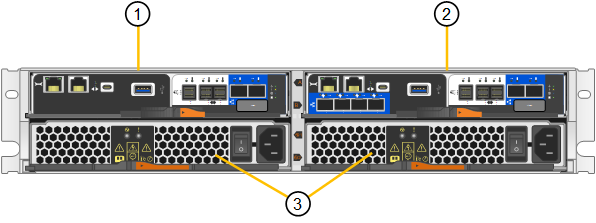

= SG5800 어플라이언스: 개요
:allow-uri-read: 
:icons: font
:imagesdir: ../media/

[role="lead"]
SG5800 시리즈 StorageGRID 어플라이언스는 StorageGRID 그리드에서 스토리지 노드로 작동하는 통합 스토리지 및 컴퓨팅 플랫폼입니다.

StorageGRID SG5800 시리즈 어플라이언스는 다음과 같은 기능을 제공합니다.

* StorageGRID 스토리지 노드의 스토리지 및 컴퓨팅 요소 통합
* 스토리지 노드 구축 및 구성을 단순화하기 위해 StorageGRID 어플라이언스 설치 프로그램을 포함합니다.
* 하드웨어 관리 및 모니터링을 위한 E-Series SANtricity System Manager가 포함됩니다.
* StorageGRID 그리드 네트워크 및 클라이언트 네트워크에 대한 10GbE 또는 25GbE 연결을 최대 4개까지 지원합니다.
* FDE(전체 디스크 암호화) 드라이브 또는 FIPS 드라이브를 지원합니다. 이러한 드라이브를 SANtricity 시스템 관리자의 드라이브 보안 기능과 함께 사용하면 데이터에 대한 무단 액세스가 방지됩니다.

SG5800 어플라이언스는 SG5812와 SG5860의 두 가지 모델로 제공됩니다.

== SG5800 구성 요소

SG5800 모델에는 다음과 같은 구성 요소가 포함되어 있습니다.

[role="tabbed-block"]
====
.SG5812
--
컴퓨팅 컨트롤러:: SG5800 컨트롤러
스토리지 컨트롤러:: E4000 컨트롤러
섀시:: E-Series DE212C 엔클로저, 2개의 랙 유닛(2U) 엔클로저
드라이브:: NL-SAS 드라이브 12개(3.5인치)
중복 전원 공급 장치 및 팬:: 2개의 전원 팬 캐니스터

--
.SG5860
--
컴퓨팅 컨트롤러:: SG5800 컨트롤러
스토리지 컨트롤러:: E4000 컨트롤러
섀시:: E-Series DE460C 엔클로저, 4개의 랙 유닛(4U) 엔클로저
드라이브:: NL-SAS 드라이브 60개(3.5인치)
중복 전원 공급 장치 및 팬:: 두 개의 전원 캐니스터 및 두 개의 팬 캐니스터

--
====
StorageGRID 어플라이언스에서 사용할 수 있는 최대 기본 스토리지는 각 엔클로저의 드라이브 수에 따라 고정됩니다. 쉘프를 추가하려면 드라이브를 추가할 때 사용 가능한 스토리지를 확장할 수 없습니다.

== SG5800 다이어그램

=== SG5812 전면도 및 후면도

이 그림은 12개의 드라이브를 장착할 수 있는 2U 엔클로저인 SG5812의 전면과 후면을 보여줍니다.

image::../media/sg5812_front_and_back_views.png[SG5812 어플라이언스의 앞면과 뒷면]

=== SG5812 구성 요소

SG5812에는 컨트롤러 2개와 전원 팬 캐니스터 2개가 포함되어 있습니다.

[cols="1a,3a"]
|===
| 속성 표시기 | 설명 

 a| 
1
 a| 
E4000 컨트롤러(스토리지 컨트롤러)

 a| 
2
 a| 
SG5800 컨트롤러(컴퓨팅 컨트롤러)

 a| 
3
 a| 
전원 팬 캐니스터

|===

=== SG5860 전면도 및 후면도

이 그림은 60개의 드라이브를 5개의 드라이브 드로어에 장착할 수 있는 4U 엔클로저인 SG5860 모델의 전면과 후면을 보여줍니다.

image::../media/sg5860_front_and_back_views.png[SG5860 어플라이언스의 앞면과 뒷면]

=== SG5860 구성 요소

SG5860에는 컨트롤러 2개, 팬 캐니스터 2개, 전원 캐니스터 2개가 포함되어 있습니다.

image::../media/sg5860_with_callouts.png[컨트롤러,fan canisters,and power canisters in SG5860 appliance]

[cols="1a,2a"]
|===
| 속성 표시기 | 설명 

 a| 
1
 a| 
E4000 컨트롤러(스토리지 컨트롤러)

 a| 
2
 a| 
SG5800 컨트롤러(컴퓨팅 컨트롤러)

 a| 
3
 a| 
팬 캐니스터(1/2)

 a| 
4
 a| 
전원 캐니스터(1/2)

|===

== SG5800 컨트롤러

StorageGRID 어플라이언스의 12드라이브 SG5812 및 60개 드라이브 SG5860 모델에는 SG5800 컴퓨팅 컨트롤러와 E-Series E4000 스토리지 컨트롤러가 포함됩니다.

=== SG5800 컴퓨팅 컨트롤러

* 어플라이언스의 컴퓨팅 서버로 작동합니다.
* StorageGRID 어플라이언스 설치 프로그램을 포함합니다.
+

NOTE: StorageGRID 소프트웨어는 어플라이언스에 사전 설치되어 있지 않습니다. 이 소프트웨어는 어플라이언스를 배포할 때 관리 노드에서 액세스합니다.

* 는 그리드 네트워크, 관리자 네트워크 및 클라이언트 네트워크를 포함하여 세 개의 StorageGRID 네트워크에 모두 연결할 수 있습니다.
* E4000 컨트롤러에 연결하고 이니시에이터로 작동합니다.

==== SG5800 커넥터

image::../media/sg5800_controller_with_callouts.png[SG5800 컨트롤러의 커넥터]

[cols="1a,2a,2a,2a"]
|===
| 속성 표시기 | 포트 | 유형 | 사용 

 a| 
1
 a| 
관리 포트 1
 a| 
1Gb(RJ-45) 이더넷
 a| 
StorageGRID용 관리자 네트워크에 연결합니다.

 a| 
2
 a| 
진단 및 지원 포트
 a| 
* RJ-45 직렬 포트
* USB-C 직렬 포트
* USB 포트

 a| 
기술 지원용으로 예약되어 있습니다.

 a| 
3
 a| 
드라이브 확장 포트
 a| 
12Gb/s SAS
 a| 
사용 안 합니다.

 a| 
4
 a| 
상호 연결 포트 1 및 2
 a| 
25GbE iSCSI
 a| 
SG5800 컨트롤러를 E4000 컨트롤러에 연결합니다.

 a| 
5
 a| 
네트워크 포트 1-4
 a| 
SFP 트랜시버 유형, 스위치 속도 및 구성된 링크 속도를 기반으로 한 10GbE 또는 25GbE
 a| 
그리드 네트워크 및 StorageGRID용 클라이언트 네트워크에 연결합니다.

|===

=== E4000 저장소 컨트롤러

E4000 시리즈 스토리지 컨트롤러의 사양은 다음과 같습니다.

* 어플라이언스에 대한 스토리지 컨트롤러로 작동합니다.
* 드라이브의 데이터 스토리지를 관리합니다.
* 단일 모드에서 표준 E-Series 컨트롤러로 사용됩니다.
* SANtricity OS 소프트웨어(컨트롤러 펌웨어) 포함.
* 어플라이언스 하드웨어를 모니터링하고 경고, AutoSupport 기능 및 드라이브 보안 기능을 관리하기 위한 SANtricity System Manager를 포함합니다.
* SG5800 컨트롤러에 연결하고 타겟 역할을 수행합니다.

==== E4000 커넥터

image::../media/e4000_controller_with_callouts.png[E4000 컨트롤러의 커넥터]

[cols="1a,2a,2a,2a"]
|===
| 속성 표시기 | 포트 | 유형 | 사용 

 a| 
1
 a| 
관리 포트입니다
 a| 
1Gb(RJ-45) 이더넷
 a| 
포트 옵션:
** 관리 네트워크에 연결하여 SANtricity 시스템 관리자에 대한 직접 TCP/IP 액세스를 활성화합니다
**스위치 포트와 IP 주소를 저장하려면 무선을 그대로 두십시오.  그리드 관리자 또는 스토리지 그리드 어플라이언스 설치 프로그램을 사용하여 SANtricity 시스템 관리자에 액세스합니다.

* 참고 *: 관리 포트를 유선으로 두도록 선택하면 정확한 로그 타임스탬프를 위한 NTP 동기화와 같은 일부 선택적 SANtricity 기능을 사용할 수 없습니다.

* 참고 *: 관리 포트를 유선으로 사용하지 않을 때는 StorageGRID 11.8 이상 및 SANtricity 11.8 이상이 필요합니다.

 a| 
2
 a| 
진단 및 지원 포트
 a| 
* RJ-45 직렬 포트
* USB-C 직렬 포트
* USB 포트

 a| 
기술 지원용으로 예약되어 있습니다.

 a| 
3
 a| 
드라이브 확장 포트:
 a| 
12Gb/s SAS
 a| 
사용 안 합니다.

 a| 
4
 a| 
상호 연결 포트 1 및 2
 a| 
25GbE iSCSI
 a| 
E4000 컨트롤러를 SG5800 컨트롤러에 연결합니다.

|===
.관련 정보
https://docs.netapp.com/us-en/e-series-family/index.html["NetApp E-Series 설명서"^]
