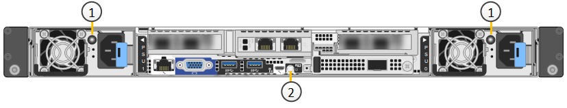
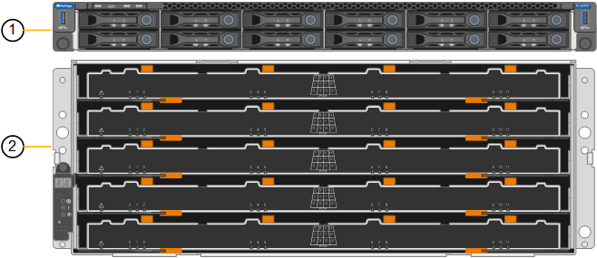

= SG6100 어플라이언스: 개요
:allow-uri-read: 
:icons: font
:imagesdir: ../media/

[role="lead"]
StorageGRID SG6100 시리즈 어플라이언스는 StorageGRID 시스템에서 스토리지 노드로 작동합니다.  다른 모든 StorageGRID 어플라이언스와 마찬가지로, 한 번의 구축으로 다른 어플라이언스 모델 및 소프트웨어 전용 노드와 자유롭게 혼합할 수 있습니다.

StorageGRID SG6160 어플라이언스에는 읽기 캐시로 작동하는 NVMe SSD 쌍이 포함된 컴퓨팅 컨트롤러와 스토리지 컨트롤러 2개와 NL-SAS 하드 드라이브 60개를 포함하는 스토리지 컨트롤러 쉘프가 포함됩니다. 최대 2개의 선택적 확장 셸프를 추가하여 최대 180개의 NL-SAS 하드 드라이브까지 확장할 수 있습니다. StorageGRID SGF6112 어플라이언스는 12개의 NVMe SSD가 채워진 소형 1U 폼 팩터를 갖춘 All-Flash 어플라이언스입니다.

SGF6112 및 SG6160 어플라이언스는 다음과 같은 기능을 제공합니다.

* StorageGRID 스토리지 노드의 스토리지 및 컴퓨팅 요소를 통합합니다.
* 스토리지 노드 구축 및 구성을 간소화하는 StorageGRID 어플라이언스 설치 프로그램이 포함되어 있습니다.
* 컴퓨팅 컨트롤러의 하드웨어를 모니터링하고 진단하는 BMC(베이스보드 관리 컨트롤러)를 포함합니다.

SGF6112는 다음과 같은 데이터 보호 기능을 제공합니다.

* 단일 SSD 장애 후 오브젝트 가용성에 영향을 주지 않고 기능을 수행할 수 있습니다.
* 여러 개의 SSD 장애 발생 후 기본 RAID 구성 설계에 따라 필요한 최소한의 개체 가용성만 제공하여 기능을 수행할 수 있습니다.
+

NOTE: 구성된 ILM 정책에 따라 로컬에서 사용할 수 없는 오브젝트에 대한 요청을 다른 노드에서 처리할 수 있으므로 가용성도 감소되지 않습니다.

* 서비스 중에 SSD 장애가 발생하여 노드 루트 볼륨(StorageGRID 운영 체제)이 RAID 하우징에 완벽하게 손상되지 않아 완전히 복구할 수 있습니다.
* 여러 개의 SSD 장애로 인해 로컬 데이터가 손실되는 경우 다른 노드의 복사본이나 삭제 코딩 청크를 통해 오브젝트 데이터를 자동으로 복원할 수 있습니다.

SG6160은 다음과 같은 데이터 보호 기능을 제공합니다.

* 2개의 하드 드라이브(HDD)에 장애가 발생해도 개체 가용성에 영향을 주지 않고 작동 가능
* 장애 및 교체 이벤트(설치 중에 DDP 또는 DDP16용으로 구성된 경우)에 대비하여 HDD를 빠르게 대피 및 리빌드하여 표준 RAID6에 비해 데이터 내구성을 향상합니다.
* 2개의 HDD의 장애로부터 완전하게 복구 가능
* HDD에서 여러 번 장애가 발생하면 로컬 데이터가 손실될 수 있으며, 다른 노드의 복사본 또는 삭제 코딩 청크로부터 오브젝트 데이터를 자동으로 복원할 수 있습니다.

== SG6100 하드웨어 구성 요소

=== SGF6112 어플라이언스

SGF6112 어플라이언스에는 다음과 같은 구성 요소가 포함되어 있습니다.

기능과 성능을 제공합니다:: 다음을 포함하는 1랙 유닛(1U) 서버:
+
--
* 48코어(96스레드)를 제공하는 2.1GHz/2.6GHz 165W 프로세서 2개
* 256GB RAM
* 2 × 1/10 GBase-T 포트
* 그리드/클라이언트 네트워크 트래픽용 10/25 GbE 이더넷 포트 4개
* 256GB 내부 부팅 드라이브 1개(StorageGRID 소프트웨어 포함)
* 하드웨어 관리를 단순화하는 베이스보드 관리 컨트롤러(BMC)
* 중복 전원 공급 장치 및 팬

--

=== SG6160 어플라이언스

SG6160 어플라이언스에는 다음과 같은 구성 요소가 포함되어 있습니다.

컴퓨팅 컨트롤러:: SG6100-CN 컨트롤러는 다음을 포함하는 1랙 유닛(1U) 서버입니다.
+
--
* 48코어(96스레드)
* 256GB RAM
* 최대 4개의 25GbE 통합 이더넷 대역폭(또는 100G NIC SKU 옵션 포함 최대 4개의 100GbE)
* 100GbE 상호 연결 1개
* 읽기 캐시를 위한 2개의 NVMe SSD
* 하드웨어 관리를 단순화하는 베이스보드 관리 컨트롤러(BMC)
* 중복 전원 공급 장치 및 팬

--
스토리지 컨트롤러 쉘프:: E-Series E4000 컨트롤러 쉘프(스토리지 어레이)는 다음을 포함하는 4U 셸프입니다.
+
--
* 스토리지 컨트롤러 대체 작동을 지원하기 위한 E4000 시리즈 컨트롤러 2개(이중 구성
* 60개의 3.5인치 NL-SAS 드라이브를 장착할 수 있는 5드로어 드라이브 쉘프
* 중복 전원 공급 장치 및 팬

--
선택 사항: 스토리지 확장 쉘프:: 각 SG6160 어플라이언스에는 총 180개 드라이브에 대한 확장 쉘프가 하나 또는 두 개 있을 수 있습니다.
+
--

NOTE: 확장 셸프는 초기 구축 시 설치하거나 나중에 추가할 수 있습니다.

E-Series DE460C 엔클로저는 다음을 포함하는 4U 셸프입니다.

* 입출력 모듈(IOM) 2개
* 각각 12개의 NL-SAS 드라이브가 장착된 5개의 드로어, 총 60개의 드라이브
* 중복 전원 공급 장치 및 팬

--

== SGF6112 및 SG6160 다이어그램

=== SGF6112 정면도

이 그림은 베젤이 없는 SGF6112의 전면을 보여줍니다. 이 어플라이언스에는 SSD 드라이브 12개가 포함된 1U 컴퓨팅 및 스토리지 플랫폼이 포함되어 있습니다.

image::../media/sgf6112_front_with_ssds.png[SGF6112 정면 뷰]

=== SGF6112 후면도

이 그림은 포트, 팬 및 전원 공급 장치를 포함하여 SGF6112의 후면을 보여줍니다.

image::../media/sgf6112_rear_view.png[SGF6112 후면도]

[cols="1a,2a,2a,2a"]
|===
| 속성 표시기 | 포트 | 유형 | 사용 

 a| 
1
 a| 
네트워크 포트 1-4
 a| 
케이블 또는 SFP 트랜시버 유형(SFP28 및 SFP+ 모듈 지원), 스위치 속도 및 구성된 링크 속도를 기반으로 한 10/25-GbE
 a| 
그리드 네트워크 및 StorageGRID용 클라이언트 네트워크에 연결합니다.

 a| 
2
 a| 
BMC 관리 포트
 a| 
1GbE(RJ-45)
 a| 
어플라이언스 베이스보드 관리 컨트롤러에 연결합니다.

 a| 
3
 a| 
진단 및 지원 포트
 a| 
* VGA
* USB
* 마이크로 USB 콘솔 포트
* Micro-SD 슬롯 모듈

 a| 
기술 지원용으로 예약되어 있습니다.

 a| 
4
 a| 
관리 네트워크 포트 1
 a| 
1/10GbE(RJ-45)
 a| 
StorageGRID용 관리 네트워크에 어플라이언스를 연결합니다.

 a| 
5
 a| 
관리 네트워크 포트 2
 a| 
1/10GbE(RJ-45)
 a| 
옵션:

* StorageGRID용 관리 네트워크에 대한 중복 연결을 위해 관리 네트워크 포트 1과 연결합니다.
* 연결이 끊어진 상태로 임시 로컬 액세스(IP 169.254.0.1)에 대해 사용 가능한 상태로 둡니다.
* 설치하는 동안 DHCP 할당 IP 주소를 사용할 수 없는 경우 IP 구성에 포트 2를 사용합니다.

|===
이 그림에서는 전원 공급 장치의 위치를 보여 주고 SGF6112의 후면에 있는 LED를 식별합니다. 추가 상태 및 작동 상태 표시등은 어플라이언스 포트에 있습니다. 이러한 LED는 어플라이언스 모델에 따라 다를 수 있습니다.

[cols="1a,2a,3a"]
|===
| 속성 표시기 | LED | 상태 

 a| 
1
 a| 
전원 공급 장치 LED
 a| 
* 녹색, 켜짐: 제품에 전원이 공급되고 전원 버튼이 켜져 있습니다.
* 녹색, 깜박임: 제품에 전원이 공급되고 전원 단추가 꺼져 있습니다.
* 꺼짐: 어플라이언스에 전원이 공급되지 않습니다.
* 주황색: 전원 공급 장치에 오류가 있습니다.

 a| 
2
 a| 
LED를 식별합니다
 a| 
* 파란색, 깜박임: 캐비닛이나 랙에 있는 제품을 나타냅니다.
* 파란색, 켜짐: 캐비닛이나 랙에 있는 제품을 나타냅니다.
* 꺼짐: 캐비닛이나 랙에서 제품을 육안으로 확인할 수 없습니다.

|===

=== SG6160 전면

이 그림은 1U 컴퓨팅 컨트롤러와 4U 쉘프에 5개의 드라이브 드로어에 2개의 스토리지 컨트롤러와 60개 드라이브가 포함된 SG6160의 전면을 보여줍니다.

[cols="1a,2a"]
|===
| 속성 표시기 | 설명 

 a| 
1
 a| 
전면 베젤이 제거된 SG6100-CN 컴퓨팅 컨트롤러

 a| 
2
 a| 
전면 베젤이 분리된 E4000 컨트롤러 쉘프(선택적 확장 셸프는 동일하게 보임)

|===

=== SG6160 후면

이 그림에서는 컴퓨팅 및 스토리지 컨트롤러, 팬, 전원 공급 장치를 비롯한 SG6160의 뒷면을 보여줍니다.

image::../media/sg6160_rear_view.png[SG6160 후면]

[cols="1a,2a"]
|===
| 속성 표시기 | 설명 

 a| 
1
 a| 
SG6100-CN 컴퓨팅 컨트롤러용 전원 공급 장치(1/2

 a| 
2
 a| 
SG6100-CN 컴퓨팅 컨트롤러용 커넥터

 a| 
3
 a| 
E4000 컨트롤러 쉘프용 팬(1/2

 a| 
4
 a| 
E-Series E400 스토리지 컨트롤러(1/2) 및 커넥터

 a| 
5
 a| 
E4000 컨트롤러 쉘프용 전원 공급 장치(1/2

|===

== SG6100 컨트롤러

=== SG6100-CN 컴퓨팅 컨트롤러

* 어플라이언스에 대한 컴퓨팅 리소스를 제공합니다.
* StorageGRID 어플라이언스 설치 프로그램을 포함합니다.
+

NOTE: StorageGRID 소프트웨어는 어플라이언스에 사전 설치되어 있지 않습니다. 이 소프트웨어는 어플라이언스를 배포할 때 관리 노드에서 검색됩니다.

* 는 그리드 네트워크, 관리자 네트워크 및 클라이언트 네트워크를 포함하여 세 개의 StorageGRID 네트워크에 모두 연결할 수 있습니다.
* E-Series 스토리지 컨트롤러에 연결하고 이니시에이터로 작동합니다.

이 그림에서는 SG6100-CN 컴퓨팅 컨트롤러 후면의 포트를 보여줍니다.

image::../media/sg6100_cn_rear_connectors.png[SG6100-CN 후면 커넥터]

[cols="1a,2a,2a,3a"]
|===
| 속성 표시기 | 포트 | 유형 | 사용 

 a| 
1
 a| 
네트워크 포트 1-4
 a| 
* 케이블 또는 SFP 트랜시버 유형(SFP28 및 SFP+ 모듈 지원) 기준 10/25GbE, 스위치 속도 및 구성된 링크 속도
* 100G NIC SKU(SG6160만 해당) 옵션, 케이블 또는 트랜시버 유형, 스위치 속도 및 구성된 링크 속도를 기반으로 하는 10/25/40/100GbE. QSFP56(100GbE/포트로 제한), QSFP28(100GbE) 및 QSFP+(40GbE)는 기본적으로 지원됩니다. SFP+(10GbE) 또는 SFP28(25GbE) 트랜시버는 QSA(별도 판매)와 함께 사용할 수 있습니다.

 a| 
그리드 네트워크 및 StorageGRID용 클라이언트 네트워크에 연결합니다.

 a| 
2
 a| 
BMC 관리 포트
 a| 
1GbE(RJ-45)
 a| 
SG6100-CN 베이스보드 관리 컨트롤러에 연결합니다.

 a| 
3
 a| 
진단 및 지원 포트
 a| 
* VGA
* USB
* 마이크로 USB 콘솔 포트
* Micro-SD 슬롯 모듈

 a| 
기술 지원용으로 예약되어 있습니다.

 a| 
4
 a| 
관리 네트워크 포트 1
 a| 
1/10GbE(RJ-45)
 a| 
SG6100-CN을 StorageGRID용 관리 네트워크에 연결합니다.

 a| 
5
 a| 
관리 네트워크 포트 2
 a| 
1/10GbE(RJ-45)
 a| 
옵션:

* StorageGRID용 관리 네트워크에 대한 중복 연결을 위해 관리 포트 1과 연결합니다.
* 유선을 해제하고 임시 로컬 액세스(IP 169.254.0.1)를 위해 사용 가능한 상태로 둡니다.
* 설치하는 동안 DHCP 할당 IP 주소를 사용할 수 없는 경우 IP 구성에 포트 2를 사용합니다.

 a| 
6
 a| 
상호 연결 포트입니다
 a| 
100-GbE
 a| 
SG6100-CN 컨트롤러를 E4000 컨트롤러에 연결합니다.

|===
이 그림에서는 전원 공급 장치의 위치를 보여 주고 SG6100-CN 컴퓨팅 컨트롤러 후면의 LED를 식별합니다. 추가 상태 및 작동 상태 표시등은 어플라이언스 포트에 있습니다. 이러한 LED는 어플라이언스 모델에 따라 다를 수 있습니다.

image::../media/q2023_rear_leds.png[후면 LED SG6100-CN]

[cols="1a,2a,3a"]
|===
| 속성 표시기 | LED | 상태 

 a| 
1
 a| 
전원 공급 장치 LED
 a| 
* 녹색, 켜짐: 제품에 전원이 공급되고 전원 버튼이 켜져 있습니다.
* 녹색, 깜박임: 제품에 전원이 공급되고 전원 단추가 꺼져 있습니다.
* 꺼짐: 어플라이언스에 전원이 공급되지 않습니다.
* 주황색: 전원 공급 장치에 오류가 있습니다.

 a| 
2
 a| 
LED를 식별합니다
 a| 
* 파란색, 깜박임: 캐비닛이나 랙에 있는 제품을 나타냅니다.
* 파란색, 켜짐: 캐비닛이나 랙에 있는 제품을 나타냅니다.
* 꺼짐: 캐비닛이나 랙에서 제품을 육안으로 확인할 수 없습니다.

|===

=== SG6160: E4000 스토리지 컨트롤러

* 페일오버 지원을 위한 2개의 컨트롤러
* 드라이브의 데이터 스토리지를 관리합니다.
* 이중 구성에서 표준 E-Series 컨트롤러로 작동합니다.
* SANtricity OS 소프트웨어(컨트롤러 펌웨어)를 포함합니다.
* 스토리지 하드웨어를 모니터링하고 경고, AutoSupport 기능 및 드라이브 보안 기능을 관리하기 위한 SANtricity 시스템 관리자를 포함합니다.
* SG6100-CN 컨트롤러에 연결하고 스토리지에 대한 액세스를 제공합니다.

image::../media/e4000_controller_with_callouts.png[E4000 컨트롤러의 커넥터]

[cols="1a,2a,2a,3a"]
|===
| 속성 표시기 | 포트 | 유형 | 사용 

 a| 
1
 a| 
관리 포트 1
 a| 
1Gb(RJ-45) 이더넷
 a| 
* 포트 1 옵션:
+
** 관리 네트워크에 연결하여 SANtricity 시스템 관리자에 대한 직접 TCP/IP 액세스를 활성화합니다
** 스위치 포트 및 IP 주소를 저장하려면 유선 연결을 해제하십시오.  그리드 관리자 또는 스토리지 그리드 어플라이언스 설치 프로그램을 사용하여 SANtricity 시스템 관리자에 액세스합니다.

*참고*: 정확한 로그 타임스탬프를 위한 NTP 동기화와 같은 일부 선택적 SANtricity 기능은 포트 1을 무선으로 두도록 선택할 때 사용할 수 없습니다.

 a| 
2
 a| 
진단 및 지원 포트
 a| 
* RJ-45 직렬 포트
* 마이크로 USB 직렬 포트
* USB 포트

 a| 
기술 지원용으로 예약되어 있습니다.

 a| 
3
 a| 
드라이브 확장 포트 1 및 2
 a| 
12Gb/s SAS
 a| 
확장 쉘프에 있는 IOM의 드라이브 확장 포트에 포트를 연결합니다.

 a| 
4
 a| 
상호 연결 포트 1 및 2
 a| 
25GbE iSCSI
 a| 
각 E4000 컨트롤러를 SG6100-CN 컨트롤러에 연결합니다.

SG6100-CN 컨트롤러에는 4개의 연결이 있습니다(E4000마다 2개씩).

|===

=== SG6160: 선택적 확장 쉘프용 IOM

확장 쉘프에는 스토리지 컨트롤러 또는 다른 확장 쉘프에 연결하는 2개의 I/O 모듈(IOM)이 포함되어 있습니다.

==== IOM 커넥터

image::../media/iom_connectors.gif[IOM 후면]

[cols="1a,2a,2a,3a"]
|===
| 속성 표시기 | 포트 | 유형 | 사용 

 a| 
1
 a| 
드라이브 확장 포트 1-4
 a| 
12Gb/s SAS
 a| 
각 포트를 스토리지 컨트롤러 또는 추가 확장 쉘프(있는 경우)에 연결합니다.

|===