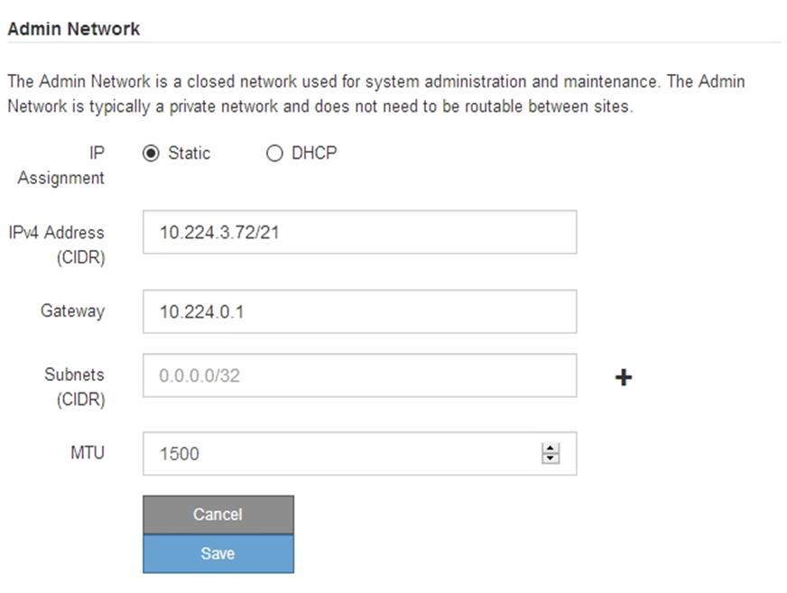
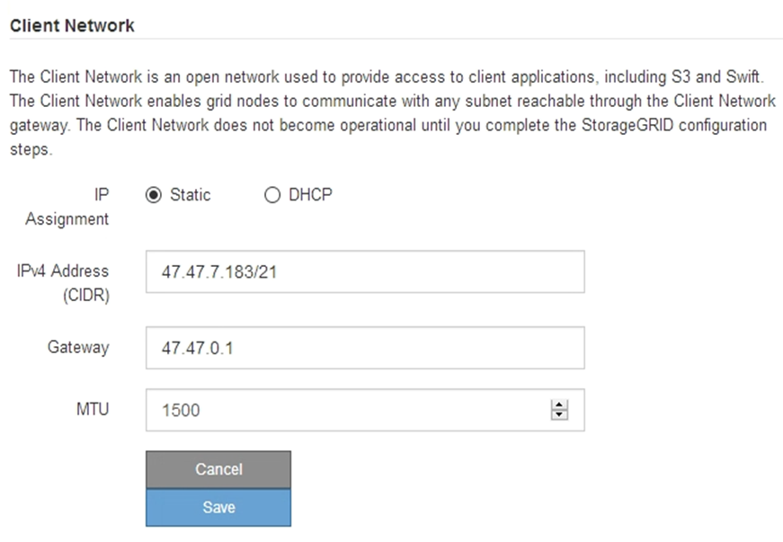

= StorageGRID IP 주소를 구성합니다
:allow-uri-read: 
:icons: font
:imagesdir: ../media/

[role="lead"]
StorageGRID 어플라이언스 설치 프로그램을 사용하여 StorageGRID 그리드, 관리자 및 클라이언트 네트워크의 서비스 어플라이언스 또는 어플라이언스 스토리지 노드에 사용되는 IP 주소 및 라우팅 정보를 구성합니다.

ConfigBuilder를 사용하여 JSON 파일을 생성하는 경우 IP 주소를 자동으로 구성할 수 있습니다. 을 참조하십시오 link:automating-appliance-installation-and-configuration.html["어플라이언스 설치 및 구성 자동화"].

.이 작업에 대해
연결된 각 네트워크에서 어플라이언스에 대해 고정 IP를 할당하거나 DHCP 서버의 주소에 대해 영구 임대를 할당해야 합니다.

링크 구성을 변경하려면 다음 지침을 참조하십시오.

* link:../sg100-1000/changing-link-configuration-of-services-appliance.html["SG100 또는 SG1000 서비스 어플라이언스의 링크 구성을 변경합니다"]
* link:../sg110-1100/changing-link-configuration-of-sg110-and-sg1100-appliance.html["SG110 또는 SG1100 서비스 어플라이언스의 링크 구성을 변경합니다"]
* link:../sg5700/changing-link-configuration-of-e5700sg-controller.html["E5500SG 컨트롤러의 링크 구성을 변경합니다"]
* link:../sg5800/changing-link-configuration-of-sg5800-controller.html["SG5800 컨트롤러의 링크 구성을 변경합니다"]
* link:../sg6000/changing-link-configuration-of-sg6000-cn-controller.html["SG6000-CN 컨트롤러의 링크 구성을 변경합니다"]
* link:../sg6100/changing-link-configuration-of-sgf6112-appliance.html["SG6100 어플라이언스의 링크 구성을 변경합니다"]

[NOTE]
====
다음 IPv4 주소가 포함된 서브넷은 모든 노드의 그리드 네트워크, 관리 네트워크 또는 클라이언트 네트워크에 사용하지 마세요.

* 192,168,130,101
* 192,168,131,101
* 192,168,130,102
* 192,168,131,102
* 198.51.100.2
* 198.51.100.4

예를 들어, 어떤 노드의 그리드 네트워크, 관리 네트워크 또는 클라이언트 네트워크에도 다음 서브넷 범위를 사용하지 마세요.

* 192.168.130.0/24는 이 서브넷 범위에 IP 주소 192.168.130.101과 192.168.130.102가 포함되어 있기 때문입니다.
* 192.168.131.0/24는 이 서브넷 범위에 IP 주소 192.168.131.101과 192.168.131.102가 포함되어 있기 때문입니다.
* 198.51.100.0/24는 이 서브넷 범위에 IP 주소 198.51.100.2와 198.51.100.4가 포함되어 있기 때문입니다.

====
.단계
. StorageGRID 어플라이언스 설치 프로그램에서 * 네트워킹 구성 * > * IP 구성 * 을 선택합니다.
+
IP 구성 페이지가 나타납니다.

. 그리드 네트워크를 구성하려면 페이지의 * 그리드 네트워크 * 섹션에서 * 정적 * 또는 * DHCP * 를 선택합니다.
. Static * (정적 *)을 선택한 경우 다음 단계에 따라 Grid Network(그리드 네트워크)를 구성합니다.
+
.. CIDR 표기법을 사용하여 정적 IPv4 주소를 입력합니다.
.. 게이트웨이를 입력합니다.
+
네트워크에 게이트웨이가 없는 경우 동일한 정적 IPv4 주소를 다시 입력합니다.

.. 점보 프레임을 사용하려면 MTU 필드를 9000과 같은 점보 프레임에 적합한 값으로 변경합니다. 그렇지 않으면 기본값 1500을 유지합니다.
+

CAUTION: 네트워크의 MTU 값은 노드가 연결된 스위치 포트에 구성된 값과 일치해야 합니다. 그렇지 않으면 네트워크 성능 문제 또는 패킷 손실이 발생할 수 있습니다.

+

NOTE: 최상의 네트워크 성능을 얻으려면 모든 노드를 그리드 네트워크 인터페이스에서 유사한 MTU 값으로 구성해야 합니다. 개별 노드의 그리드 네트워크에 대한 MTU 설정에 상당한 차이가 있을 경우 * Grid Network MTU mismatch * 경고가 트리거됩니다. MTU 값은 모든 네트워크 유형에 대해 같을 필요는 없습니다.

.. 저장 * 을 클릭합니다.
+
IP 주소를 변경하면 게이트웨이와 서브넷 목록도 변경될 수 있습니다.

+
StorageGRID 어플라이언스 설치 프로그램에 대한 연결이 끊어진 경우 방금 할당한 새 고정 IP 주소를 사용하여 URL을 다시 입력합니다. 예: +
`*https://_appliance_IP_:8443*`

.. 그리드 네트워크 서브넷 목록이 올바른지 확인합니다.
+
그리드 서브넷이 있는 경우 그리드 네트워크 게이트웨이가 필요합니다. 지정된 모든 그리드 서브넷은 이 게이트웨이를 통해 연결할 수 있어야 합니다. 이러한 그리드 네트워크 서브넷은 StorageGRID 설치를 시작할 때 기본 관리 노드의 그리드 네트워크 서브넷 목록에도 정의되어 있어야 합니다.

+

NOTE: 기본 라우트는 나열되지 않습니다. 클라이언트 네트워크가 활성화되지 않은 경우 기본 라우트는 그리드 네트워크 게이트웨이를 사용합니다.

+
*** 서브넷을 추가하려면 마지막 항목 오른쪽에 있는 삽입 아이콘을 클릭합니다image:../media/icon_plus_sign_black_on_white.gif["삽입 아이콘"].
*** 사용하지 않는 서브넷을 제거하려면 삭제 아이콘을 image:../media/icon_nms_delete_new.gif["삭제 아이콘"]클릭합니다.

.. 저장 * 을 클릭합니다.

. DHCP * 를 선택한 경우 다음 단계에 따라 그리드 네트워크를 구성합니다.
+
.. DHCP * 라디오 버튼을 선택한 후 * 저장 * 을 클릭합니다.
+
IPv4 주소 *, * 게이트웨이 * 및 * 서브넷 * 필드가 자동으로 채워집니다. DHCP 서버가 MTU 값을 할당하도록 설정된 경우 * MTU * 필드가 해당 값으로 채워지고 필드는 읽기 전용이 됩니다.

+
웹 브라우저가 자동으로 StorageGRID 어플라이언스 설치 프로그램의 새 IP 주소로 리디렉션됩니다.

.. 그리드 네트워크 서브넷 목록이 올바른지 확인합니다.
+
그리드 서브넷이 있는 경우 그리드 네트워크 게이트웨이가 필요합니다. 지정된 모든 그리드 서브넷은 이 게이트웨이를 통해 연결할 수 있어야 합니다. 이러한 그리드 네트워크 서브넷은 StorageGRID 설치를 시작할 때 기본 관리 노드의 그리드 네트워크 서브넷 목록에도 정의되어 있어야 합니다.

+

NOTE: 기본 라우트는 나열되지 않습니다. 클라이언트 네트워크가 활성화되지 않은 경우 기본 라우트는 그리드 네트워크 게이트웨이를 사용합니다.

+
*** 서브넷을 추가하려면 마지막 항목 오른쪽에 있는 삽입 아이콘을 클릭합니다image:../media/icon_plus_sign_black_on_white.gif["삽입 아이콘"].
*** 사용하지 않는 서브넷을 제거하려면 삭제 아이콘을 image:../media/icon_nms_delete_new.gif["삭제 아이콘"]클릭합니다.

.. 점보 프레임을 사용하려면 MTU 필드를 9000과 같은 점보 프레임에 적합한 값으로 변경합니다. 그렇지 않으면 기본값 1500을 유지합니다.
+

CAUTION: 네트워크의 MTU 값은 노드가 연결된 스위치 포트에 구성된 값과 일치해야 합니다. 그렇지 않으면 네트워크 성능 문제 또는 패킷 손실이 발생할 수 있습니다.

+

NOTE: 최상의 네트워크 성능을 얻으려면 모든 노드를 그리드 네트워크 인터페이스에서 유사한 MTU 값으로 구성해야 합니다. 개별 노드의 그리드 네트워크에 대한 MTU 설정에 상당한 차이가 있을 경우 * Grid Network MTU mismatch * 경고가 트리거됩니다. MTU 값은 모든 네트워크 유형에 대해 같을 필요는 없습니다.

.. 저장 * 을 클릭합니다.

. 관리 네트워크를 구성하려면 페이지의 * 관리 네트워크 * 섹션에서 * 정적 * 또는 * DHCP * 를 선택합니다.
+

NOTE: 관리 네트워크를 구성하려면 링크 구성 페이지에서 관리 네트워크를 활성화합니다.

+

. 정적 * 을 선택한 경우 다음 단계에 따라 관리 네트워크를 구성합니다.
+
.. 어플라이언스의 관리 포트 1에 대한 CIDR 표기법을 사용하여 정적 IPv4 주소를 입력합니다.
+
관리 포트 1은 어플라이언스의 오른쪽 끝에 있는 2개의 1GbE RJ45 포트 왼쪽에 있습니다.

.. 게이트웨이를 입력합니다.
+
네트워크에 게이트웨이가 없는 경우 동일한 정적 IPv4 주소를 다시 입력합니다.

.. 점보 프레임을 사용하려면 MTU 필드를 9000과 같은 점보 프레임에 적합한 값으로 변경합니다. 그렇지 않으면 기본값 1500을 유지합니다.
+

CAUTION: 네트워크의 MTU 값은 노드가 연결된 스위치 포트에 구성된 값과 일치해야 합니다. 그렇지 않으면 네트워크 성능 문제 또는 패킷 손실이 발생할 수 있습니다.

.. 저장 * 을 클릭합니다.
+
IP 주소를 변경하면 게이트웨이와 서브넷 목록도 변경될 수 있습니다.

+
StorageGRID 어플라이언스 설치 프로그램에 대한 연결이 끊어진 경우 방금 할당한 새 고정 IP 주소를 사용하여 URL을 다시 입력합니다. 예: +
`*https://_appliance_:8443*`

.. 관리자 네트워크 서브넷 목록이 올바른지 확인합니다.
+
입력한 게이트웨이를 사용하여 모든 서브넷에 연결할 수 있는지 확인해야 합니다.

+

NOTE: 관리 네트워크 게이트웨이를 사용하도록 기본 경로를 지정할 수 없습니다.

+
*** 서브넷을 추가하려면 마지막 항목 오른쪽에 있는 삽입 아이콘을 클릭합니다image:../media/icon_plus_sign_black_on_white.gif["삽입 아이콘"].
*** 사용하지 않는 서브넷을 제거하려면 삭제 아이콘을 image:../media/icon_nms_delete_new.gif["삭제 아이콘"]클릭합니다.

.. 저장 * 을 클릭합니다.

. DHCP * 를 선택한 경우 다음 단계에 따라 관리 네트워크를 구성합니다.
+
.. DHCP * 라디오 버튼을 선택한 후 * 저장 * 을 클릭합니다.
+
IPv4 주소 *, * 게이트웨이 * 및 * 서브넷 * 필드가 자동으로 채워집니다. DHCP 서버가 MTU 값을 할당하도록 설정된 경우 * MTU * 필드가 해당 값으로 채워지고 필드는 읽기 전용이 됩니다.

+
웹 브라우저가 자동으로 StorageGRID 어플라이언스 설치 프로그램의 새 IP 주소로 리디렉션됩니다.

.. 관리자 네트워크 서브넷 목록이 올바른지 확인합니다.
+
입력한 게이트웨이를 사용하여 모든 서브넷에 연결할 수 있는지 확인해야 합니다.

+

NOTE: 관리 네트워크 게이트웨이를 사용하도록 기본 경로를 지정할 수 없습니다.

+
*** 서브넷을 추가하려면 마지막 항목 오른쪽에 있는 삽입 아이콘을 클릭합니다image:../media/icon_plus_sign_black_on_white.gif["삽입 아이콘"].
*** 사용하지 않는 서브넷을 제거하려면 삭제 아이콘을 image:../media/icon_nms_delete_new.gif["삭제 아이콘"]클릭합니다.

.. 점보 프레임을 사용하려면 MTU 필드를 9000과 같은 점보 프레임에 적합한 값으로 변경합니다. 그렇지 않으면 기본값 1500을 유지합니다.
+

CAUTION: 네트워크의 MTU 값은 노드가 연결된 스위치 포트에 구성된 값과 일치해야 합니다. 그렇지 않으면 네트워크 성능 문제 또는 패킷 손실이 발생할 수 있습니다.

.. 저장 * 을 클릭합니다.

. 클라이언트 네트워크를 구성하려면 페이지의 * 클라이언트 네트워크 * 섹션에서 * 정적 * 또는 * DHCP * 를 선택합니다.
+

NOTE: 클라이언트 네트워크를 구성하려면 링크 구성 페이지에서 클라이언트 네트워크를 활성화합니다.

+

. 정적 * 을 선택한 경우 다음 단계에 따라 클라이언트 네트워크를 구성합니다.
+
.. CIDR 표기법을 사용하여 정적 IPv4 주소를 입력합니다.
.. 저장 * 을 클릭합니다.
.. 클라이언트 네트워크 게이트웨이의 IP 주소가 올바른지 확인합니다.
+

NOTE: 클라이언트 네트워크가 활성화된 경우 기본 경로가 표시됩니다. 기본 라우트는 클라이언트 네트워크 게이트웨이를 사용하며 클라이언트 네트워크가 활성화된 동안에는 다른 인터페이스로 이동할 수 없습니다.

.. 점보 프레임을 사용하려면 MTU 필드를 9000과 같은 점보 프레임에 적합한 값으로 변경합니다. 그렇지 않으면 기본값 1500을 유지합니다.
+

CAUTION: 네트워크의 MTU 값은 노드가 연결된 스위치 포트에 구성된 값과 일치해야 합니다. 그렇지 않으면 네트워크 성능 문제 또는 패킷 손실이 발생할 수 있습니다.

.. 저장 * 을 클릭합니다.

. DHCP * 를 선택한 경우 다음 단계에 따라 클라이언트 네트워크를 구성합니다.
+
.. DHCP * 라디오 버튼을 선택한 후 * 저장 * 을 클릭합니다.
+
IPv4 주소 * 및 * 게이트웨이 * 필드가 자동으로 채워집니다. DHCP 서버가 MTU 값을 할당하도록 설정된 경우 * MTU * 필드가 해당 값으로 채워지고 필드는 읽기 전용이 됩니다.

+
웹 브라우저가 자동으로 StorageGRID 어플라이언스 설치 프로그램의 새 IP 주소로 리디렉션됩니다.

.. 게이트웨이가 올바른지 확인합니다.
+

NOTE: 클라이언트 네트워크가 활성화된 경우 기본 경로가 표시됩니다. 기본 라우트는 클라이언트 네트워크 게이트웨이를 사용하며 클라이언트 네트워크가 활성화된 동안에는 다른 인터페이스로 이동할 수 없습니다.

.. 점보 프레임을 사용하려면 MTU 필드를 9000과 같은 점보 프레임에 적합한 값으로 변경합니다. 그렇지 않으면 기본값 1500을 유지합니다.
+

CAUTION: 네트워크의 MTU 값은 노드가 연결된 스위치 포트에 구성된 값과 일치해야 합니다. 그렇지 않으면 네트워크 성능 문제 또는 패킷 손실이 발생할 수 있습니다.

