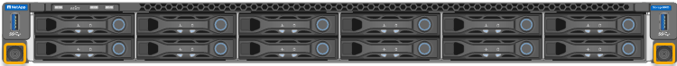

= SG6000-CN 컨트롤러(SG6060 및 SG6024) 설치
:allow-uri-read: 
:icons: font
:imagesdir: ../media/

[role="lead"]
캐비닛 또는 랙에 SG6000-CN 컨트롤러용 레일 세트를 설치한 다음 레일을 따라 컨트롤러를 밀어 넣습니다.

.시작하기 전에
* 상자에 포함된 안전 고지 문서를 검토하고 하드웨어 이동 및 설치에 대한 예방 조치를 이해했습니다.
* 레일 키트와 함께 제공된 지침이 있습니다.
* E2860 컨트롤러 쉘프 및 드라이브 또는 EF570 컨트롤러 쉘프를 설치했습니다.

.단계
. 레일 키트의 지침에 따라 캐비닛이나 랙에 레일을 설치합니다.
. 캐비닛이나 랙에 설치된 두 개의 레일에서 딸깍 소리가 날 때까지 레일의 이동식 부품을 확장합니다.
+
image::../media/rails_extended_out.gif[SG6000 레일]

. SG6000-CN 컨트롤러를 레일에 삽입합니다.
. 캐비닛이나 랙에 컨트롤러를 밀어 넣습니다.
+
컨트롤러를 더 이상 이동할 수 없는 경우 섀시 양쪽에 있는 파란색 래치를 당겨 컨트롤러를 완전히 밀어 넣습니다.

+
image::../media/sg6000_cn_rails_blue_button.gif[SG6000 레일 위의 슬라이딩]

+

NOTE: 컨트롤러의 전원을 켜기 전에는 전면 베젤을 연결하지 마십시오.

. 컨트롤러 전면 패널의 조임 나사를 조여 컨트롤러를 랙에 고정합니다.
+

