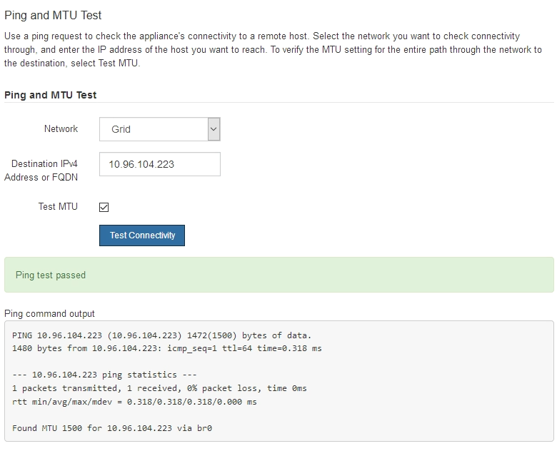

= 네트워크 연결을 확인합니다
:allow-uri-read: 
:icons: font
:imagesdir: ../media/

[role="lead"]
어플라이언스에서 사용 중인 StorageGRID 네트워크에 액세스할 수 있는지 확인해야 합니다. 네트워크 게이트웨이를 통한 라우팅의 유효성을 검사하려면 StorageGRID 어플라이언스 설치 프로그램과 다른 서브넷의 IP 주소 간의 연결을 테스트해야 합니다. MTU 설정을 확인할 수도 있습니다.

.단계
. StorageGRID 어플라이언스 설치 프로그램의 메뉴 모음에서 * 네트워킹 구성 * > * Ping 및 MTU 테스트 * 를 클릭합니다.
+
Ping 및 MTU 테스트 페이지가 나타납니다.

+
image::../media/ping_test_start.png[StorageGRID 어플라이언스 설치 프로그램의 Ping 및 MTU 테스트 옵션 스크린샷]

. 네트워크 * 드롭다운 상자에서 테스트할 네트워크(그리드, 관리자 또는 클라이언트)를 선택합니다.
. 해당 네트워크의 호스트에 대한 IPv4 주소 또는 FQDN(정규화된 도메인 이름)을 입력합니다.
+
예를 들어 네트워크 또는 기본 관리 노드의 게이트웨이를 Ping할 수 있습니다.

. 선택적으로 * Test MTU * 확인란을 선택하여 네트워크를 통해 대상으로 가는 전체 경로에 대한 MTU 설정을 확인합니다.
+
예를 들어, 어플라이언스 노드와 다른 사이트의 노드 간 경로를 테스트할 수 있습니다.

. 연결 테스트 * 를 클릭합니다.
+
네트워크 연결이 유효한 경우 ping 명령 출력이 나열된 "Ping test Passed" 메시지가 나타납니다.

+

.관련 정보
* link:configuring-network-links.html["네트워크 링크를 구성합니다"]
* link:../commonhardware/changing-mtu-setting.html["MTU 설정을 변경합니다"]

