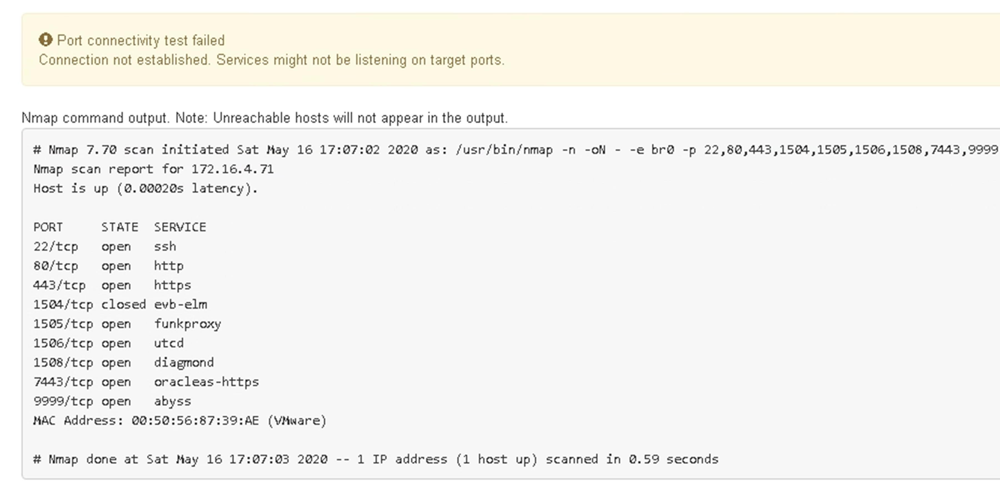

= 포트 수준 네트워크 연결을 확인합니다
:allow-uri-read: 
:icons: font
:imagesdir: ../media/

[role="lead"]
StorageGRID 어플라이언스 설치 프로그램과 다른 노드 간의 액세스가 방화벽에 의해 방해 받지 않도록 하려면 StorageGRID 어플라이언스 설치 관리자가 지정된 IP 주소 또는 주소 범위의 특정 TCP 포트 또는 포트 집합에 연결할 수 있는지 확인합니다.

.이 작업에 대해
StorageGRID 어플라이언스 설치 프로그램에 제공된 포트 목록을 사용하여 어플라이언스와 그리드 네트워크의 다른 노드 간의 연결을 테스트할 수 있습니다.

또한 외부 NFS 또는 DNS 서버에 사용되는 것과 같은 UDP 포트와 Admin 및 Client Networks에서 연결을 테스트할 수 있습니다. 이러한 포트 목록은 를 https://docs.netapp.com/us-en/storagegrid/network/network-port-reference.html["네트워크 포트 참조"^] 참조하십시오.

NOTE: 포트 연결 표에 나열된 그리드 네트워크 포트는 StorageGRID 버전 11.7 이상에서만 사용할 수 있습니다. 각 노드 유형에 맞는 포트를 확인하려면 사용 중인 StorageGRID 버전에 대한 네트워킹 지침을 항상 참조해야 합니다.

.단계
. StorageGRID 어플라이언스 설치 프로그램에서 * 네트워킹 구성 * > * 포트 연결 테스트(nmap) * 를 클릭합니다.
+
포트 연결 테스트 페이지가 나타납니다.

+
포트 연결 표에는 그리드 네트워크에서 TCP 연결이 필요한 노드 유형이 나와 있습니다. 각 노드 유형에 대해 표에는 어플라이언스에 액세스할 수 있어야 하는 그리드 네트워크 포트가 나열되어 있습니다.

+
표에 나열된 어플라이언스 포트와 그리드 네트워크의 다른 노드 간의 연결을 테스트할 수 있습니다.

. Network * (네트워크 *) 드롭다운에서 * Grid * (그리드 *), * Admin * (* 관리자 *) 또는 * Client * (클라이언트 *)와 같이 테스트할 네트워크를 선택합니다.
. 해당 네트워크의 호스트에 대한 IPv4 주소 범위를 지정합니다.
+
예를 들어 네트워크 또는 기본 관리 노드의 게이트웨이를 조사할 수 있습니다.

+
예제에 표시된 대로 하이픈을 사용하여 범위를 지정합니다.

. TCP 포트 번호, 쉼표로 구분된 포트 목록 또는 포트 범위를 입력합니다.
+
image::../media/port_connectivity_test_start.png[포트 연결 테스트]

. 연결 테스트 * 를 클릭합니다.
+
** 선택한 포트 수준 네트워크 연결이 유효하면 ""포트 연결 테스트 통과"" 메시지가 녹색 배너에 나타납니다. nmap 명령 출력은 배너 아래에 나열되어 있습니다.
+
image::../media/port_connectivity_test_passed.png[포트 연결 테스트에 통과했습니다]

** 원격 호스트에 대한 포트 수준 네트워크 연결이 이루어졌지만 호스트가 선택한 포트 중 하나 이상의 포트에서 수신 대기 중이 아니면 ""포트 연결 테스트 실패" 메시지가 노란색 배너에 나타납니다. nmap 명령 출력은 배너 아래에 나열되어 있습니다.
+
호스트가 청취하지 않는 모든 원격 포트는 ""닫힘"" 상태입니다. 예를 들어 연결하려는 노드가 사전 설치된 상태이고 StorageGRID NMS 서비스가 아직 실행되지 않은 경우 이 노란색 배너가 나타날 수 있습니다.

+

** 하나 이상의 선택한 포트에 대해 포트 수준 네트워크 연결을 설정할 수 없는 경우 빨간색 배너에 ""포트 연결 테스트 실패" 메시지가 나타납니다. nmap 명령 출력은 배너 아래에 나열되어 있습니다.
+
빨간색 배너는 원격 호스트의 포트에 대한 TCP 연결 시도가 이루어졌지만 보낸 사람에게 반환된 것이 없음을 나타냅니다. 응답이 반환되지 않으면 포트에 "필터링된" 상태가 있으며 방화벽에 의해 차단될 수 있습니다.

+

NOTE: 폐쇄된 항만 목록에 있다.

+
image::../media/nmap_test_red_banner.png[nMap 테스트 빨간색 배너]

