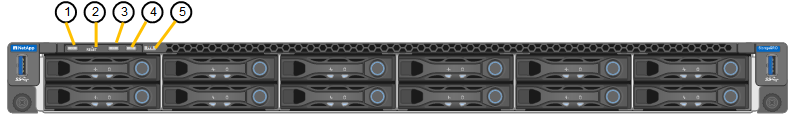

= 상태 표시기 및 코드를 봅니다
:allow-uri-read: 
:icons: font
:imagesdir: ../media/

[role="lead"]
어플라이언스 및 컨트롤러에는 어플라이언스 구성 요소의 상태를 확인하는 데 도움이 되는 표시등이 포함되어 있습니다.

[role="tabbed-block"]
====
.SG100 및 SG1000입니다
--
이 제품에는 어플라이언스 컨트롤러 및 2개의 SSD의 상태를 확인하는 데 도움이 되는 표시등이 포함되어 있습니다.

* <<appliance_indicators_SG100_1000,제품 표시등 및 버튼>>
* <<general_boot_codes_SG100_1000,일반 부팅 코드>>
* <<ssd_indicators_SG100_1000,SSD 표시등>>

이 정보를 사용하여 도움을 받으십시오 link:troubleshooting-hardware-installation-sg100-and-sg1000.html["SG100 및 SG1000 하드웨어 설치 문제를 해결합니다"].

[[appliance_indicators_SG100_1000]]
제품 표시등 및 버튼::
+
--
다음 그림에서는 SG100 및 SG1000 전면의 상태 표시기와 단추를 보여 줍니다.

image::../media/sg6000_cn_front_indicators.gif[전면 표시등 - SG1000]

[cols="1a,2a,2a"]
|===
| 속성 표시기 | 디스플레이 | 상태 

 a| 
1
 a| 
전원 단추
 a| 
* 파란색: 제품의 전원이 켜져 있습니다.
* 꺼짐: 제품의 전원이 꺼져 있습니다.

 a| 
2
 a| 
재설정 버튼
 a| 
이 단추를 사용하여 컨트롤러를 하드 리셋합니다.

 a| 
3
 a| 
식별 버튼
 a| 
이 단추는 깜박임, 켜짐(켜짐) 또는 꺼짐 으로 설정할 수 있습니다.

* 파란색, 깜박임: 캐비닛이나 랙에 있는 제품을 나타냅니다.
* 파란색, 켜짐: 캐비닛이나 랙에 있는 제품을 나타냅니다.
* 꺼짐: 캐비닛이나 랙에서 제품을 육안으로 확인할 수 없습니다.

 a| 
4
 a| 
알람 LED
 a| 
* 황색, 켜짐: 오류가 발생했습니다.
+
* 참고: * 부팅 및 오류 코드를 보려면 link:accessing-bmc-interface.html["BMC 인터페이스에 액세스합니다"].

* 꺼짐: 오류가 없습니다.

|===
--

다음 그림에서는 전원 공급 장치의 위치를 보여 주고 SG100 및 SG1000 후면의 LED를 식별합니다. 추가 상태 및 작동 상태 표시등은 어플라이언스 포트에 있습니다. 이러한 LED는 어플라이언스 모델에 따라 다를 수 있습니다.

image::../media/q2023_rear_leds.png[후면 LED SG100 및 SG1000입니다]

[cols="1a,2a,3a"]
|===
| 속성 표시기 | LED | 상태 

 a| 
1
 a| 
전원 공급 장치 LED
 a| 
* 녹색, 켜짐: 제품에 전원이 공급되고 전원 버튼이 켜져 있습니다.
* 녹색, 깜박임: 제품에 전원이 공급되고 전원 단추가 꺼져 있습니다.
* 꺼짐: 어플라이언스에 전원이 공급되지 않습니다.
* 주황색: 전원 공급 장치에 오류가 있습니다.

 a| 
2
 a| 
LED를 식별합니다
 a| 
* 파란색, 깜박임: 캐비닛이나 랙에 있는 제품을 나타냅니다.
* 파란색, 켜짐: 캐비닛이나 랙에 있는 제품을 나타냅니다.
* 꺼짐: 캐비닛이나 랙에서 제품을 육안으로 확인할 수 없습니다.

|===
[[general_boot_codes_SG100_1000]]
일반 부팅 코드::
+
--
부팅하거나 제품을 하드 리셋한 후 다음과 같은 현상이 발생합니다.

. BMC(베이스보드 관리 컨트롤러)는 발생한 오류를 포함하여 부팅 순서의 코드를 기록합니다.
. 전원 단추가 켜집니다.
. 부팅 중에 오류가 발생하면 알람 LED가 켜집니다.
+
부팅 및 오류 코드를 보려면 link:accessing-bmc-interface.html["BMC 인터페이스에 액세스합니다"].

--

[[ssd_indicators_SG100_1000]]
SSD 표시등::
+
--
다음 그림에서는 SG100 및 SG1000의 SSD 표시등을 보여 줍니다.

image::../media/ssd_indicators.png[SSD 표시등]

[cols="1a,2a,2a"]
|===
| LED | 디스플레이 | 상태 

 a| 
1
 a| 
드라이브 상태/장애
 a| 
* 파란색(계속 켜짐): 드라이브가 온라인 상태입니다
* 주황색(계속 켜짐): 드라이브 장애가 발생했습니다
* 호박색(깜박임): 드라이브 로케이터 표시등이 켜집니다
* 꺼짐: 슬롯이 비어 있습니다

 a| 
2
 a| 
드라이브가 활성 상태입니다
 a| 
파란색(깜박임): 드라이브에 액세스하는 중입니다

|===
--

--
.SG110 및 SG1100
--
이 제품에는 어플라이언스 컨트롤러 및 SSD의 상태를 확인하는 데 도움이 되는 표시등이 포함되어 있습니다.

* <<appliance_indicators,제품 표시등 및 버튼>>
* <<general_boot_codes,일반 부팅 코드>>
* <<ssd_indicators,SSD 표시등>>

이 정보를 사용하여 도움을 받으십시오 link:troubleshooting-hardware-installation-sg110-and-sg1100.html["SG110 및 SG1100 하드웨어 설치 문제를 해결합니다"].

[[appliance_indicators]]
제품 표시등 및 버튼::
+
--
다음 그림은 SG110 및 SG1100 어플라이언스 전면의 표시등과 버튼입니다.

[cols="1a,2a,3a"]
|===
| 속성 표시기 | 디스플레이 | 상태 

 a| 
1
 a| 
전원 단추
 a| 
* 파란색: 제품의 전원이 켜져 있습니다.
* 꺼짐: 제품의 전원이 꺼져 있습니다.

 a| 
2
 a| 
재설정 버튼
 a| 
이 단추를 사용하여 컨트롤러를 하드 리셋합니다.

 a| 
3
 a| 
식별 버튼
 a| 
BMC를 사용하여 이 버튼을 깜박임, 켜짐(켜짐) 또는 끄기로 설정할 수 있습니다.

* 파란색, 깜박임: 캐비닛이나 랙에 있는 제품을 나타냅니다.
* 파란색, 켜짐: 캐비닛이나 랙에 있는 제품을 나타냅니다.
* 꺼짐: 캐비닛이나 랙에서 제품을 육안으로 확인할 수 없습니다.

 a| 
4
 a| 
상태 LED
 a| 
* 황색, 켜짐: 오류가 발생했습니다.
+
* 참고: * 부팅 및 오류 코드를 보려면 link:accessing-bmc-interface.html["BMC 인터페이스에 액세스합니다"].

* 꺼짐: 오류가 없습니다.

 a| 
5
 a| 
PFR
 a| 
이 표시등은 SG110 및 SG1100 어플라이언스에서 사용되지 않으며 꺼져 있습니다.

|===
--

다음 그림에서는 전원 공급 장치의 위치를 보여 주고 SG110 및 SG1100 뒷면에서 LED를 식별합니다. 추가 상태 및 작동 상태 표시등은 어플라이언스 포트에 있습니다. 이러한 LED는 어플라이언스 모델에 따라 다를 수 있습니다.

image::../media/q2024_rear_leds.png[후면 LED SG110 및 SG1100]

[cols="1a,2a,3a"]
|===
| 속성 표시기 | LED | 상태 

 a| 
1
 a| 
전원 공급 장치 LED
 a| 
* 녹색, 켜짐: 제품에 전원이 공급되고 전원 버튼이 켜져 있습니다.
* 녹색, 깜박임: 제품에 전원이 공급되고 전원 단추가 꺼져 있습니다.
* 꺼짐: 어플라이언스에 전원이 공급되지 않습니다.
* 주황색: 전원 공급 장치에 오류가 있습니다.

 a| 
2
 a| 
LED를 식별합니다
 a| 
* 파란색, 깜박임: 캐비닛이나 랙에 있는 제품을 나타냅니다.
* 파란색, 켜짐: 캐비닛이나 랙에 있는 제품을 나타냅니다.
* 꺼짐: 캐비닛이나 랙에서 제품을 육안으로 확인할 수 없습니다.

|===
[[general_boot_codes]]
일반 부팅 코드::
+
--
부팅하거나 제품을 하드 리셋한 후 다음과 같은 현상이 발생합니다.

. BMC(베이스보드 관리 컨트롤러)는 발생한 오류를 포함하여 부팅 순서의 코드를 기록합니다.
. 전원 단추가 켜집니다.
. 부팅 중에 오류가 발생하면 알람 LED가 켜집니다.
+
부팅 및 오류 코드를 보려면 link:accessing-bmc-interface.html["BMC 인터페이스에 액세스합니다"].

--

[[ssd_indicators]]
SSD 표시등::
+
--
다음 그림은 SG110 및 SG1100 어플라이언스의 SSD 표시등을 보여줍니다.

image::../media/ssd_indicators.png[SSD 표시등]

[cols="1a,2a,2a"]
|===
| LED | 디스플레이 | 상태 

 a| 
1
 a| 
드라이브 상태/장애
 a| 
* 파란색(계속 켜짐): 드라이브가 온라인 상태입니다
* 주황색(계속 켜짐): 드라이브 장애가 발생했습니다
* 꺼짐: 슬롯이 비어 있습니다

 a| 
2
 a| 
드라이브가 활성 상태입니다
 a| 
파란색(깜박임): 드라이브에 액세스하는 중입니다

|===
--

--
.SG5700입니다
--
어플라이언스 컨트롤러에는 어플라이언스 컨트롤러의 상태를 확인하는 데 도움이 되는 표시등이 포함되어 있습니다.

* <<boot_codes_sg5700,SG5700 부팅 상태 코드>>
* <<status_indicators_e5700sg_controller,E5500SG 컨트롤러의 상태 표시등>>
* <<general_boot_codes_sg5700,일반 부팅 코드>>
* <<boot_codes_e5700sg_controller,E5500SG 컨트롤러 부팅 코드>>
* <<error_codes_e5700sg_controller,E5500SG 컨트롤러 오류 코드>>

이 정보를 사용하여 도움을 받으십시오 link:troubleshooting-hardware-installation.html["SG5700 하드웨어 설치 문제를 해결합니다"].

[[boot_codes_sg5700]]
SG5700 부팅 상태 코드::
+
--
각 컨트롤러에 7개의 세그먼트가 표시되면 어플라이언스 전원이 켜질 때 상태 및 오류 코드가 표시됩니다.

E2800 컨트롤러 및 E5500SG 컨트롤러는 다양한 상태 및 오류 코드를 표시합니다.

이러한 코드의 의미를 이해하려면 다음 리소스를 참조하십시오.

[cols="1a,2a"]
|===
| 컨트롤러 | 참조하십시오 

 a| 
E2800 컨트롤러
 a| 
_E5700 및 E2800 시스템 모니터링 가이드 _

* 참고: * E-Series E5700 컨트롤러에 대해 나열된 코드는 어플라이언스의 E5500SG 컨트롤러에 적용되지 않습니다.

 a| 
E5500SG 컨트롤러
 a| 
"E5700SG 컨트롤러의 상태 표시기"

|===
--

.단계
. 부팅 중에 7세그먼트 디스플레이에 표시된 코드를 확인하여 진행 상황을 모니터링합니다.
+
** E2800 컨트롤러의 7개 세그먼트 디스플레이에는 * OS *, * SD *, `*_blank_*` 시작 시간 처리를 수행하고 있음을 나타냅니다.
** E5500SG 컨트롤러의 7개 세그먼트 디스플레이에는 * AA * 및 * FF * 로 끝나는 코드 시퀀스가 표시됩니다.

. 컨트롤러가 부팅된 후 7세그먼트 디스플레이에 다음이 표시되는지 확인합니다.
+
image::../media/seven_segment_display_codes.gif[컨트롤러가 부팅된 후 7개의 세그먼트가 표시됩니다.]

+
[cols="1a,2a"]
|===
| 컨트롤러 | 7개 세그먼트 디스플레이 

 a| 
E2800 컨트롤러
 a| 
에는 99가 나와 있습니다. 이 ID는 E-Series 컨트롤러 쉘프의 기본 ID입니다.

 a| 
E5500SG 컨트롤러
 a| 
에는 * HO * 가 표시되고 그 뒤에 두 개의 숫자가 반복됩니다.

[listing]
----
HO -- IP address for Admin Network -- IP address for Grid Network HO
----
순서대로 첫 번째 숫자 세트는 컨트롤러의 관리 포트 1에 대해 DHCP가 할당한 IP 주소입니다. 이 주소는 컨트롤러를 StorageGRID용 관리 네트워크에 연결하는 데 사용됩니다. 두 번째 숫자 세트는 어플라이언스를 StorageGRID용 그리드 네트워크에 연결하는 데 사용되는 DHCP 할당 IP 주소입니다.

* 참고: * DHCP를 사용하여 IP 주소를 할당할 수 없는 경우 0.0.0.0이 표시됩니다.

|===
. 7개 세그먼트가 표시되면 다른 값을 표시합니다. 을 참조하십시오 link:troubleshooting-hardware-installation.html["하드웨어 설치 문제 해결(SG6000 또는 SG5700)"] 설치 단계를 올바르게 완료했는지 확인합니다. 문제를 해결할 수 없는 경우 기술 지원 부서에 문의하십시오.

[[status_indicators_e5700sg_controller]]
E5500SG 컨트롤러의 상태 표시등::
+
--
어플라이언스 전원이 켜지고 하드웨어가 초기화되는 동안 E700SG 컨트롤러의 7세그먼트 디스플레이와 LED에 상태 및 오류 코드가 표시됩니다. 이러한 디스플레이를 사용하여 상태를 확인하고 오류를 해결할 수 있습니다.

StorageGRID 어플라이언스 설치 프로그램을 시작한 후에는 정기적으로 E5500SG 컨트롤러의 상태 표시등을 검토해야 합니다.

다음 그림에서는 E5500SG 컨트롤러의 상태 표시등을 보여 줍니다.

image::../media/e5700sg_leds.gif[E5500SG 컨트롤러의 상태 표시등]

[cols="1a,2a,2a"]
|===
| 속성 표시기 | 디스플레이 | 설명 

 a| 
1
 a| 
주의 LED
 a| 
황색: 컨트롤러에 결함이 있으며 운영자의 주의가 필요하거나 설치 스크립트를 찾을 수 없습니다.

Off(끄기): 컨트롤러가 정상적으로 작동하고 있습니다.

 a| 
2
 a| 
7개 세그먼트 디스플레이
 a| 
에서는 진단 코드를 보여 줍니다

7개 세그먼트 디스플레이 시퀀스를 통해 어플라이언스의 오류 및 작동 상태를 파악할 수 있습니다.

 a| 
3
 a| 
확장 포트 주의 LED
 a| 
황색: 본 제품은 확장 포트를 사용하지 않으므로 LED는 항상 주황색으로 켜져 있습니다(링크가 설정되지 않음).

 a| 
4
 a| 
호스트 포트 링크 상태 LED
 a| 
녹색: 링크가 작동 중입니다.

꺼짐: 링크가 다운되었습니다.

 a| 
5
 a| 
이더넷 링크 상태 LED
 a| 
녹색: 링크가 설정되었습니다.

꺼짐: 링크가 설정되지 않았습니다.

 a| 
6
 a| 
이더넷 작동 LED
 a| 
녹색: 관리 포트와 연결된 장치(예: 이더넷 스위치) 사이의 링크가 작동 중입니다.

꺼짐: 컨트롤러와 연결된 장치 사이에 링크가 없습니다.

녹색으로 깜박임: 이더넷이 작동 중입니다.

|===
--

[[general_boot_codes_sg5700]]
일반 부팅 코드::
+
--
부팅하거나 제품을 하드 리셋한 후 다음과 같은 현상이 발생합니다.

. E5500SG 컨트롤러의 7개 세그먼트 디스플레이에는 컨트롤러와 관련이 없는 일반적인 코드 시퀀스가 표시됩니다. 일반 시퀀스는 AA 및 FF 코드로 끝납니다.
. E5500SG 컨트롤러에 고유한 부팅 코드가 나타납니다.

--

[[boot_codes_e5700sg_controller]]
E5500SG 컨트롤러 부팅 코드::
+
--
정상적인 어플라이언스 부팅 중에 E700SG 컨트롤러의 7세그먼트 디스플레이에는 다음 코드가 나열된 순서대로 표시됩니다.

[cols="1a,3a"]
|===
| 코드 | 를 나타냅니다 

 a| 
높이
 a| 
마스터 부팅 스크립트가 OS 부팅이 완료될 때까지 기다리고 있습니다.

 a| 
안녕
 a| 
마스터 부트 스크립트가 시작되었습니다.

 a| 
PP
 a| 
시스템에서 FPGA 업데이트 여부를 확인 중입니다.

 a| 
HP
 a| 
시스템에서 10/25-GbE 컨트롤러 펌웨어를 업데이트해야 하는지 확인합니다.

 a| 
RB
 a| 
펌웨어 업데이트를 적용한 후 시스템이 재부팅되고 있습니다.

 a| 
FP
 a| 
하드웨어 하위 시스템 펌웨어 업데이트 검사가 완료되었습니다. 컨트롤러 간 통신 서비스가 시작됩니다.

 a| 
그는
 a| 
시스템이 E2800 컨트롤러와의 연결을 기다리고 있으며 SANtricity 운영 체제와의 동기화를 기다리고 있습니다.

* 참고: * 이 부팅 절차가 이 단계 이후 진행되지 않을 경우 두 컨트롤러 사이의 연결을 확인하십시오.

 a| 
HC
 a| 
시스템에서 기존 StorageGRID 설치 데이터를 확인하고 있습니다.

 a| 
호
 a| 
StorageGRID 어플라이언스 설치 프로그램이 실행 중입니다.

 a| 
HA
 a| 
StorageGRID가 실행 중입니다.

|===
--

[[error_codes_e5700sg_controller]]
E5500SG 컨트롤러 오류 코드::
+
--
이러한 코드는 어플라이언스 부팅 시 E5500SG 컨트롤러에 표시될 수 있는 오류 상태를 나타냅니다. 특정 하위 수준 하드웨어 오류가 발생할 경우 추가 2자리 16진수 코드가 표시됩니다. 이러한 코드 중 하나라도 1초 또는 2초 이상 지속되거나 규정된 문제 해결 절차 중 하나를 수행하여 오류를 해결할 수 없는 경우 기술 지원 부서에 문의하십시오.

[cols="1a,3a"]
|===
| 코드 | 를 나타냅니다 

 a| 
22
 a| 
부팅 장치에서 마스터 부트 레코드를 찾을 수 없습니다.

 a| 
23
 a| 
내부 플래시 디스크가 연결되어 있지 않습니다.

 a| 
2A, 2B
 a| 
버스 고착, DIMM SPD 데이터를 읽을 수 없음.

 a| 
40
 a| 
DIMM이 잘못되었습니다.

 a| 
41
 a| 
DIMM이 잘못되었습니다.

 a| 
42
 a| 
메모리 테스트에 실패했습니다.

 a| 
51
 a| 
SPD 읽기 오류입니다.

 a| 
92에서 96까지
 a| 
PCI 버스 초기화.

 a| 
A0에서 A3까지
 a| 
SATA 드라이브 초기화

 a| 
복부
 a| 
대체 부팅 코드.

 a| 
AE
 a| 
OS 부팅 중.

 a| 
EA
 a| 
DDR4 교육에 실패했습니다.

 a| 
예 8
 a| 
설치된 메모리가 없습니다.

 a| 
EU
 a| 
설치 스크립트를 찾을 수 없습니다.

 a| 
EP
 a| 
E2800 컨트롤러 설치 또는 통신에 실패했습니다.

|===
--

.관련 정보
* https://mysupport.netapp.com/site/global/dashboard["NetApp 지원"^]
* https://library.netapp.com/ecmdocs/ECMLP2588751/html/frameset.html["E5700 및 E2800 시스템 모니터링 가이드"^]

--
.SG5800을 참조하십시오
--
어플라이언스 컨트롤러에는 어플라이언스 컨트롤러의 상태를 확인할 수 있는 표시등이 포함되어 있습니다. 이 정보를 사용하여 도움을 받으십시오 link:troubleshooting-hardware-installation.html["SG5800 하드웨어 설치 문제를 해결합니다"].

SG5800 컨트롤러의 상태 표시등::
+
--
StorageGRID 어플라이언스 설치 프로그램을 시작한 후 SG5800 컨트롤러의 상태 표시기를 주기적으로 검토해야 합니다.

다음 그림은 SG5800 컨트롤러의 상태 표시등을 보여줍니다.

image::../media/sg5800_leds.png[SG5800 컨트롤러의 상태 표시등]

[cols="1a,2a,2a"]
|===
| 속성 표시기 | 디스플레이 | 설명 

 a| 
1
 a| 
주의 LED
 a| 
황색: 컨트롤러에 결함이 있으며 운영자의 주의가 필요하거나 설치 스크립트를 찾을 수 없습니다.

Off(끄기): 컨트롤러가 정상적으로 작동하고 있습니다.

 a| 
2
 a| 
확장 포트 주의 LED
 a| 
황색: 본 제품은 확장 포트를 사용하지 않으므로 LED는 항상 주황색으로 켜져 있습니다(링크가 설정되지 않음).

 a| 
3
 a| 
호스트 포트 링크 상태 LED
 a| 
녹색: 링크가 작동 중입니다.

꺼짐: 링크가 다운되었습니다.

 a| 
4
 a| 
이더넷 링크 상태 LED
 a| 
녹색: 링크가 설정되었습니다.

꺼짐: 링크가 설정되지 않았습니다.

 a| 
5
 a| 
이더넷 작동 LED
 a| 
녹색: 관리 포트와 연결된 장치(예: 이더넷 스위치) 사이의 링크가 작동 중입니다.

꺼짐: 컨트롤러와 연결된 장치 사이에 링크가 없습니다.

녹색으로 깜박임: 이더넷이 작동 중입니다.

|===
--

.관련 정보
link:https://mysupport.netapp.com/site/global/dashboard["NetApp 지원"^]

--
.SG6000 을 참조하십시오
--
SG6000 어플라이언스 컨트롤러에는 어플라이언스 컨트롤러의 상태를 확인하는 데 도움이 되는 표시등이 포함되어 있습니다.

* <<status_indicators_sg6000cn,SG6000-CN 컨트롤러의 상태 표시등 및 단추>>
* <<general_boot_codes_sg6000,일반 부팅 코드>>
* <<boot_codes_sg6000_storage_controller,SG6000 스토리지 컨트롤러의 부팅 상태 코드입니다>>

이 정보를 사용하여 도움을 받으십시오 link:troubleshooting-hardware-installation.html["SG6000 설치 문제를 해결합니다"].

[[status_indicators_sg6000cn]]
SG6000-CN 컨트롤러의 상태 표시등 및 단추::
+
--
SG6000-CN 컨트롤러에는 다음 표시등 및 단추를 포함하여 컨트롤러의 상태를 확인하는 데 도움이 되는 표시등이 포함되어 있습니다.

다음 그림은 SG6000-CN 컨트롤러 전면에 있는 상태 표시기와 버튼을 보여줍니다.

image::../media/sg6000_cn_front_indicators.gif[전면 표시등 - SG6000-CN]

[cols="1a,2a,3a"]
|===
| 속성 표시기 | 디스플레이 | 설명 

 a| 
1
 a| 
전원 단추
 a| 
* 파란색: 컨트롤러의 전원이 켜져 있습니다.
* 꺼짐: 컨트롤러의 전원이 꺼져 있습니다.

 a| 
2
 a| 
재설정 버튼
 a| 
_표시기 없음 _

이 단추를 사용하여 컨트롤러를 하드 리셋합니다.

 a| 
3
 a| 
식별 버튼
 a| 
* 파란색 깜박임 또는 켜짐: 캐비닛이나 랙의 컨트롤러를 식별합니다.
* Off(끄기): 캐비닛이나 랙에서 컨트롤러를 시각적으로 확인할 수 없습니다.

이 단추는 깜박임, 켜짐(켜짐) 또는 꺼짐 으로 설정할 수 있습니다.

 a| 
4
 a| 
알람 LED
 a| 
* 황색: 오류가 발생했습니다.
+
* 참고: * 부팅 및 오류 코드를 보려면 link:accessing-bmc-interface.html["BMC 인터페이스에 액세스합니다"].

* 꺼짐: 오류가 없습니다.

|===
--

다음 그림에서는 전원 공급 장치의 위치를 보여 주고 SG6000-CN 컨트롤러 후면에 있는 LED를 식별합니다. 추가 상태 및 작동 상태 표시등은 어플라이언스 포트에 있습니다. 이러한 LED는 어플라이언스 모델에 따라 다를 수 있습니다.

image::../media/q2023_rear_leds.png[후면 LED SG6000-CN]

[cols="1a,2a,3a"]
|===
| 속성 표시기 | LED | 상태 

 a| 
1
 a| 
전원 공급 장치 LED
 a| 
* 녹색, 켜짐: 제품에 전원이 공급되고 전원 버튼이 켜져 있습니다.
* 녹색, 깜박임: 제품에 전원이 공급되고 전원 단추가 꺼져 있습니다.
* 꺼짐: 어플라이언스에 전원이 공급되지 않습니다.
* 주황색: 전원 공급 장치에 오류가 있습니다.

 a| 
2
 a| 
LED를 식별합니다
 a| 
* 파란색, 깜박임: 캐비닛이나 랙에 있는 제품을 나타냅니다.
* 파란색, 켜짐: 캐비닛이나 랙에 있는 제품을 나타냅니다.
* 꺼짐: 캐비닛이나 랙에서 제품을 육안으로 확인할 수 없습니다.

|===
[[general_boot_codes_sg6000]]
일반 부팅 코드::
+
--
부팅 중 또는 SG6000-CN 컨트롤러의 하드 리셋 후, 다음과 같은 현상이 발생합니다.

. BMC(베이스보드 관리 컨트롤러)는 발생한 오류를 포함하여 부팅 순서의 코드를 기록합니다.
. 전원 단추가 켜집니다.
. 부팅 중에 오류가 발생하면 알람 LED가 켜집니다.
+
부팅 및 오류 코드를 보려면 link:accessing-bmc-interface.html["BMC 인터페이스에 액세스합니다"].

--

[[boot_codes_sg6000_storage_controller]]
SG6000 스토리지 컨트롤러의 부팅 상태 코드입니다::
+
--
각 스토리지 컨트롤러에는 컨트롤러 전원이 켜질 때 상태 코드를 제공하는 7개의 세그먼트 디스플레이가 있습니다. 상태 코드는 E2800 컨트롤러와 EF570 컨트롤러에서 동일합니다.

이러한 코드에 대한 설명은 스토리지 컨트롤러 유형에 대한 E-Series 시스템 모니터링 정보를 참조하십시오.

--

.단계
. 부팅 중에 각 스토리지 컨트롤러의 7개 세그먼트 디스플레이에 표시된 코드를 확인하여 진행 상황을 모니터링합니다.
+
각 스토리지 컨트롤러의 7개 세그먼트 디스플레이에는 반복 시퀀스 * OS *, * SD *, `*_blank_*` 컨트롤러가 일상적인 처리를 수행하고 있음을 나타냅니다.

. 컨트롤러가 부팅된 후 각 스토리지 컨트롤러에 99가 표시되는지 확인합니다. 이 값은 E-Series 컨트롤러 쉘프의 기본 ID입니다.
+
이 예의 E2800 컨트롤러에 표시된 대로 이 값이 두 스토리지 컨트롤러 모두에 표시되는지 확인합니다.

+
image::../media/seven_segment_display_codes_for_e2800.gif[E2800용 7세그먼트 디스플레이 코드]

. 한 컨트롤러 또는 두 컨트롤러 모두에 다른 값이 표시되는 경우 를 참조하십시오 link:troubleshooting-hardware-installation.html["하드웨어 설치 문제 해결(SG6000 또는 SG5700)"] 설치 단계를 올바르게 완료했는지 확인합니다. 문제를 해결할 수 없는 경우 기술 지원 부서에 문의하십시오.

.관련 정보
* https://mysupport.netapp.com/site/global/dashboard["NetApp 지원"^]
* link:../sg6000/power-sg6000-cn-controller-off-on.html#power-on-sg6000-cn-controller-and-verify-operation["SG6000-CN 컨트롤러의 전원을 켜고 작동을 확인합니다"]

--
.SG6100
--
이 제품에는 어플라이언스 컨트롤러 및 SSD의 상태를 확인하는 데 도움이 되는 표시등이 포함되어 있습니다.

* <<appliance_indicators_SG6100,제품 표시등 및 버튼>>
* <<general_boot_codes_SG6100,일반 부팅 코드>>
* <<ssd_indicators_SG6100,SSD 표시등>>

이 정보를 사용하여 도움을 받으십시오 link:troubleshooting-hardware-installation-sg6100.html["SG6100 하드웨어 설치 문제를 해결합니다"].

[[appliance_indicators_SG6100]]
제품 표시등 및 버튼::
+
--
다음 그림은 SG6100 어플라이언스 전면의 표시등과 버튼입니다.

[cols="1a,2a,3a"]
|===
| 속성 표시기 | 디스플레이 | 상태 

 a| 
1
 a| 
전원 단추
 a| 
* 파란색: 제품의 전원이 켜져 있습니다.
* 꺼짐: 제품의 전원이 꺼져 있습니다.

 a| 
2
 a| 
재설정 버튼
 a| 
이 단추를 사용하여 컨트롤러를 하드 리셋합니다.

 a| 
3
 a| 
식별 버튼
 a| 
BMC를 사용하여 이 버튼을 깜박임, 켜짐(켜짐) 또는 끄기로 설정할 수 있습니다.

* 파란색, 깜박임: 캐비닛이나 랙에 있는 제품을 나타냅니다.
* 파란색, 켜짐: 캐비닛이나 랙에 있는 제품을 나타냅니다.
* 꺼짐: 캐비닛이나 랙에서 제품을 육안으로 확인할 수 없습니다.

 a| 
4
 a| 
상태 LED
 a| 
* 황색, 켜짐: 오류가 발생했습니다.
+
* 참고: * 부팅 및 오류 코드를 보려면 link:accessing-bmc-interface.html["BMC 인터페이스에 액세스합니다"].

* 꺼짐: 오류가 없습니다.

 a| 
5
 a| 
PFR
 a| 
이 표시등은 SG6100 제품에서 사용되지 않으며 꺼져 있습니다.

|===
--

다음 그림에서는 전원 공급 장치의 위치를 보여 주고 SGF6112 및 SG6100-CN 후면의 LED를 식별합니다. 추가 상태 및 작동 상태 표시등은 어플라이언스 포트에 있습니다. 이러한 LED는 어플라이언스 모델에 따라 다를 수 있습니다.

image::../media/q2024_rear_leds.png[후면 LED SGF6112 및 SG6100-CN]

[cols="1a,2a,3a"]
|===
| 속성 표시기 | LED | 상태 

 a| 
1
 a| 
전원 공급 장치 LED
 a| 
* 녹색, 켜짐: 제품에 전원이 공급되고 전원 버튼이 켜져 있습니다.
* 녹색, 깜박임: 제품에 전원이 공급되고 전원 단추가 꺼져 있습니다.
* 꺼짐: 어플라이언스에 전원이 공급되지 않습니다.
* 주황색: 전원 공급 장치에 오류가 있습니다.

 a| 
2
 a| 
LED를 식별합니다
 a| 
* 파란색, 깜박임: 캐비닛이나 랙에 있는 제품을 나타냅니다.
* 파란색, 켜짐: 캐비닛이나 랙에 있는 제품을 나타냅니다.
* 꺼짐: 캐비닛이나 랙에서 제품을 육안으로 확인할 수 없습니다.

|===
[[general_boot_codes_SG6100]]
일반 부팅 코드::
+
--
부팅하거나 제품을 하드 리셋한 후 다음과 같은 현상이 발생합니다.

. BMC(베이스보드 관리 컨트롤러)는 발생한 오류를 포함하여 부팅 순서의 코드를 기록합니다.
. 전원 단추가 켜집니다.
. 부팅 중에 오류가 발생하면 알람 LED가 켜집니다.
+
부팅 및 오류 코드를 보려면 link:accessing-bmc-interface.html["BMC 인터페이스에 액세스합니다"].

--

[[ssd_indicators_SG6100]]
SSD 표시등::
+
--
다음 그림은 SGF6112 또는 SG6160 어플라이언스의 SSD 표시등을 보여줍니다.

image::../media/ssd_indicators.png[SSD 표시등]

[cols="1a,2a,2a"]
|===
| LED | 디스플레이 | 상태 

 a| 
1
 a| 
드라이브 상태/장애
 a| 
* 파란색(계속 켜짐): 드라이브가 온라인 상태입니다
* 주황색(계속 켜짐): 드라이브 장애가 발생했습니다
* 꺼짐: 슬롯이 비어 있습니다

*참고:* 정상 작동하는 새 SSD가 작동 중인 SGF6112 또는 SG6160 StorageGRID 노드에 삽입되면 SSD의 LED가 처음에는 깜박이지만, 시스템이 드라이브의 용량이 충분하고 작동 중임을 확인하자마자 깜박임을 멈춥니다.

 a| 
2
 a| 
드라이브가 활성 상태입니다
 a| 
파란색(깜박임): 드라이브에 액세스하는 중입니다

|===
--

.관련 정보
https://mysupport.netapp.com/site/global/dashboard["NetApp 지원"^]

--
====