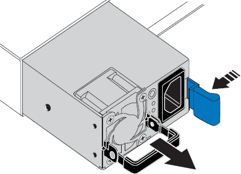

= SG110 또는 SG1100에서 하나 또는 두 개의 전원 공급 장치를 교체합니다
:allow-uri-read: 
:icons: font
:imagesdir: ../media/

[role="lead"]
SG110 및 SG1100 어플라이언스에는 이중화를 위한 전원 공급 장치가 2개 있습니다. 전원 공급 장치 중 하나에 장애가 발생하면 가능한 한 빨리 교체해야 어플라이언스에 중복 전원이 공급되는지 확인할 수 있습니다. 제품에서 작동하는 두 전원 공급 장치의 모델 및 와트는 동일해야 합니다.

.시작하기 전에
* 있습니다 link:locating-sg110-and-sg1100-in-data-center.html["제품을 물리적으로 위치했습니다"] 전원 공급 장치를 교체해야 합니다.
* 있습니다 link:verify-component-to-replace.html["교체할 전원 공급 장치의 위치를 확인했습니다"].
* 하나의 전원 공급 장치만 교체하는 경우:
+
** 교체 전원 공급 장치의 포장을 풀고 교체할 전원 공급 장치와 동일한 모델 및 와트인지 확인했습니다.
** 다른 전원 공급 장치가 설치되어 실행 중인지 확인했습니다.

* 두 전원 공급 장치를 동시에 교체하는 경우:
+
** 교체 전원 공급 장치의 포장을 풀고 동일한 모델 및 와트인지 확인했습니다.

.이 작업에 대해
이 그림에서는 SG110 및 SG1100용 전원 공급 장치 두 개를 보여 줍니다. 전원 공급 장치는 제품 뒷면에서 액세스할 수 있습니다.

image::../media/sgf6112_power_supplies.png[2개의 전원 공급 장치가 있는 SGF6112 뒷면]

.단계
. 하나의 전원 공급 장치만 교체하는 경우 제품을 종료할 필요가 없습니다. 로 이동합니다 <<Unplug_the_power_cord,전원 코드를 뽑습니다>> 단계. 두 전원 공급 장치를 동시에 교체하는 경우 전원 코드를 뽑기 전에 다음을 수행하십시오.
+
.. link:power-sg110-and-sg1100-off-on.html#shut-down-the-sg110-or-sg1100-appliance["제품을 종료하십시오"].

. [[UNPLICATE_The_POWER_CODED, START=2]] 교체할 각 전원 공급 장치에서 전원 코드를 뽑습니다.
+
제품 뒷면에서 본 경우 전원 공급 장치 A(PSU0)는 오른쪽에, 전원 공급 장치 B(PSU1)는 왼쪽에 있습니다.

. 교체할 첫 번째 공급 장치의 핸들을 들어 올립니다.
+
image::../media/sg6000_cn_lift_cam_handle_psu.gif[손잡이를 들어 올려 PSU를 분리합니다]

. 파란색 래치를 누르고 전원 공급 장치를 당겨 빼냅니다.
+

. 오른쪽에 있는 파란색 걸쇠를 사용하여 교체 전원 공급 장치를 섀시에 밀어 넣습니다.
+

IMPORTANT: 설치된 두 전원 공급 장치의 모델 및 와트는 동일해야 합니다.

+
교체 장치를 밀어 넣을 때 파란색 걸쇠가 오른쪽에 있는지 확인합니다.

+
전원 공급 장치가 제자리에 고정되면 딸깍 소리가 발생합니다.

+
image::../media/sg6000_cn_insert_power_supply.gif[전원 공급 장치를 밀어 넣습니다]

. 손잡이를 PSU 본체에 대고 뒤로 밉니다.
. 두 전원 공급 장치를 모두 교체하는 경우 2-6단계를 반복하여 두 번째 전원 공급 장치를 교체합니다.
. link:../installconfig/connecting-power-cords-and-applying-power.html["전원 코드를 교체한 장치에 연결하고 전원을 공급합니다"].

부품을 교체한 후 키트와 함께 제공된 RMA 지침에 따라 오류가 발생한 부품을 NetApp에 반환합니다. 를 참조하십시오 https://mysupport.netapp.com/site/info/rma["부품 반납 및 교체"^] 페이지를 참조하십시오.
