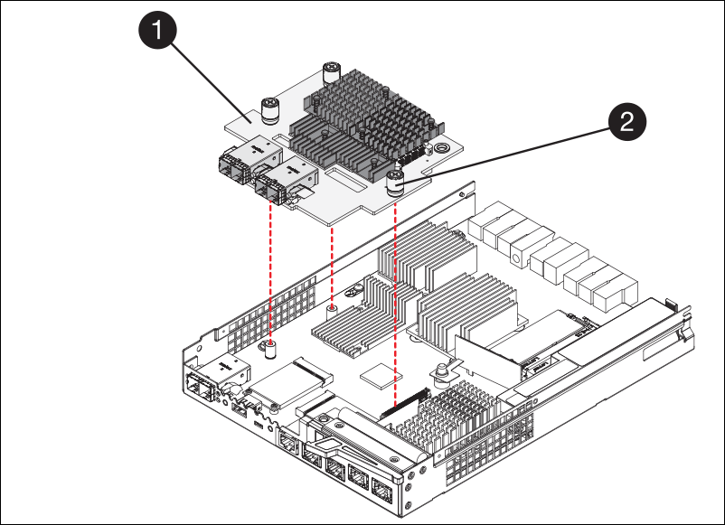

= SG5700에서 E2800 시리즈 스토리지 컨트롤러를 교체합니다
:allow-uri-read: 
:icons: font
:imagesdir: ../media/

[role="lead"]
E2800 시리즈 컨트롤러가 최적의 상태로 작동하지 않거나 오류가 발생한 경우에는 컨트롤러를 교체해야 할 수 있습니다.

.시작하기 전에
* 교체할 컨트롤러와 부품 번호가 동일한 교체 컨트롤러가 있습니다.
+

NOTE: 절차가 동일하지 않으므로 E-Series 지침에 따라 StorageGRID 어플라이언스의 컨트롤러를 교체하지 마십시오.

* 컨트롤러에 연결된 각 케이블을 식별하는 라벨이 있습니다.
* 모든 드라이브가 보안된 경우, Simplex E2800 시리즈 컨트롤러 교체 절차의 단계를 검토했습니다. 예를 들어, NetApp Support 사이트에서 E-Series SANtricity System Manager를 다운로드 및 설치한 다음 EMW(엔터프라이즈 관리 창)를 사용하여 컨트롤러를 교체한 후 보안 드라이브를 잠금 해제할 수 있습니다.
+

CAUTION: 저장된 키로 드라이브를 잠금 해제할 때까지 제품을 사용할 수 없습니다.

* 특정 액세스 권한이 있어야 합니다.
* 를 사용하여 그리드 관리자에 로그인해야 합니다 https://docs.netapp.com/us-en/storagegrid-118/admin/web-browser-requirements.html["지원되는 웹 브라우저"^].

.이 작업에 대해
다음 두 가지 방법으로 오류가 발생한 컨트롤러 캐니스터가 있는지 확인할 수 있습니다.

* SANtricity 시스템 관리자의 Recovery Guru에서 컨트롤러를 교체하도록 안내합니다.
* 컨트롤러의 주황색 주의 LED가 켜져 컨트롤러에 장애가 있음을 나타냅니다.

컨트롤러를 교체할 때 어플라이언스 스토리지 노드에 액세스할 수 없습니다. E2800 시리즈 컨트롤러가 충분히 작동할 경우 link:../commonhardware/placing-appliance-into-maintenance-mode.html["E5500SG 컨트롤러를 유지보수 모드로 설정합니다"].

컨트롤러를 교체할 때는 원래 컨트롤러에서 배터리를 분리하여 교체 컨트롤러에 설치해야 합니다. 경우에 따라 원래 컨트롤러에서 호스트 인터페이스 카드를 제거하고 교체 컨트롤러에 설치해야 할 수도 있습니다.

NOTE: 대부분의 어플라이언스 모델의 스토리지 컨트롤러에는 HIC(호스트 인터페이스 카드)가 포함되지 않습니다.

이 작업은 다음과 같은 부분으로 구성됩니다.

. 준비
. 컨트롤러를 오프라인으로 전환합니다
. 컨트롤러를 제거합니다
. 배터리를 새 컨트롤러로 이동합니다
. 필요한 경우 HIC를 새 컨트롤러로 이동합니다
. 컨트롤러를 교체합니다

== 준비

이러한 수치는 E2800A 컨트롤러 및 E2800B 컨트롤러를 보여줍니다. E2800 시리즈 컨트롤러 및 EF570 컨트롤러를 교체하는 절차는 동일합니다.

E2800A 스토리지 컨트롤러:

image::../media/e2800_labels_on_controller.gif[E2800A 컨트롤러의 Mac 및 FRU 레이블]

E2800B 스토리지 컨트롤러:

image::../media/e2800B_labels_on_controller.gif[E2800A 컨트롤러의 Mac 및 FRU 레이블]

[cols="1a,2a,4a"]
|===
| 라벨 | 구성 요소 | 설명 

 a| 
1
 a| 
MAC 주소
 a| 
관리 포트 1의 MAC 주소("'E2800A의 P1, E2800B의 0a"). DHCP를 사용하여 원래 컨트롤러의 IP 주소를 얻은 경우 이 주소가 새 컨트롤러에 연결되어 있어야 합니다.

 a| 
2
 a| 
FRU 부품 번호입니다
 a| 
FRU 부품 번호입니다. 이 번호는 현재 설치된 컨트롤러의 교체 부품 번호와 일치해야 합니다.

 a| 
3
 a| 
4-포트 HIC
 a| 
4-포트 HIC(호스트 인터페이스 카드) 교체 작업을 수행할 때 이 카드를 새 컨트롤러로 옮겨야 합니다.

* 참고 *: E2800A 컨트롤러에는 HIC가 없습니다.

|===
.단계
. E2800 컨트롤러 교체 절차의 지침에 따라 컨트롤러 제거를 준비합니다.
+
SANtricity 시스템 관리자를 사용하여 다음 단계를 수행합니다.

+
.. 현재 컨트롤러에 설치되어 있는 SANtricity OS 소프트웨어 버전을 기록해 둡니다.
.. 현재 설치된 NVSRAM 버전을 기록해 둡니다.
.. 드라이브 보안 기능이 활성화된 경우, 저장된 키가 있는지, 설치에 필요한 암호를 알고 있는지 확인하십시오.
+

CAUTION: * 데이터 액세스 손실 및 # 8212; * 어플라이언스의 모든 드라이브가 보안이 활성화된 경우 SANtricity 시스템 관리자의 엔터프라이즈 관리 창을 사용하여 보안 드라이브의 잠금을 해제할 때까지 새 컨트롤러가 어플라이언스에 액세스할 수 없습니다.

.. 구성 데이터베이스를 백업합니다.
+
컨트롤러를 제거할 때 문제가 발생하면 저장된 파일을 사용하여 구성을 복원할 수 있습니다.

.. 어플라이언스에 대한 지원 데이터를 수집합니다.
+

NOTE: 구성 요소를 교체하기 전과 교체 후에 지원 데이터를 수집하면 교체로 인해 문제가 해결되지 않는 경우 기술 지원 부서에 전체 로그 세트를 보낼 수 있습니다.

== 컨트롤러를 오프라인으로 전환합니다

.단계
. StorageGRID 어플라이언스가 StorageGRID 시스템에서 실행 중인 경우 link:../commonhardware/placing-appliance-into-maintenance-mode.html["E5500SG 컨트롤러를 유지보수 모드로 설정합니다"].
. E2800 컨트롤러가 제어된 종료를 수행할 수 있을 만큼 충분히 작동하는지 확인하려면 모든 작업이 완료되었는지 확인합니다.
+
.. SANtricity 시스템 관리자의 홈 페이지에서 * 진행 중인 작업 보기 * 를 선택합니다.
.. 모든 작업이 완료되었는지 확인합니다.

== 컨트롤러를 분리합니다

.단계
. 제품에서 컨트롤러를 분리합니다.
+
.. ESD 밴드를 착용하거나 정전기 방지 조치를 취하십시오.
.. 케이블에 레이블을 지정한 다음 케이블 및 SFP를 분리합니다.
+

NOTE: 성능 저하를 방지하려면 케이블을 비틀거나 접거나 끼거나 밟지 마십시오.

.. 캠 핸들의 래치를 눌러 제품에서 컨트롤러를 분리한 다음 캠 핸들을 오른쪽으로 엽니다.
.. 양손과 캠 손잡이를 사용하여 제어기를 제품에서 밀어 꺼냅니다.
+

CAUTION: 컨트롤러의 무게를 지탱하려면 항상 두 손을 사용하십시오.

.. 착탈식 덮개가 위를 향하도록 하여 정전기가 없는 평평한 표면에 컨트롤러를 놓습니다.
.. 단추를 누르고 덮개를 밀어 덮개를 분리합니다.

== 배터리를 새 컨트롤러로 이동합니다

.단계
. 장애가 발생한 컨트롤러에서 배터리를 분리하고 교체 컨트롤러에 설치합니다.
+
.. 컨트롤러 내부(배터리와 DIMM 사이)의 녹색 LED가 꺼져 있는지 확인합니다.
+
이 녹색 LED가 켜져 있으면 컨트롤러는 여전히 배터리 전원을 사용하고 있습니다. 구성 요소를 제거하기 전에 이 LED가 꺼질 때까지 기다려야 합니다.

+
image::../media/e2800_internal_cache_active_led.gif[E2800의 경우 녹색 LED입니다]

+
[cols="1a,2a"]
|===
| 항목 | 설명 

 a| 
1
 a| 
내부 캐시 활성 LED

 a| 
2
 a| 
배터리

|===
.. 배터리의 파란색 분리 래치를 찾습니다.
.. 분리 래치를 아래로 눌러 배터리를 분리합니다.
+
image::../media/e2800_remove_battery.gif[배터리 래치]

+
[cols="1a,2a"]
|===
| 항목 | 설명 

 a| 
1
 a| 
배터리 분리 래치

 a| 
2
 a| 
배터리

|===
.. 배터리를 들어 올려 컨트롤러에서 꺼냅니다.
.. 교체용 컨트롤러에서 덮개를 분리합니다.
.. 교체용 컨트롤러의 방향을 조정하여 배터리 슬롯이 사용자를 향하도록 합니다.
.. 배터리를 약간 아래쪽으로 비스듬히 컨트롤러에 삽입합니다.
+
배터리 전면의 금속 플랜지를 컨트롤러 하단의 슬롯에 삽입하고 배터리 상단을 컨트롤러 왼쪽의 작은 정렬 핀 아래에 밀어 넣어야 합니다.

.. 배터리 래치를 위로 이동하여 배터리를 고정합니다.
+
래치가 제자리에 고정되면 래치 하단이 섀시의 금속 슬롯에 후크됩니다.

.. 컨트롤러를 뒤집어 배터리가 올바르게 설치되었는지 확인합니다.
+

CAUTION: * 하드웨어 손상 가능성 * -- 배터리 전면의 금속 플랜지가 컨트롤러의 슬롯에 완전히 삽입되어야 합니다(첫 번째 그림 참조). 배터리가 올바르게 설치되지 않은 경우(두 번째 그림 참조) 금속 플랜지가 컨트롤러 보드에 닿으면 손상이 발생할 수 있습니다.

+
*** * 정답입니다.- 배터리의 금속 플랜지가 컨트롤러의 슬롯에 완전히 삽입됩니다. *
+
image::../media/e2800_battery_flange_ok.gif[배터리 플랜지 정답]

*** * 잘못됨 -- 배터리의 금속 플랜지가 컨트롤러의 슬롯에 삽입되지 않음: *
+
image::../media/e2800_battery_flange_not_ok.gif[배터리 플랜지 잘못됨]

. 컨트롤러 덮개를 장착합니다.

== 필요한 경우 HIC를 새 컨트롤러로 이동합니다

.단계
. 장애 컨트롤러에 HIC(호스트 인터페이스 카드)가 포함된 경우 장애가 발생한 컨트롤러에서 교체 컨트롤러로 HIC를 이동합니다.
+
E2800B 컨트롤러에만 별도의 HIC가 사용됩니다. HIC는 메인 컨트롤러 보드에 장착되며 SPF 커넥터 2개를 포함합니다.

+

NOTE: 이 절차의 그림에서는 2-포트 HIC를 보여 줍니다. 컨트롤러의 HIC는 포트 수가 다를 수 있습니다.

. 컨트롤러에 HIC(E2800A)가 없는 경우 컨트롤러 덮개를 교체합니다. 컨트롤러에 HIC(E2800B)가 있는 경우 로 이동합니다 <<move_the_HIC_to_the_replacement_controller,HIC를 장애 컨트롤러에서 교체 컨트롤러로 이동합니다>>.
+
.. [[move_the_HIC_to_the_replacement_controller]] HIC가 장착된 경우 HIC를 장애가 발생한 컨트롤러에서 교체 컨트롤러로 이동합니다.
.. HIC에서 모든 SFP를 제거합니다.
.. 1 십자 드라이버를 사용하여 HIC 페이스플레이트를 컨트롤러에 연결하는 나사를 제거합니다.
+
나사는 상단에 1개, 측면에 1개, 전면에 2개 등 4개가 있습니다.

+
image::../media/28_dwg_e2800_hic_faceplace_screws_maint-e2800.png[E2800 전면판 나사]

.. HIC 페이스플레이트를 탈거하십시오.
.. 손가락이나 십자 드라이버를 사용하여 HIC를 컨트롤러 카드에 고정하는 세 개의 나비 나사를 풉니다.
.. 카드를 들어 올리고 다시 밀어 컨트롤러 카드에서 HIC를 조심스럽게 분리합니다.
+

CAUTION: HIC 하단 또는 컨트롤러 카드 상단에 있는 구성 요소가 긁히거나 범프되지 않도록 주의하십시오.

+
image::../media/28_dwg_e2800_hic_thumbscrews_maint-e2800.png[HIC 나비 나사 E2800A]

+
[cols="1a,2a"]
|===
| 라벨 | 설명 

 a| 
1
 a| 
호스트 인터페이스 카드

 a| 
2
 a| 
나비 나사

|===
.. HIC를 정전기가 없는 표면에 놓습니다.
.. 1 Phillips 드라이버를 사용하여 블랭크 페이스 플레이트를 교체 컨트롤러에 연결하는 나사 4개를 분리하고 전면판을 분리하십시오.
.. HIC의 3개의 나비 나사를 교체 컨트롤러의 해당 구멍에 맞추고 HIC 아래쪽에 있는 커넥터를 컨트롤러 카드의 HIC 인터페이스 커넥터와 맞춥니다.
+
HIC 하단 또는 컨트롤러 카드 상단에 있는 구성 요소가 긁히거나 범프되지 않도록 주의하십시오.

.. HIC를 조심스럽게 제자리로 내리고 HIC 커넥터를 가볍게 눌러 HIC 커넥터를 장착합니다.
+

CAUTION: * 장비 손상 가능성 * -- HIC와 나비 나사 사이의 컨트롤러 LED에 금색 리본 커넥터가 끼이지 않도록 주의하십시오.

+

+
[cols="1a,2a"]
|===
| 라벨 | 설명 

 a| 
1
 a| 
호스트 인터페이스 카드

 a| 
2
 a| 
나비 나사

|===
.. HIC 나비 나사를 손으로 조입니다.
+
드라이버를 사용하지 마십시오. 나사를 너무 세게 조일 수 있습니다.

.. 1 십자 드라이버를 사용하여 원래 컨트롤러에서 제거한 HIC 면판을 4개의 나사로 새 컨트롤러에 부착합니다.
+
image::../media/28_dwg_e2800_hic_faceplace_screws_maint-e2800.png[E2800A 면판 나사]

.. 제거된 SFP를 HIC에 다시 설치합니다.

== 컨트롤러를 교체합니다

.단계
. 교체 컨트롤러를 제품에 설치합니다.
+
.. 이동식 덮개가 아래를 향하도록 컨트롤러를 뒤집습니다.
.. 캠 손잡이를 열린 상태에서 컨트롤러를 제품 안으로 끝까지 밀어 넣습니다.
.. 캠 핸들을 왼쪽으로 이동하여 컨트롤러를 제자리에 고정합니다.
.. 케이블 및 SFP를 교체합니다.
.. E2800 컨트롤러가 재부팅될 때까지 기다립니다. 7세그먼트 디스플레이에 상태가 표시되는지 확인합니다 `99`.
.. 교체 컨트롤러에 IP 주소를 할당하는 방법을 결정합니다.
+

NOTE: 교체 컨트롤러에 IP 주소를 할당하는 단계는 관리 포트 1을 DHCP 서버가 있는 네트워크에 연결했는지 여부 및 모든 드라이브가 보호되는지 여부에 따라 달라집니다.

+
관리 포트 1이 DHCP 서버가 있는 네트워크에 연결되어 있는 경우 새 컨트롤러는 DHCP 서버에서 해당 IP 주소를 가져옵니다. 이 값은 원래 컨트롤러의 IP 주소와 다를 수 있습니다.

. 보안 드라이브를 사용하는 어플라이언스의 경우 E2800 컨트롤러 교체 절차의 지침에 따라 드라이브 보안 키를 가져옵니다.
. 제품을 정상 작동 모드로 되돌리십시오. StorageGRID 어플라이언스 설치 프로그램에서 * 고급 * > * 컨트롤러 재부팅 * 을 선택한 다음 * StorageGRID * 으로 재부팅 * 을 선택합니다.
+
image::../media/reboot_controller_from_maintenance_mode.png[유지보수 모드에서 컨트롤러를 재부팅합니다]

. 재부팅 중에 노드의 상태를 모니터링하여 노드가 그리드에 재결합되었는지 확인합니다.
+
어플라이언스가 재부팅되고 그리드에 다시 추가됩니다. 이 프로세스는 최대 20분 정도 소요될 수 있습니다.

. 재부팅이 완료되고 노드가 그리드에 다시 결합되었는지 확인합니다. 그리드 관리자에서 노드 페이지에 정상 상태(녹색 확인 표시 아이콘)가 표시되는지 확인합니다 image:../media/icon_alert_green_checkmark.png["녹색 확인 표시"] (노드 이름 왼쪽) 어플라이언스 노드에 대해 알림이 활성화되어 있지 않고 노드가 그리드에 연결되어 있음을 나타냅니다.
+
image::../media/nodes_menu.png[어플라이언스 노드가 그리드에 다시 합류했습니다]

. SANtricity 시스템 관리자에서 새 컨트롤러가 최적화되었는지 확인하고 지원 데이터를 수집합니다.

부품을 교체한 후 키트와 함께 제공된 RMA 지침에 따라 오류가 발생한 부품을 NetApp에 반환합니다. 를 참조하십시오 https://mysupport.netapp.com/site/info/rma["부품 반납 및 교체"^] 페이지를 참조하십시오.
