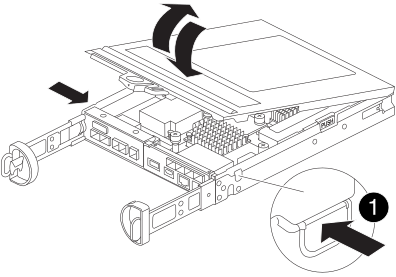

= SG5800 컨트롤러의 CMOS 배터리를 교체하세요
:allow-uri-read: 
:icons: font
:imagesdir: ../media/

[role="lead"]
시스템 서비스 및 애플리케이션이 정확한 시간 동기화를 유지하고 정상적으로 작동하려면 SG5800 컨트롤러의 CMOS 배터리를 교체해야 할 수 있습니다.

.이 작업에 대해
CMOS 배터리를 교체할 때 어플라이언스 스토리지 노드에 액세스할 수 없습니다. 서비스 중단을 방지하려면 CMOS 배터리 교체를 시작하기 전에 다른 모든 스토리지 노드가 그리드에 연결되어 있는지 확인하거나, 서비스 중단 기간이 허용되는 예약된 유지보수 윈도우 동안 배터리를 교체하십시오.

== 1단계: SG5800 컨트롤러를 종료합니다

.단계
. 그리드 노드에 로그인합니다.
+
.. 다음 명령을 입력합니다. `ssh admin@grid_node_IP`
.. 에 나열된 암호를 입력합니다 `Passwords.txt` 파일.
.. 루트로 전환하려면 다음 명령을 입력합니다. `su -`
.. 에 나열된 암호를 입력합니다 `Passwords.txt` 파일.
+
루트로 로그인하면 프롬프트가 에서 변경됩니다 `$` 를 선택합니다 `#`.

. SG5800 컨트롤러를 종료합니다.
+
*`shutdown -h now`*

== 2단계: 어플라이언스에서 컨트롤러를 분리합니다

.단계
. ESD 밴드를 착용하거나 정전기 방지 조치를 취하십시오.
. 케이블에 레이블을 지정한 다음 케이블 및 SFP를 분리합니다.
+

NOTE: 성능 저하를 방지하려면 케이블을 비틀거나, 접거나, 꼬집거나, 밟지 마십시오.

. 캠 핸들의 래치를 눌러 제품에서 컨트롤러를 분리한 다음 캠 핸들을 오른쪽으로 엽니다.
. 양손과 캠 손잡이를 사용하여 제어기를 제품에서 밀어 꺼냅니다.
+

NOTE: 컨트롤러의 무게를 지탱하려면 항상 두 손을 사용하십시오.

. 컨트롤러 모듈을 뒤집어서 평평하고 안정적인 표면에 놓으십시오.
. 컨트롤러 모듈 측면에 있는 파란색 버튼을 눌러 덮개를 연 다음, 덮개를 위로 돌려 컨트롤러 모듈에서 분리하십시오.
+

== 3단계: CMOS 배터리 교체

.단계
. CMOS 배터리를 찾습니다.
+
image::../media/drw_sg5800_replace_rtc_battery_IEOPS-701.svg[SG5800 컨트롤러의 CMOS 배터리 위치 교체]

+

NOTE: 사용하시는 컨트롤러는 그림과 다르게 생겼을 수 있습니다. 하지만 CMOS 배터리 위치는 동일합니다.

. 배터리를 홀더에서 살짝 밀고 돌린 다음 기기에서 들어 올려 빼내십시오.
+

NOTE: 홀더에서 배터리를 꺼낼 때 극성을 확인하세요. 배터리에는 플러스(+) 표시가 되어 있으며 홀더에 올바르게 장착해야 합니다. 홀더 근처에 있는 플러스(+) 표시는 배터리를 어떻게 장착해야 하는지 알려줍니다.

. 정전기 방지 배송용 봉투에서 교체용 배터리를 꺼내십시오.
. 컨트롤러 모듈에서 비어 있는 배터리 홀더를 찾으십시오.
. CMOS 배터리의 극성을 확인한 후, 배터리를 비스듬히 기울여 눌러서 홀더에 삽입하십시오.
. 배터리가 홀더에 완전히 설치되었는지, 그리고 극성이 올바른지 육안으로 확인하십시오.
. 컨트롤러 커버를 다시 설치하십시오.

== 4단계: 컨트롤러를 어플라이언스에 다시 설치합니다

.단계
. 컨트롤러를 어플라이언스에 설치하세요:
+
.. 컨트롤러를 뒤집어서 분리 가능한 덮개가 아래쪽을 향하도록 합니다.
.. 캠 손잡이를 열린 상태에서 컨트롤러를 제품 안으로 끝까지 밀어 넣습니다.
.. 캠 핸들을 왼쪽으로 이동하여 컨트롤러를 제자리에 고정합니다.
.. 케이블을 다시 연결하십시오.

. 컨트롤러가 재부팅되고 어플라이언스가 그리드에 다시 연결되면 어플라이언스 스토리지 노드가 그리드 관리자에 나타나고 알람이 나타나지 않는지 확인합니다.

부품을 교체한 후 키트와 함께 제공된 RMA 지침에 따라 오류가 발생한 부품을 NetApp에 반환합니다. 를 참조하십시오 https://mysupport.netapp.com/site/info/rma["부품 반납 및 교체"] 페이지를 참조하십시오.
