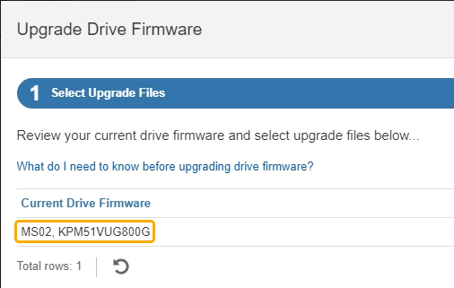

= SANtricity System Manager 온라인 방법을 사용하여 SG5800 드라이브 펌웨어를 업그레이드합니다
:allow-uri-read: 
:icons: font
:imagesdir: ../media/

[role="lead"]
SANtricity 시스템 관리자 온라인 방법을 사용하여 어플라이언스의 드라이브에 펌웨어를 업그레이드하여 최신 기능 및 버그 수정을 모두 사용할 수 있습니다.

.시작하기 전에
* 스토리지 어플라이언스 상태가 최적입니다.
* 모든 드라이브가 최적 상태입니다.

CAUTION: 한 번에 둘 이상의 StorageGRID 어플라이언스에서 드라이브 펌웨어를 업그레이드하지 마십시오. 따라서 배포 모델 및 ILM 정책에 따라 데이터를 사용할 수 없게 될 수 있습니다.

.이 작업에 대해
어플라이언스에서 입출력을 수행하는 동안 드라이브는 한 번에 하나씩 업그레이드됩니다 이 방법을 사용하면 제품을 유지보수 모드로 전환할 필요가 없습니다. 그러나 시스템 성능이 영향을 받을 수 있으며 오프라인 방법보다 몇 시간이 더 걸릴 수 있습니다.

[NOTE]
====
중복성이 없는 볼륨에 속한 드라이브는 를 사용하여 업데이트해야 link:upgrading-drive-firmware-using-santricity-system-manager-offline.html["오프라인 방법입니다"]합니다.

====
.단계
. 다음 방법 중 하나를 사용하여 SANtricity System Manager에 액세스합니다.
+
** StorageGRID 어플라이언스 설치 프로그램을 사용하여 * 고급 * > * SANtricity 시스템 관리자 * 를 선택합니다
** 그리드 관리자를 사용하여 * 노드 * > *_스토리지 노드_ * > * SANtricity 시스템 관리자 * 를 선택합니다
** 스토리지 컨트롤러 IP로 이동하여 SANtricity System Manager 사용:
+
`*https://_Storage_Controller_IP_*`

. 필요한 경우 SANtricity 시스템 관리자 사용자 이름과 암호를 입력합니다.
. 스토리지 어플라이언스에 현재 설치된 드라이브 펌웨어 버전을 확인합니다.
+
.. SANtricity 시스템 관리자에서 * 지원 * > * 업그레이드 센터 * 를 선택합니다.
.. 드라이브 펌웨어 업그레이드 에서 * 업그레이드 시작 * 을 선택합니다.
+
드라이브 펌웨어 업그레이드 페이지에는 현재 설치된 드라이브 펌웨어 파일이 표시됩니다.

.. Current Drive Firmware(현재 드라이브 펌웨어) 열에서 현재 드라이브 펌웨어 개정 및 드라이브 식별자를 확인합니다.
+

+
이 예에서

+
*** 드라이브 펌웨어 버전은 * MS02 * 입니다.
*** 드라이브 식별자는 * KPM51VUG800G * 입니다.

.. 연결된 드라이브 열에서 * 드라이브 보기 * 를 선택하여 스토리지 어플라이언스에서 해당 드라이브가 설치된 위치를 표시합니다.
.. Upgrade Drive Firmware(드라이브 펌웨어 업그레이드) 창을 닫습니다.

. 사용 가능한 드라이브 펌웨어 업그레이드를 다운로드하고 준비합니다.
+
.. 드라이브 펌웨어 업그레이드 에서 * NetApp 지원 * 을 선택합니다.
.. NetApp Support 사이트에서 * 다운로드 * 탭을 선택한 다음 * E-Series 디스크 드라이브 펌웨어 * 를 선택합니다.
+
E-Series 디스크 펌웨어 페이지가 표시됩니다.

.. 스토리지 어플라이언스에 설치된 각 * 드라이브 식별자 * 를 검색하고 각 드라이브 ID에 최신 펌웨어 버전이 있는지 확인합니다.
+
*** 펌웨어 개정판이 링크가 아닌 경우 이 드라이브 식별자는 최신 펌웨어 개정판을 가지고 있습니다.
*** 드라이브 식별자에 대해 하나 이상의 드라이브 부품 번호가 나열되면 해당 드라이브에 대해 펌웨어 업그레이드를 사용할 수 있습니다. 펌웨어 파일을 다운로드할 링크를 선택할 수 있습니다.
+
image::../media/storagegrid_drive_firmware_download.png[E-Series 디스크 펌웨어 페이지를 참조하십시오]

.. 최신 펌웨어 개정판이 나열된 경우 펌웨어 개정판에서 링크를 선택합니다 (다운로드) 열을 클릭하여 를 다운로드합니다 `.zip` 펌웨어 파일이 포함된 아카이브입니다.
.. 지원 사이트에서 다운로드한 드라이브 펌웨어 아카이브 파일의 압축을 풉니다.

. 드라이브 펌웨어 업그레이드를 설치합니다.
+
.. SANtricity 시스템 관리자의 드라이브 펌웨어 업그레이드 아래에서 * 업그레이드 시작 * 을 선택합니다.
.. 찾아보기 * 를 선택하고 Support 사이트에서 다운로드한 새 드라이브 펌웨어 파일을 선택합니다.
+
드라이브 펌웨어 파일의 파일 이름은 과 유사합니다 `D_HUC101212CSS600_30602291_MS01_2800_0002.dlp`.

+
한 번에 하나씩 최대 4개의 드라이브 펌웨어 파일을 선택할 수 있습니다. 둘 이상의 드라이브 펌웨어 파일이 동일한 드라이브와 호환되는 경우 파일 충돌 오류가 발생합니다. 업그레이드에 사용할 드라이브 펌웨어 파일을 결정하고 다른 드라이브 펌웨어 파일을 제거합니다.

.. 다음 * 을 선택합니다.
+
* 드라이브 선택 * 은 선택한 펌웨어 파일로 업그레이드할 수 있는 드라이브를 나열합니다.

+
호환되는 드라이브만 나타납니다.

+
선택한 드라이브 펌웨어가 * 제안된 펌웨어 * 열에 나타납니다. 이 펌웨어를 변경해야 하는 경우 * Back * 을 선택합니다.

.. SELECT * Upgrade all drives online * -스토리지 배열에서 I/O를 처리하는 동안 펌웨어 다운로드를 지원할 수 있는 드라이브를 업그레이드합니다 이 업그레이드 방법을 선택할 때 이러한 드라이브를 사용하여 연결된 볼륨에 대한 I/O를 중지할 필요가 없습니다.
+

NOTE: 온라인 업그레이드는 오프라인 업그레이드보다 몇 시간이 더 걸릴 수 있습니다.

.. 테이블의 첫 번째 열에서 업그레이드할 드라이브를 선택합니다.
+
모범 사례는 동일한 모델의 모든 드라이브를 동일한 펌웨어 개정판으로 업그레이드하는 것입니다.

.. 시작 * 을 선택하고 업그레이드를 수행할지 확인합니다.
+
업그레이드를 중지해야 하는 경우 * Stop * (중지 *)을 선택합니다. 현재 진행 중인 모든 펌웨어 다운로드가 완료되었습니다. 시작되지 않은 모든 펌웨어 다운로드는 취소됩니다.

+

CAUTION: 드라이브 펌웨어 업그레이드를 중지하면 데이터가 손실되거나 드라이브를 사용할 수 없게 될 수 있습니다.

.. (선택 사항) 업그레이드된 항목 목록을 보려면 * Save Log * 를 선택합니다.
+
로그 파일은 브라우저의 다운로드 폴더에 해당 이름으로 저장됩니다 `latest-upgrade-log-timestamp.txt`.

+
link:troubleshoot-upgrading-drive-firmware-using-santricity-system-manager.html["필요한 경우 드라이버 펌웨어 업그레이드 오류 문제를 해결합니다"].

