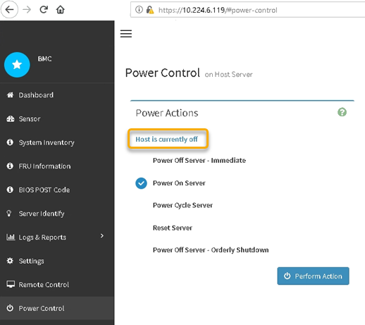

= SG6000-CN 컨트롤러의 전원을 껐다가 켭니다
:allow-uri-read: 
:icons: font
:imagesdir: ../media/

[role="lead"]
SG6000-CN 컨트롤러를 종료한 다음 전원을 다시 켜서 유지 관리를 수행할 수 있습니다.

== SG6000-CN 컨트롤러를 종료합니다

SG6000-CN 컨트롤러를 종료하여 하드웨어 유지 관리를 수행합니다.

.시작하기 전에
* 데이터 센터의 유지 관리가 필요한 SG6000-CN 컨트롤러를 물리적으로 배치했습니다. 을 참조하십시오 link:locating-controller-in-data-center.html["데이터 센터에서 컨트롤러를 찾습니다"].

.이 작업에 대해
서비스 중단을 방지하려면 서비스 중단 기간이 허용되는 예약된 유지 관리 기간 동안 컨트롤러를 종료하거나 시작하기 전에 다른 모든 스토리지 노드가 그리드에 연결되어 있는지 확인하십시오. 에 대한 정보를 참조하십시오 https://docs.netapp.com/us-en/storagegrid-118/monitor/monitoring-system-health.html#monitor-node-connection-states["노드 연결 상태를 모니터링합니다"^].

CAUTION: 개체의 복사본을 하나만 만드는 ILM 규칙을 사용한 적이 있는 경우에는 예약된 유지 관리 기간 동안 컨트롤러를 종료해야 합니다. 그렇지 않으면 이 절차 중에 해당 개체에 대한 액세스가 일시적으로 끊어질 수 있습니다. 를 누릅니다
정보 수명 주기 관리를 사용하여 개체 관리에 대한 정보를 참조하십시오.

.단계
. SG6000-CN 컨트롤러를 종료합니다.
+

CAUTION: 아래 지정된 명령을 입력하여 어플라이언스 종료를 제어해야 합니다. 불필요한 경고를 방지하고, 전체 로그를 사용하고, 서비스 중단을 방지하기 위해 가능하면 제어된 종료를 수행하는 것이 좋습니다.

+
.. 그리드 노드에 아직 로그인하지 않은 경우 PuTTY 또는 다른 ssh 클라이언트를 사용하여 로그인합니다.
+
... 다음 명령을 입력합니다. `ssh admin@_grid_node_IP_`
... 에 나열된 암호를 입력합니다 `Passwords.txt` 파일.
... 루트로 전환하려면 다음 명령을 입력합니다. `su -`
... 에 나열된 암호를 입력합니다 `Passwords.txt` 파일.
+
루트로 로그인하면 프롬프트가 에서 변경됩니다 `$` 를 선택합니다 `#`.

.. SG6000-CN 컨트롤러를 종료합니다
`*shutdown -h now*`
+
이 명령을 완료하는 데 최대 10분이 걸릴 수 있습니다.

. 다음 방법 중 하나를 사용하여 SG6000-CN 컨트롤러의 전원이 꺼져 있는지 확인합니다.
+
** 컨트롤러 전면에 있는 파란색 전원 LED를 확인하여 꺼져 있는지 확인합니다.
+
image::../media/sg6060_front_panel_power_led_off.jpg[SG6060 전면 패널 전원 LED - 꺼짐]

** 컨트롤러 후면에 있는 두 전원 공급 장치의 녹색 LED를 살펴보고 정상 속도로 깜박이는지 확인합니다(초당 약 1회 깜박임).
+
image::../media/sg6060_rear_panel_power_led_on.jpg[SG6060 후면 패널 전원 LED]

** 컨트롤러 BMC 인터페이스 사용:
+
... 컨트롤러 BMC 인터페이스에 액세스합니다.
+
link:../installconfig/accessing-bmc-interface.html["BMC 인터페이스에 액세스합니다"]

... 전원 제어 * 를 선택합니다.
... 전원 작업에서 호스트가 현재 꺼져 있음을 나타내는지 확인합니다.
+

== SG6000-CN 컨트롤러의 전원을 켜고 작동을 확인합니다

유지 관리를 완료한 후 컨트롤러 전원을 켭니다.

.시작하기 전에
* 캐비닛이나 랙에 컨트롤러를 설치하고 데이터 및 전원 케이블을 연결했습니다.
+
link:reinstalling-sg6000-cn-controller-into-cabinet-or-rack.html["캐비닛 또는 랙에 SG6000-CN 컨트롤러를 다시 설치합니다"]

* 데이터 센터에서 물리적으로 컨트롤러를 찾은 경우
+
link:locating-controller-in-data-center.html["데이터 센터에서 컨트롤러를 찾습니다"]

.단계
. SG6000-CN 컨트롤러의 전원을 켜고 다음 방법 중 하나를 사용하여 컨트롤러 LED 및 부팅 코드를 모니터링합니다.
+
** 컨트롤러 전면에 있는 전원 스위치를 누릅니다.
+
image::../media/sg6060_front_panel_power_led_off.jpg[SG6060 전면 패널 전원 LED - 꺼짐]

** 컨트롤러 BMC 인터페이스 사용:
+
... 컨트롤러 BMC 인터페이스에 액세스합니다.
+
link:../installconfig/accessing-bmc-interface.html["BMC 인터페이스에 액세스합니다"]

... 전원 제어 * 를 선택합니다.
... Power On Server * 를 선택한 다음 * Perform Action * 을 선택합니다.
+
image::../media/sg6060_power_on_from_bmc.png[BMC에서 컨트롤러의 전원을 켭니다]

+
BMC 인터페이스를 사용하여 시작 상태를 모니터링합니다.

. 어플라이언스 컨트롤러가 그리드 관리자에 표시되고 경고가 표시되지 않는지 확인합니다.
+
컨트롤러가 그리드 관리자에 표시되는 데 최대 20분이 걸릴 수 있습니다.

. 새 SG6000-CN 컨트롤러가 완전히 작동하는지 확인합니다.
+
.. PuTTY 또는 다른 ssh 클라이언트를 사용하여 그리드 노드에 로그인합니다.
+
... 다음 명령을 입력합니다. `ssh admin@_grid_node_IP_`
... 에 나열된 암호를 입력합니다 `Passwords.txt` 파일.
... 루트로 전환하려면 다음 명령을 입력합니다. `su -`
... 에 나열된 암호를 입력합니다 `Passwords.txt` 파일.
+
루트로 로그인하면 프롬프트가 에서 변경됩니다 `$` 를 선택합니다 `#`.

.. 다음 명령을 입력하고 예상 출력을 반환하는지 확인합니다. +
`cat /sys/class/fc_host/*/port_state`
+
예상 출력:

+
[listing]
----
Online
Online
Online
Online
----
+
예상 결과가 반환되지 않으면 기술 지원 부서에 문의하십시오.

.. 다음 명령을 입력하고 예상 출력을 반환하는지 확인합니다. +
`cat /sys/class/fc_host/*/speed`
+
예상 출력:

+
[listing]
----
16 Gbit
16 Gbit
16 Gbit
16 Gbit
----
+
예상 결과가 반환되지 않으면 기술 지원 부서에 문의하십시오.

.. 그리드 관리자의 노드 페이지에서 어플라이언스 노드가 그리드에 연결되어 있고 경고가 없는지 확인합니다.
+

CAUTION: 이 어플라이언스에 녹색 아이콘이 없으면 다른 어플라이언스 노드를 오프라인으로 전환하지 마십시오.

. 선택 사항: 앞면 베젤이 분리된 경우 설치합니다.

.관련 정보
* link:reinstalling-sg6000-cn-controller-into-cabinet-or-rack.html#remove-sg6000-cn-controller-from-cabinet-or-rack["캐비닛 또는 랙에서 SG6000-CN 컨트롤러를 제거합니다"]
* link:../installconfig/viewing-status-indicators.html["상태 표시기를 봅니다"]

