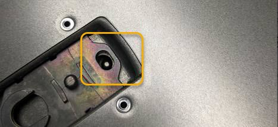

= SG6000 컨트롤러 덮개를 교체합니다
:allow-uri-read: 
:icons: font
:imagesdir: ../media/

[role="lead"]
유지관리 시 제품 덮개를 분리하여 내부 부품에 액세스하고, 작업이 끝나면 덮개를 다시 끼우십시오.

== SG6000-CN 컨트롤러 덮개를 분리합니다

컨트롤러 덮개를 분리하여 내부 구성요소에 유지보수 액세스를 제공합니다.

.시작하기 전에
캐비닛 또는 랙에서 컨트롤러를 제거하여 상단 덮개에 액세스합니다.

link:reinstalling-sg6000-cn-controller-into-cabinet-or-rack.html#remove-sg6000-cn-controller-from-cabinet-or-rack["캐비닛 또는 랙에서 SG6000-CN 컨트롤러를 제거합니다"]

.단계
. SG6000-CN 컨트롤러 덮개 래치가 잠겨 있지 않은지 확인합니다. 필요한 경우 래치 잠금 장치에 표시된 대로 파란색 플라스틱 래치 잠금 장치를 잠금 해제 방향으로 1/4바퀴 돌립니다.
. 걸쇠를 위로 돌려 SG6000-CN 컨트롤러 섀시의 후면을 향해 멈출 때까지 돌린 다음 섀시에서 덮개를 조심스럽게 들어 올려 한 쪽에 둡니다.
+
image::../media/sg6060_cover_latch_open.jpg[SG6060 덮개 래치가 열려 있습니다]

+

CAUTION: SG6000-CN 컨트롤러 내부에서 작업할 때 정전기 방전을 방지하려면 ESD 밴드의 스트랩 끝을 손목 둘레에 감고 클립 끝을 금속 바닥에 고정합니다.

부품을 교체한 후 키트와 함께 제공된 RMA 지침에 따라 오류가 발생한 부품을 NetApp에 반환합니다. 를 참조하십시오 https://mysupport.netapp.com/site/info/rma["부품 반납 및 교체"^] 페이지를 참조하십시오.

== SG6000-CN 컨트롤러 덮개를 다시 설치합니다

내부 하드웨어 유지보수가 완료되면 컨트롤러 덮개를 다시 설치합니다.

.시작하기 전에
컨트롤러 내의 모든 유지보수 절차를 완료했습니다.

.단계
. 덮개 래치를 연 상태에서 섀시 위의 덮개를 잡고 상단 덮개 래치의 구멍을 섀시의 핀에 맞춥니다. 덮개가 정렬되면 섀시 위로 내립니다.
+

. 덮개가 멈추고 덮개가 섀시에 완전히 장착될 때까지 덮개 래치를 앞으로 또는 아래로 돌립니다. 덮개의 전면 가장자리를 따라 틈이 없는지 확인합니다.
+
덮개가 완전히 장착되지 않은 경우 SG6000-CN 컨트롤러를 랙에 밀어 넣을 수 없을 수 있습니다.

. 선택 사항: 래치 잠금 장치에 표시된 것처럼 파란색 플라스틱 래치 잠금 장치를 잠금 방향으로 1/4바퀴 돌려 잠급니다.

.작업을 마친 후
link:reinstalling-sg6000-cn-controller-into-cabinet-or-rack.html["캐비닛 또는 랙에 컨트롤러를 다시 설치합니다."]
