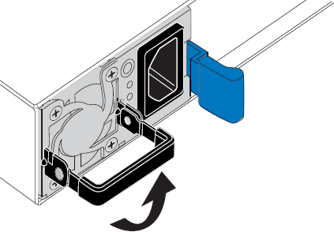

= SG6000-CN 컨트롤러의 전원 공급 장치를 교체합니다
:allow-uri-read: 
:icons: font
:imagesdir: ../media/

[role="lead"]
SG6000-CN 컨트롤러에는 이중화를 위한 2개의 전원 공급 장치가 있습니다. 전원 공급 장치 중 하나에 장애가 발생하면 가능한 한 빨리 교체해야 컴퓨팅 컨트롤러에 중복 전원이 공급되는지 확인할 수 있습니다.

NOTE: 두 전원 공급 장치의 와트는 동일해야 합니다. 두 전원 공급 장치를 모두 교체해야 하는 경우 을 참조하십시오 link:replacing-one-or-both-power-supplies-in-sg6000-cn-controller.html["SG6000-CN 컨트롤러의 두 전원 공급 장치를 교체합니다"].

.시작하기 전에
* 교체용 전원 공급 장치의 포장을 풀었습니다.
* 데이터 센터의 전원 공급 장치를 교체하는 컨트롤러를 물리적으로 배치했습니다.
+
link:locating-controller-in-data-center.html["데이터 센터에서 컨트롤러를 찾습니다"]

* 다른 전원 공급 장치가 설치되어 실행 중인지 확인했습니다.

.이 작업에 대해
그림에서는 컨트롤러 후면에서 액세스할 수 있는 SG6000-CN 컨트롤러용 전원 공급 장치 2개를 보여 줍니다.

image::../media/sg6000_cn_power_supplies.gif[2개의 전원 공급 장치가 있는 SG6000-CN의 후면]

.단계
. 전원 공급 장치에서 전원 코드를 뽑습니다.
. 캠 핸들을 들어 올립니다.
+

. 파란색 래치를 누르고 전원 공급 장치를 당겨 빼냅니다.
+
image::../media/sg6000_cn_remove_power_supply.gif[SG6000-CN 전원 공급 장치를 제거합니다]

. 교체용 전원 공급 장치를 섀시에 밀어 넣습니다.
+
장치를 밀어 넣을 때 파란색 걸쇠가 오른쪽에 있는지 확인합니다.

+
image::../media/sg6000_cn_insert_power_supply.gif[전원 공급 장치를 SG6000-CN으로 밀어 넣습니다]

. 캠 핸들을 아래로 눌러 전원 공급 장치를 고정합니다.
. 전원 코드를 전원 공급 장치에 연결하고 녹색 LED가 켜지는지 확인합니다.

