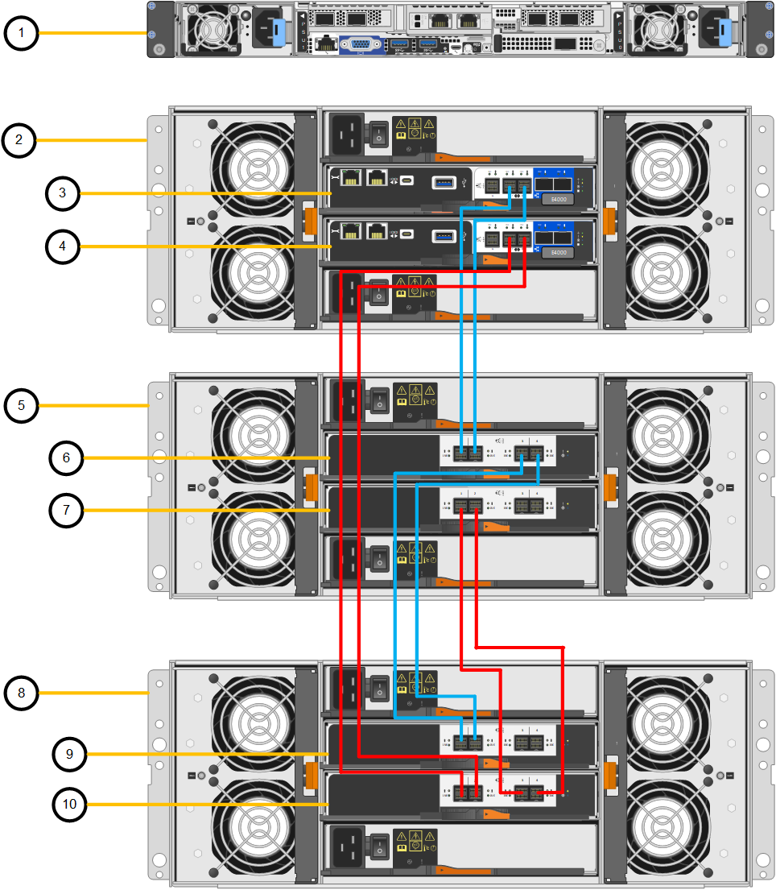
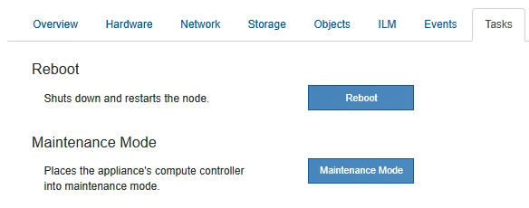

= 배포된 SG6160에 확장 쉘프를 추가합니다
:allow-uri-read: 
:icons: font
:imagesdir: ../media/

[role="lead"]
스토리지 용량을 늘리기 위해 이미 StorageGRID 시스템에 구축된 SG6160에 하나 또는 두 개의 확장 쉘프를 추가할 수 있습니다.

.시작하기 전에
* 프로비저닝 암호가 있어야 합니다.
* StorageGRID 11.8 이상을 실행 중이어야 합니다.
* 확장 쉘프와 각 확장 쉘프의 SAS 케이블을 2개 사용합니다.
* 데이터 센터에 확장 쉘프를 추가할 스토리지 어플라이언스를 물리적으로 배치했습니다.
+
link:locating-sgf6112-in-data-center.html["데이터 센터에서 컨트롤러를 찾습니다"]

.이 작업에 대해
확장 쉘프를 추가하려면 다음 단계를 높은 수준으로 수행해야 합니다.

* 캐비닛 또는 랙에 하드웨어를 설치합니다.
* SG6160을 유지 관리 모드로 전환합니다.
* 확장 쉘프를 E4000 컨트롤러 쉘프 또는 다른 확장 쉘프에 연결합니다.
* StorageGRID 어플라이언스 설치 프로그램을 사용하여 확장을 시작합니다.
* 새 볼륨이 구성될 때까지 기다립니다.

하나 또는 두 개의 확장 셸프에 대한 절차를 완료하는 데는 어플라이언스 노드당 1시간 이하가 걸립니다. 다운타임을 최소화하기 위해 다음 단계에서는 SG6160을 유지보수 모드로 전환하기 전에 새 확장 셸프 및 드라이브를 설치하도록 안내합니다. 나머지 단계는 어플라이언스 노드당 약 20~30분 정도 소요됩니다.

.단계
. 의 지침을 따릅니다 link:../installconfig/sg6160-installing-60-drive-shelves-into-cabinet-or-rack.html["캐비닛 또는 랙에 60-드라이브 쉘프 설치"].
. Grid Manager에서 link:../commonhardware/placing-appliance-into-maintenance-mode.html["SG6100-CN 컨트롤러를 유지 관리 모드로 전환합니다"].
. 다이어그램에 표시된 각 확장 쉘프를 E4000 컨트롤러 쉘프에 연결합니다.
+
이 도면에는 2개의 확장 쉘프가 나와 있습니다. IOM A가 하나만 있는 경우 IOM A를 컨트롤러 A에 연결하고 IOM B를 컨트롤러 B에 연결합니다

+

+
[cols="1a,2a"]
|===
| 속성 표시기 | 설명 

 a| 
1
 a| 
SG6100-CN을 참조하십시오

 a| 
2
 a| 
E4000 컨트롤러 쉘프

 a| 
3
 a| 
컨트롤러 A

 a| 
4
 a| 
컨트롤러 B

 a| 
5
 a| 
확장 쉘프 1

 a| 
6
 a| 
확장 쉘프 1의 경우 IOM A

 a| 
7
 a| 
확장 쉘프 1의 IOM B

 a| 
8
 a| 
확장 쉘프 2

 a| 
9
 a| 
확장 쉘프 2의 IOM A

 a| 
10
 a| 
확장 쉘프 2의 IOM B

|===
. 전원 코드를 연결하고 확장 셸프에 전원을 공급합니다.
+
.. 각 확장 쉘프에 있는 2개의 전원 공급 장치 각각에 전원 코드를 연결합니다.
.. 각 확장 셸프의 전원 코드 2개를 캐비닛이나 랙에 있는 서로 다른 PDU 2개에 연결합니다.
.. 각 확장 셸프에 대해 2개의 전원 스위치를 켭니다.
+
*** 전원을 켜는 동안 전원 스위치를 끄지 마십시오.
*** 확장 선반의 팬은 처음 시작할 때 매우 클 수 있습니다. 시동 중 큰 소음이 정상입니다.

. StorageGRID 어플라이언스 설치 프로그램의 홈 페이지를 모니터링합니다.
+
약 5분 후 확장 셸프의 전원이 꺼지고 시스템에 의해 감지됩니다. 홈 페이지에는 감지된 새 확장 셸프의 수가 표시되고 확장 시작 버튼이 활성화됩니다.

+
스크린샷은 다음과 같이 기존 또는 새 확장 셸프 수에 따라 홈 페이지에 표시될 수 있는 메시지의 예를 보여 줍니다.

+
** 페이지 상단에 동그라미로 표시된 배너는 감지된 총 확장 셸프 수를 나타냅니다.
+
*** 배너는 셸프의 구성 및 구축 또는 신규/구성되지 않은 총 확장 셸프 수를 나타냅니다.
*** 확장 셸프가 감지되지 않으면 배너가 나타나지 않습니다.

** 페이지 하단에 동그라미 표시된 메시지는 확장을 시작할 준비가 되었음을 나타냅니다.
+
*** 이 메시지는 StorageGRID에서 감지하는 새 확장 쉘프의 수를 나타냅니다. "부착됨"은 선반이 감지되었음을 나타냅니다. "'Unconfigured'"는 StorageGRID 어플라이언스 설치 프로그램을 사용하여 셸프가 새로 추가되었으며 아직 구성되지 않았음을 나타냅니다.
+

NOTE: 이미 구축된 확장 쉘프가 이 메시지에 포함되어 있지 않습니다. 페이지 상단의 배너에 있는 카운트에 포함됩니다.

*** 새 확장 쉘프가 감지되지 않으면 메시지가 나타나지 않습니다.
+
image::../media/appl_installer_home_expansion_shelf_ready_to_install.png[확장 셸프 설치]

. 필요한 경우 홈 페이지의 메시지에 설명된 문제를 해결합니다.
+
예를 들어, SANtricity 시스템 관리자를 사용하여 스토리지 하드웨어 문제를 해결할 수 있습니다.

. 홈 페이지에 표시되는 확장 셸프 수가 추가하려는 확장 셸프 수와 일치하는지 확인합니다.
+

NOTE: 새 확장 쉘프가 감지되지 않은 경우 케이블이 올바르게 연결되고 전원이 켜져 있는지 확인합니다.

. [[start_expansion]] * 확장 시작 * 을 클릭하여 확장 쉘프를 구성하고 오브젝트 스토리지에 사용할 수 있도록 합니다.
. 확장 쉘프 구성의 진행률을 모니터링합니다.
+
진행 표시줄은 초기 설치 중에 나타나는 것처럼 웹 페이지에 나타납니다.

+
image::../media/monitor_expansion_for_new_appliance_shelf.png[모니터 확장 셸프 구성]

+
구성이 완료되면 어플라이언스가 자동으로 재부팅되어 유지 관리 모드를 종료하고 그리드에 다시 연결됩니다. 이 프로세스는 최대 20분 정도 소요될 수 있습니다.

+

NOTE: 확장 셸프 구성이 실패할 경우 다시 시도하려면 StorageGRID 어플라이언스 설치 프로그램으로 이동하여 * 고급 * > * 컨트롤러 재부팅 * 을 선택한 다음 * 유지보수 모드로 재부팅 * 을 선택합니다. 노드가 재부팅된 후 를 재시도하십시오 <<start_expansion,확장 쉘프 구성>>.

+
재부팅이 완료되면 * Tasks * 탭이 다음 스크린샷과 같이 표시됩니다.

+

. 어플라이언스 스토리지 노드 및 새 확장 셸프의 상태를 확인합니다.
+
.. Grid Manager에서 * nodes * 를 선택하고 어플라이언스 스토리지 노드에 녹색 확인 표시 아이콘이 있는지 확인합니다.
+
녹색 확인 표시 아이콘은 활성화된 알림이 없고 노드가 그리드에 연결되어 있음을 의미합니다. 노드 아이콘에 대한 설명은 을 https://docs.netapp.com/us-en/storagegrid/monitor/monitoring-system-health.html#monitor-node-connection-states["노드 연결 상태를 모니터링합니다"^]참조하십시오.

.. Storage * 탭을 선택하고 추가한 확장 셸프마다 Object Storage 테이블에 16개의 새 오브젝트 저장소가 표시되는지 확인합니다.
.. 각 새 확장 셸프의 쉘프 상태가 공칭 이고 구성 상태가 구성됨 인지 확인합니다.

