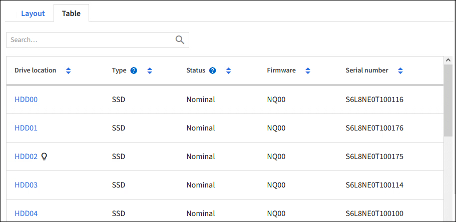

= 드라이브 관리 탭 사용(SGF6112)
:allow-uri-read: 
:icons: font
:imagesdir: ../media/

[role="lead"]
그리드 관리자의 드라이브 관리 탭을 사용하여 SGF6112 어플라이언스의 드라이브에 대한 문제 해결 및 유지 관리 작업을 수행할 수 있습니다.

.시작하기 전에
* 를 사용하여 그리드 관리자에 로그인했습니다 https://docs.netapp.com/us-en/storagegrid-118/admin/web-browser-requirements.html["지원되는 웹 브라우저"^].

.이 작업에 대해
SGF6112 어플라이언스와 이 있는 경우 https://docs.netapp.com/us-en/storagegrid-118/admin/admin-group-permissions.html["스토리지 어플라이언스 관리자 또는 루트 액세스 권한"^]어플라이언스 세부 정보 페이지에 드라이브 관리 탭이 나타납니다.

드라이브 관리 탭에는 다음 보기가 포함되어 있습니다.

레이아웃:: 어플라이언스의 데이터 스토리지 드라이브 레이아웃 드라이브 세부 정보를 보려면 드라이브를 선택합니다.
+
--
image:../media/manage_drives_tab.png["드라이브 관리 탭 레이아웃 보기"]

--
표:: 각 드라이브에 대한 정보를 나열합니다. 드라이브 세부 정보를 보려면 드라이브를 선택합니다.
+
--

--
드라이브 세부 정보:: 각 드라이브에 대한 요약 아래 단계에 설명된 대로 해당 작업 버튼을 선택합니다.
+
--
image:../media/manage_drives_tab_details.png["드라이브 관리 탭 드라이브 세부 정보"]

--

== 로케이터 조명을 켜거나 끕니다

어플라이언스에서 드라이브를 물리적으로 찾으려면:

. 그리드 관리자에서 * nodes * > * _data center_ * 를 선택합니다.
. select *_appliance storage node_ * > * 드라이브 관리 * > * 레이아웃 * > * _drive_ * 를 선택합니다.
+
드라이브 세부 정보 패널이 나타납니다.

. 로케이터 조명 켜기 * 를 선택합니다.
+
** 전구 아이콘 image:../media/icon_drive-light-bulb.png["드라이브 램프 전구"] 드라이브에 대해 나타납니다.
** 물리적 드라이브에서 주황색 LED가 깜박입니다.

. 로케이터 라이트를 끄려면 * 로케이터 라이트 끄기 * 를 선택합니다.

== [[logical-replace-drive]] 논리적으로 드라이브를 교체합니다

스토리지 어플라이언스의 드라이브를 재구성하거나 다시 초기화해야 하는 경우:

. 그리드 관리자에서 * nodes * > * _data center_ * 를 선택합니다.
. select *_appliance storage node_ * > * 드라이브 관리 * > * 레이아웃 * > * _drive_ * 를 선택합니다.
+
드라이브 세부 정보 패널이 나타납니다.

. 논리적으로 대체 * 를 선택합니다.
+
드라이브 세부 정보 패널에서 드라이브 상태는 _Rebuilding_으로 표시됩니다. 드라이브를 재구축하는 데 최대 5분이 소요될 수 있습니다.

== 드라이브 오류

문제 해결을 위해 결함이 있는 것으로 의심되는 드라이브를 수동으로 "실패"할 수 있습니다. 그러면 해당 드라이브 없이 시스템이 실행됩니다.

. 그리드 관리자에서 * nodes * > * _data center_ * 를 선택합니다.
. select *_appliance storage node_ * > * 드라이브 관리 * > * 레이아웃 * > * _drive_ * 를 선택합니다.
+
드라이브 세부 정보 패널이 나타납니다.

. Fail drive * 를 선택합니다.

드라이브에 오류가 발생한 후 또는 드라이브를 물리적으로 교체해야 합니다 <<logically-replace-drive,드라이브를 논리적으로 교체합니다>>.
